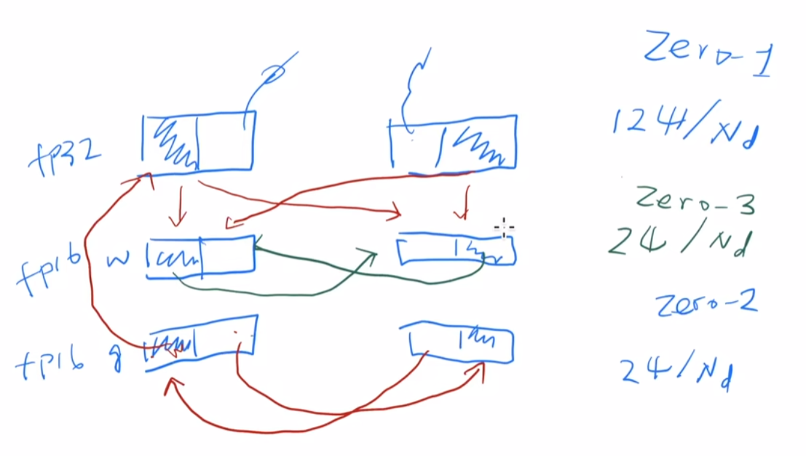

# ZeRO论文精读的一些知识点

所谓ZeRO，即指**0冗余的优化器**（Zero Rredundancy Optimizer）,能做到trillion级别的模型参数。

<!-- truncate -->
- 数据并行DP不能降低每个卡的内存使用

并行方式：
- pipeline parallelism(PP)
- Model Parrallelism(MP) Megatron, 张量并行，模型每个层里都要做通讯，通讯量太大，跨卡跨机器性能下降很快，计算通讯比很差。

优化器：  
Adam还需要存过去的冲量信息占空间,需要维护一个momentun和variance，内存还要存梯度和模型，activation和临时的buffers，而且像pytorch这种不停析构内存再开内存会导致内存碎片化要占30%。

Nvida在fp16精度下的计算性能是fp32的好几倍，因此要使用半精度训练。权重更新的时候用fp32，因为fp16精度不够导致累加的时候一直处于0。训练的时候序列的长度和batch的大小都是和内存线性的关系。

## 问题怎么优化？
优化模型参数，优化中间状态
- 1、切开模型参数放不同地方
- 2、ZeRO-DP结合ZeRO-R
## Insights：  
DP比MP效率高，DP的内存inefficient  
ZeRO-DP思想：所有的w只存一份，用的时候找对应GPU要  
ZeRO-R：用带宽来换空间  
Buffer怎么办：只开固定大小，超过了就删掉  
碎片，内存做整理  
