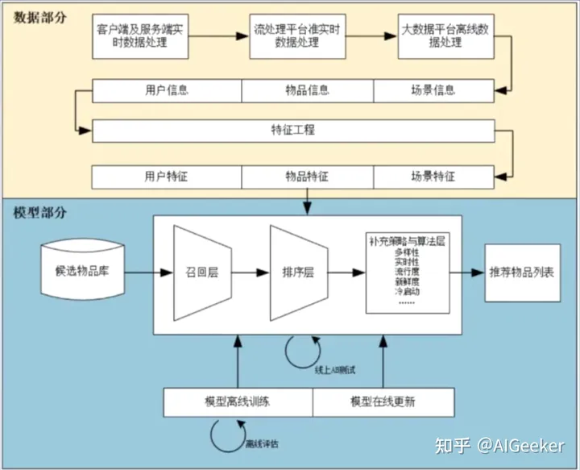
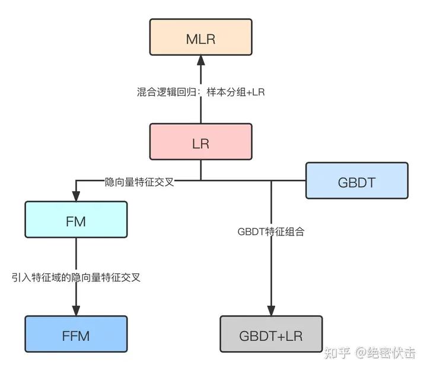
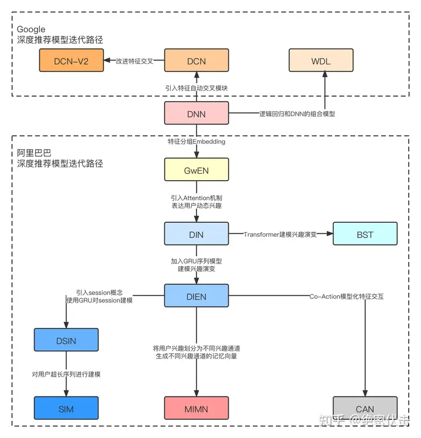

# 推荐系统相关知识概略

文本简单概述了推荐系统常见的结构，各阶段常用的模型算法和评价指标

<!-- truncate -->
模型部分的结构主要分为召回层（万），粗排（千），精排（百），重排（个位数）。 

推荐模型演化历史：

# 推荐系统主要评价指标
准确率，召回率，rankingscore，Hitratio
交叉熵，MAE，MSE  
非准确率指标：海明距离衡量两个用户推荐列表的差异  
内部相关性： 对于用户u的推荐列表，如果物品与物品之间的相似度越大，说明推荐给用户的商品比较单一，推荐算法越发现不了新的物品；反之，如果该值越小，则推荐的物品越丰富，越有利于对用户的兴趣进行扩展  
流行度指标：表示用户u的前K个推荐物品的集合，da表示α的被多少用户购买过，购买次数越多，则该商品越流行。该指标越大，说明推荐算法倾向于推荐“热度”越大、越流行的商品；反之，则越倾向于推荐比较冷门的物品，越能反映出用户的兴趣。  
NDCG

## 粗排阶段
- 粗排与精排的异同： 
使用相同的特征，但是模型复杂度较低。
精排注重头部商品的排序精度，粗排需要对腰部商品也具有排序能力。
粗排要对用户喜欢和不喜欢的边界由很强的区分能力
### 样本选择
- 负样本范围  
    曝光未点击样本；全库除转化外样本；精排靠后样本；除曝光外的召回样本
- 正样本范  
    曝光点击样本；全域点击样本；延迟点击样本（如下一天点击样本）
- 样本采样方式  
随机采样、热门商品打压、同类目下商品
- 粗排样本组成方案  
    - 通过扩正负样本来减少偏差   
正样本：曝光点击样本 + 全域点击修正样本  
负样本：曝光未点击样本 + 除曝光外召回样本随机采样  
    - 拟合精排排序的方案  
正样本：曝光点击样本 + 除去曝光后的精排靠前商品适当采样  
负样本：曝光未点击样本 + 精排靠后商品适当采样
- 技术路线  
listwise以集合为建模目标
pointwise以值为建模目标
- 粗排优化方向
双塔， User部署线上， item embedding离线计算好建索引
    - 加强序列特征：用户塔引入实时、短期、长期行为序列和 Query 语义表征，关注于行为序列部分，作者针对不同序列设计不同结构，实时输入为商品序列，采用 LSTM+ 多头注意力结构实现，短期较实时少 LSTM，长期输入为 4 种属性序列做 Pooling。在关联 Query 时，作者有个巧妙的优化点是引入全零向量，来消除噪声和解决用户历史行为与当前 Query 可能完全无关的情况。
    - 增强双塔交叉程度
- 精度提升
    - 精排蒸馏：对粗排模型进行蒸馏学习，从而提升粗排效果。
    - 特征交叉：特征蒸馏，加入交叉特征，轻量级MLP
- 延迟降低
    - 特征裁剪
    - 量化：32bit-->8bit
    - 网络剪枝
    - 模型蒸馏
- 多目标（点击目标，时长目标，互动目标）  
线上融合：线性，指数，带权指数加分，带权指数乘分
- 多场景  
场景用户，定位，物品分布  
场景特征直接作为特征输入  
场景作为bias
M2M动态权重：将场景特征分别通过一层网络 Reshape 到主网络的各个层，生成与主网络每层维度相同的向量，然后与主网络中间层特征向量相乘，实现场景信息融入到主网络的中间层。  
分阶段学习：预训练+微调  预训练阶段学习场景特征，微调阶段拟合最终目标。  

## 召回阶段
召回模式：多路召回
（协同过滤，关注者，地理位置，兴趣，热门）
FM  
具体的来说，FM的二阶部分的 
 表示是对应特征 
 的隐向量。因此，在训练完FM模型后，我们就可以得到用户和物料各个特征的隐向量。通过将用户和物料的隐向量做sum pooling就可以得到它们对应的Embedding向量，进而就可以它们的Embedding向量做相似召回。  

基于上述思路，在离线训练好FM模型后，对于物料部分，我们就可以离线生成好所有物料的Embedding向量并灌入FAISS建立索引；对于用户部分，我们则只需将其隐向量写入在线FAISS。当线上有用户发起召回请求时，只需在线读取用户隐向量SUM后即可得到用户的Embedding，通过FAISS用户Embedding与物料Embedding计算相似度截断后，便可以得到我们指定的结果。
## 精排算法

## 重排算法
精排模型通常学习的是物品pointwise的得分，直接根据精排分数排序，无法考虑多个商品间的影响，而且同质化严重（相似的商品得分相似所以位置接近，但同时点击的概率很少），缺少发现性，用户体验较差。  
通过重排序提升Top-K商品的信息覆盖度、减少信息冗余。通常query包含多种信息需求，通过展示多种类型的商品，能够提升Top-K商品的覆盖度，同时避免无效曝光多个类似的物品。多样性能带来发现性：用户发现多种商品、新的兴趣，同时系统能了解更多用户。合适的多样性，通常对实现重排序目标有重要的作用。

- 消重服务：
布隆过滤器

- 序列生成->序列评估->流量调控动态调权->滑窗打散策略

- 重排算法参考：[推荐系统](https://zhuanlan.zhihu.com/p/662096012)

## 大模型时代的推荐系统（待重开一篇补充）