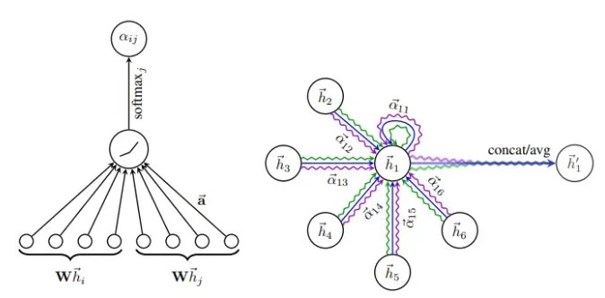
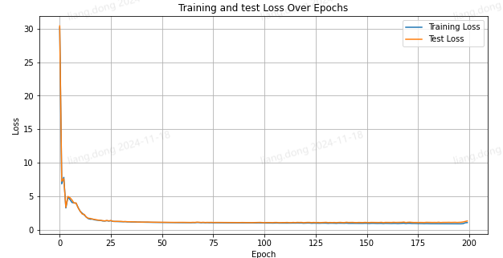
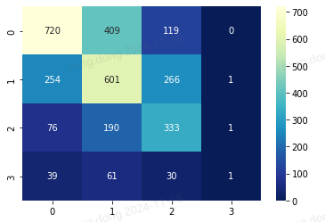
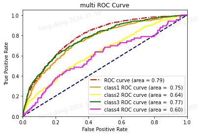

<!-- truncate -->
## 图神经网络应用简述

## 背景:
最近在进行一个根据公开语料创建医疗诊疗知识库用于根据医疗发票推断可能的疾病用于风险预判。

## 基本概念：

主要节点类型由四类构成：科室，检查，用药，疾病。  
主要边类型有五类：科室 vs 疾病，疾病 vs 用药，疾病 vs 检查，

## GAT的概念
要先讲清楚GAT，必须先理解什么是GNN图神经网络。图神经网络其实就是用一个节点和他相邻的节点的特征信息进行sum，mean或者max等操作提取出来再拼接此节点自己的特征放入到多层全连接中去，再不断更新其他节点的特征参数。也就是说将一个节点用一个特征向量来进行表示。

GAT主要可以解决融合周边特征时权重是固定的，不够灵活。利用attention机制给节点之间的边以权重，帮助学到网络的结构信息。

而GAT很显而易见就是把注意力机制使用到提取周边1阶邻居节点的特征上了，假设节点i有一个邻居节点j，节点的embedding向量分别是N维，即(N,)
那会有一个权重矩阵（要学习的参数）N*M,将节点变为（M,），然后再将变化后的i,j拼接到一起
 <!-- // Start of Selection
$$
\mathbf{x}^{\prime}_i = \sum_{j \in \mathcal{N}(i) \cup \{ i \}} \alpha_{i,j} \mathbf{\Theta}_t \mathbf{x}_{j}
$$

$$
\alpha_{i,j} = \frac{\exp\left(\mathrm{LeakyReLU}\left(\mathbf{a}^{\top}_{s} \mathbf{\Theta}_{s} \mathbf{x}_i + \mathbf{a}^{\top}_{t} \mathbf{\Theta}_{t} \mathbf{x}_j\right)\right)}{\sum_{k \in \mathcal{N}(i) \cup \{ i \}} \exp\left(\mathrm{LeakyReLU}\left(\mathbf{a}^{\top}_{s} \mathbf{\Theta}_{s} \mathbf{x}_i + \mathbf{a}^{\top}_{t} \mathbf{\Theta}_{t} \mathbf{x}_k\right)\right)}
$$ -->
从注意力公式上来看，alphai,j是节点i和节点j之间的注意力系数，先观察分子：  
- 1、计算节点$i$和节点$j$的特征向量的线性变换结果。  
- 2、然后，通过$LeakyReLU$激活函数引入非线性。  
- 3、最后，作为softmax的分子部分。   
从分母上看，对节点i及其所有邻居节点（包括节点i本身）进行相同的计算。
将所有这些结果的指数值相加，得到一个归一化因子。   
GAT也有多头注意力，其实就是对相同的节点创造多个w矩阵计算alpha向量来实现。
计算的图示在原论文中，已经一目了然了：



## 比较好用的库
### pytorch-geometric
适配Pytorch,可参考官方教程和最佳实践，很清晰：[PyG文档](https://pytorch-geometric.readthedocs.io/en/2.6.0/tutorial/heterogeneous.html)

### dgl
亚马逊开发的图神经网络库，比较优秀的是有中文的使用指南，可以帮助快速入门。
[dgl文档](https://docs.dgl.ai/guide_cn/index.html)

## 实践（使用了PyG)
### 1.数据集整理
先看下整理完后的整体数据结构：
```
HeteroData(
  check={ x=[3353, 768] },
  drug={ x=[3828, 768] },
  dept={ x=[54, 768] },
  disease={
    x=[8807, 768],
    y=[8807, 4],
    train_mask=[8807],
    test_mask=[8807],
    val_mask=[8807],
  },
  (disease, need, check)={ edge_index=[2, 39531] },
  (disease, take, drug)={ edge_index=[2, 59738] },
  (disease, in, dept)={ edge_index=[2, 8807] },
  (check, done, disease)={ edge_index=[2, 39531] },
  (drug, cure, disease)={ edge_index=[2, 59738] }
)
```
由于数据本身不同的节点和边类型适合构建成异质图模型，因此使用了PyG的HeteroData对象来构建，节点名称和关键信息一目了然，比如`x=[3353, 768]`代表check类型节点有3353个，特征有768维。`y=[8807, 4]`代表了作为要预测的节点disease的疾病风险等级共有8807个，要预测的风险等级有4种。train_mask，test_mask等代表了训练，测试，验证集的mask矩阵。而`(disease, need, check)={ edge_index=[2, 39531] }`代表了*disease*需要*check*这类边关系有39531对，这一矩阵都是由disease和check的索引俩俩组成的tuple构成。

具体的代码方法可以参考官方例子：[构建图数据集](https://pytorch-geometric.readthedocs.io/en/2.6.0/tutorial/load_csv.html)

### 2.GAT网络定义及超参选择
```
class GAT(torch.nn.Module):
    def __init__(self, hidden_channel1, hidden_channel2, out_channels):
        super().__init__()
        self.conv1 = GATConv((-1, -1), hidden_channel1, dropout=0.5, add_self_loops=False)
        self.lin1 = Linear(-1, hidden_channel1)
        self.conv2 = GATConv((-1, -1), hidden_channel2, dropout=0.5, add_self_loops=False)
        self.lin2 = Linear(-1, hidden_channel2)
        self.conv3 = GATConv((-1, -1), out_channels, dropout=0.5, add_self_loops=False)
        self.lin3 = Linear(-1, out_channels)

    def forward(self, x, edge_index):
        x = self.conv1(x, edge_index) + self.lin1(x)
        x = x.relu()
        x = self.conv2(x, edge_index) + self.lin2(x)
        x = x.relu()
        t = self.conv3(x, edge_index, return_attention_weights=None)
        lin = self.lin3(x)
        x = t + lin
        # return x, (egi, alpha)
        return x
    
    def message(self, x_j, alpha):
        return self.conv3.message(x_j, alpha)

model = GAT(hidden_channel1=256, hidden_channel2=64, out_channels=4)
model = to_hetero(model, data.metadata(), aggr='sum')
```
这次使用的仍然还是比较简单的GAT网络，PyG已经为你实现了注意力层，实现网络只需要自己往里面像叠积木一样叠了三层。不过有一点需要注意，由于GAT网络是适配同质图的，因此要将model使用PyG的`to_hetero`方法将其传化为异质图，需要将数据集的metadata信息和节点间数据聚合方法aggr传入。

### 3.训练过程
```
def train():
    model.train()
    optimizer.zero_grad()
    out= model(data.x_dict, data.edge_index_dict)
    mask = data['disease'].train_mask
    loss = F.cross_entropy(out['disease'][mask], data['disease'].y[mask])
    loss.backward()
    optimizer.step()
    test_loss = F.cross_entropy(out['disease'][data['disease'].test_mask], data['disease'].y[data['disease'].test_mask])
    return float(loss), float(test_loss)
```
训练方式的话还是常规方式，之前的tran_mask和test_mask就有用处了，可以筛选训练的数据集和测试集，由于这边的数据量不大就没有分batch，**如果数据集大且维度多，建议一定要分batch**。

### 4.测试集效果
多分类效果整体效果取决于数量比较多的那一类的效果，而数量较少的等级4由于数量太少，其实效果不佳。



从multi-ROC图也可以印证这一点，从整体ROC curve来说已经可堪使用了，但等级4确实需要补充更多数据来进行优化模型的效果。



### 4.总结
图神经网络目前还处在一个较为初级的阶段，远没有像nlp大模型这样来得直接，一个transformer结构一统天下。GAT也并不是最新和最流行的结构，大多数仍旧需要一种算法一次调参适配于一个数据集，尚且没有大模型这样的通识型能力。个人认为因为类似异质图这样的网络不同数据集边类型，节点类型变化太大了，不像语言一样总有一些语言学上相同的语法和句法等等注意力关系。但用来解决某一些特定问题（节点类型预测，子图识别，链接预测等等），我认为还是非常有实践价值的。
