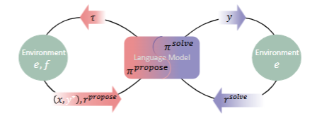
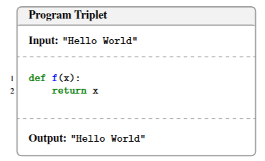
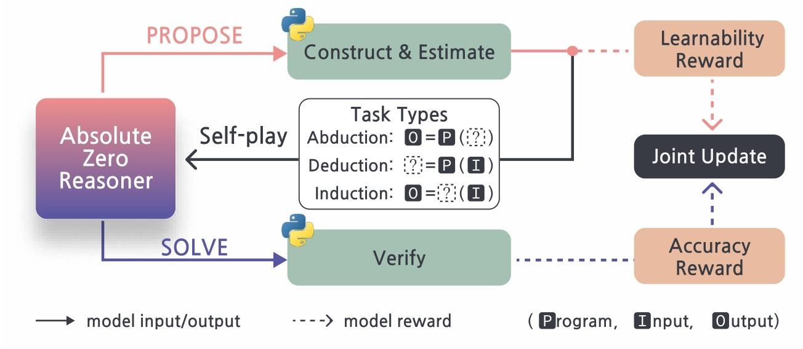
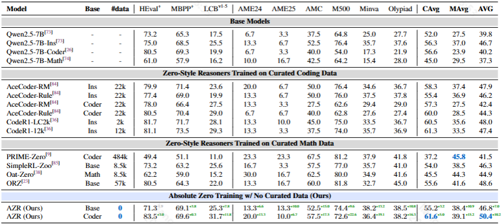

# RL没有人工标注数据怎么办？试试Abolute Zero吧！
这篇论文主要介绍了绝对零度范式和AZR模型，在无监督情况下进行训练，实现强大的推理能力，效果仅限在reasoning的benchmark上。好在代码都已开源，回头可以自己尝试一下。
[github链接](https://github.com/LeapLabTHU/Absolute-Zero-Reasoner)
[论文链接](https://arxiv.org/pdf/2505.03335)
## 研究背景
强化学习结合可验证奖励（RLVR）提升了大语言模型推理能力，但现有方法依赖人工策划的问答对，存在可扩展性瓶颈，且可能限制 AI 的自主学习。本文就这一问题展开研究，提出绝对零度范式和AZR模型，在无监督情况下实现强大的推理能力。

## 绝对零度
模型同时扮演提议者和解决者角色，通过自我对弈学习。提议者生成任务，解决者解决问题，根据环境反馈获得奖励并更新策略。

绝对零循环起始于智能体$\pi$ 提议任务$\tau$ 。任务$\tau$ 由函数f 结合环境e 进行转换，成为经过验证的问题 $(x, y^{\star})$ ，同时会产生一个衡量可学习性的奖励 $r_{propose}$ 。接着是标准的强化学习步骤：智能体通过生成y 来解决问题x ，并依据y 与 $y^{\star}$ 的匹配情况，从环境e 处获得奖励 $r_{solve}$ 。$\pi_{propose}$ （负责提议任务的策略）和 $\pi_{solve}$ （负责解决任务的策略）会进行联合训练 ，并且这个过程可以无限重复。在不断循环中，智能体通过自我生成任务、解决任务并基于奖励反馈学习，逐步提升自身的推理和解决问题能力，实现不依赖外部数据的自主学习和优化。

### 几个概念
- **提议者**：
负责生成任务，设计奖励函数鼓励生成有学习潜力的任务。
提议者根据变量 $z$ 对提议的任务进行采样，得到 $\tau ~ \pi_{\theta}^{propose }(\cdot | z)$ 。变量 $z$ 可被实例化为从不断更新的任务记忆中采样的一小部分过去的（任务，答案）对。这个采样得到的任务 $\tau$ 随后会与环境 $e$ 一起进行验证，并构建成一个有效的推理任务 $(x, y^{*}) ~ f_{e}(\cdot | \tau)$ ，其中 $x$ 是任务查询， $y^{*}$ 是黄金标签（正确答案）。
- **解决者**：
根据接收到的任务查询 $x$ 生成答案 $y ~ \pi_{\theta}^{solve }(\cdot | x)$ 。
- **奖励机制**：
    - **学习奖励**：每个提议的任务 $T$ 都会由一个学习奖励 $r_{e}^{propose }(\tau, \pi_{\theta})$ 进行评分，这个奖励反映了在基于任务查询 $x$ 进行训练后，模型 $\pi_{\theta}$ 预期的提升程度。 
    - **解决方案奖励**：解算器给出答案 $y$ 后，会因为对任务查询 $x$ 的回答而获得一个解决方案奖励 $r_{e}^{solve }(y, y^{*})$ ，环境会作为验证者来评估答案的正确性。 
    - **平衡系数**：非负系数 $\lambda$ 用于平衡探索新的、可学习的任务和提升模型推理及解决问题能力之间的权衡。较大的 $\lambda$ 更注重提升模型解决现有问题的能力，较小的 $\lambda$ 则更鼓励模型探索新的任务。
- **目标函数**：
绝对零设置的目标是通过优化模型参数 $\theta$ 来最大化目标函数 $\mathcal{J}(\theta)$ 。该目标函数是一个期望值的嵌套结构，外层期望是对变量 $z$ 按照分布 $p(z)$ 进行采样的期望，内层期望是在给定 $z$ 的情况下，对任务 $\tau$ 、推理任务 $(x, y^{*})$ 以及答案 $y$ 的联合期望。其数学表达式为：$$
\mathcal{J}(\theta):=max _{\theta} \mathbb{E}_{z \sim p(z)}\left[\mathbb{E}_{\left(x, y^{*}\right) \sim f_{c}(\cdot | \tau), \tau \sim \pi_{\theta}^{prov }(\cdot | z)}\left[r_{e}^{propose }\left(\tau, \pi_{\theta}\right)+\lambda \mathbb{E}_{y \sim \pi_{\theta}^{soe }(\cdot | x)}\left[r_{\epsilon}^{solve }\left(y, y^{*}\right)\right]\right]\right] . (3) $$

### AZR训练过程
具体步骤如下：
1. **任务提议（PROPOSE）阶段**：在每次迭代中，绝对零推理器会根据存储在缓冲区中的过去自我生成的三元组（程序、输入、输出）以及特定的三种任务类型（溯因、演绎或归纳）来提议一批任务。
举一个例子，下图中的IPO就分别代表了输入、程序和输出。
之后，利用Python对生成的任务进行筛选，确保程序的语法正确、安全且具有确定性，进而构建出有效的基于代码的推理问题。同时，为每个提议的任务计算一个学习奖励 $T_{propose }$ ，该奖励用于衡量任务对模型学习的潜在价值，奖励机制旨在鼓励模型生成难度适中、具有学习意义的任务。
2. **任务求解（SOLVE）阶段**：推理器在生成并筛选出有效任务后，开始对这批推理问题进行求解。求解完成后，再次使用Python来验证生成的回答。通过将模型的输出与正确答案进行比对，依据公式$$r_{solve }=\mathbb{I}_{\left(y=y^{*}\right)}, \quad$$
计算出准确率奖励 $T_{solve }$，以此评估模型回答的正确性。 
3. **模型更新阶段**：最后，绝对零推理器会利用任务相对REINFORCE++（TRR++）算法，结合 $T_{propose }$ 和 $T_{solve }$ 这两个奖励，对模型在所有三种任务类型上进行联合更新。TRR++算法通过为不同的任务 - 角色配置计算单独的基线，实现更结构化的方差减少，有助于模型更有效地学习和优化，以提升其在各种推理任务中的性能。 

## 实验
使用Qwen2.5 - 7B及其变体作为基础模型，在不同数据集上进行训练和评估。

**效果**：与其他零设置模型比较：AZR - Coder - 7B在多个基准测试中表现优异，超越了依赖人类专家数据的模型，高出1.8%。不同基础模型变体的影响：编码器变体整体性能更好，初始代码能力有助于提升推理能力。模型规模的影响：较大模型在分布内和分布外任务中表现更好，表现出更好的收益。

文章也尝试在Llama3.1 - 8B上进行实验，结果也有一定改进，但效果相对有限。
比较有意思的是文章观察到模型在提议和解决阶段有不同的响应模式，如提出多样化程序、中间规划等，同时也发现了一些潜在的安全问题。

消融实验也证明绝对零推理器中的任务类型（包括归纳、演绎等）以及提议者角色（包含其条件设定和训练过程 ）等各个组件，对于通用推理都至关重要，缺少任何一部分都可能损害模型的推理性能 。

## 总结
这篇论文确实让人感觉眼前一亮，在缺乏人工标注的情况下，采用“绝对零范式“竟然有效提升了模型推理能力，甚至实验效果比依赖人类专家数据的模型还好。不过论文使用的是参数规模较小的7B模型进行验证，且主要是在math和coder任务上进行比较，应该后续还能继续拓展。
