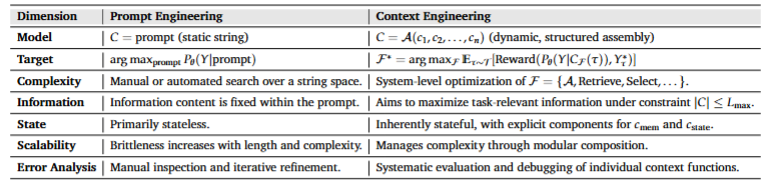
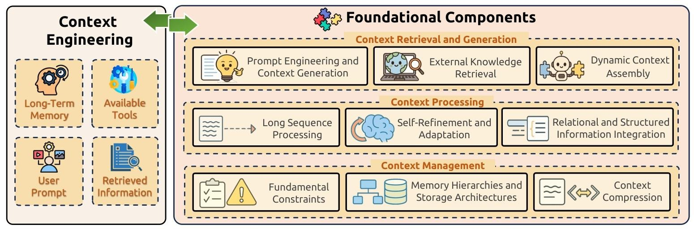
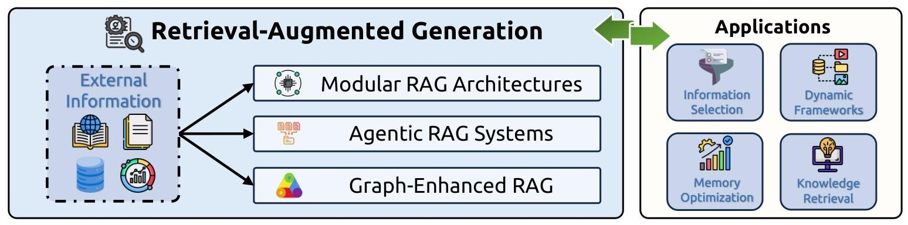
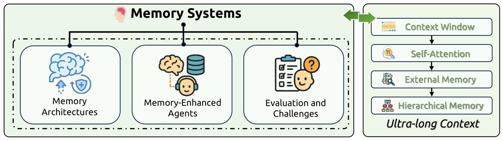
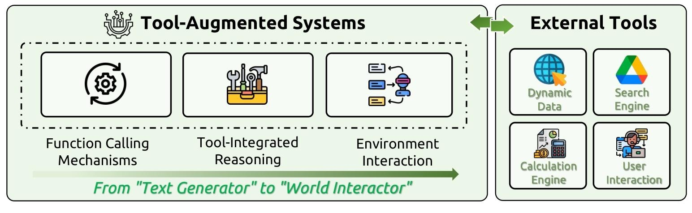
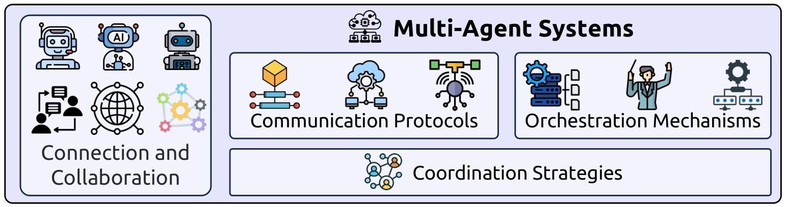

# 开发AI应用必看：Context Engineering综述

最近Context Engineering这个概念大火，由此有了这篇关于LLM的上下文工程的综述论文，详细说明了为什么上下文工程如此重要，有哪些基础组件，如何系统实现和进行评估，确定了总体挑战并规划了未来研究的有前景的方向。论文的github地址如下：https://github.com/Meirtz/Awesome-Context-Engineering

## 为什么需要语境工程
- **定义**：语境工程将语境Context重新概念化为动态结构化的信息组件集合 $ c_{1}, c_{2}, ..., c_{n}$ ，这些组件由一组函数进行来源、过滤和格式化，最终由高级组装函数A进行编排，即 $C=\mathcal{A}\left(c_{1}, c_{2}, ..., c_{n}\right)$。
- **当前局限性**：LLMs面临计算约束（自注意力机制随序列长度增加带来二次计算和内存开销）、可靠性问题（频繁幻觉、对输入语境不忠实等）、传统提示工程方法主观且局限于任务特定优化，难以应对复杂场景。
- **性能增强**：通过检索增强生成和叠加提示等技术实现显著性能提升，思维链技术使复杂推理成为可能；还有比如领域特定的语境工程在专业应用中特别有价值。
- **未来潜力**：通过语境学习实现灵活适应机制，为细致的语言理解和生成能力奠定基础，无需重新训练模型，未来在chain-of-thought增强等方面有很大潜力。
### 和提示词工程有什么区别？
语境工程和提示词工程最大的区别就在于提示词是一个单一的静态的文本，而语境工程则是动态结构化的信息组件结合，提示词工程是找到最优提示词，而语境工程是找到理想的语境生成函数集 $\mathcal{F}$。从复杂性，信息内容处理方式，可扩展性等方面语境工程都要强得多。

## 基础组件
下图是语境工程的大致框架：

语境工程建立在三个主要组件上，分别是：context Retrieval and Generation(语境检索及生成，负责外部知识检索和动态语境组装来获取合适的语境信息)，Context Processing（语境处理，负责转换和优化所获取的信息）和Context Management（语境管理负责语境信息的高效组织和利用）。以下是论文总结的详细的组件与内容：
| 组件 | 子类别 | 关键内容 |
| --- | --- | --- |
| 语境检索与生成 | 提示工程与语境生成 | 基于CLEAR框架（简洁性、逻辑性、明确性、适应性和反思性）；包含零样本和少样本学习范式、Chain-of-Thought基础、认知架构集成等 |
|  | 外部知识检索 | 包括RAG基础、知识图谱集成和结构化检索、智能体和模块化检索系统等，如Self-RAG引入自适应检索机制 |
|  | 动态语境组装 | 涉及组装函数和编排机制、多组件集成策略、自动组装优化等，如自动提示工程解决手动优化限制 |
| 语境处理 | 长序列处理 | 面临 transformer 自注意力\(O(n^{2})\)复杂性等计算挑战；有架构创新（如SSMs、Dilated attention等）、位置插值和语境扩展、优化技术（如GQA、FlashAttention等）、内存管理和语境压缩等方法 |
|  | 语境自我优化与适应 | 基础框架有Self-Refine、Reflexion等；涉及元学习和自主进化，如SELF教LLMs元技能；还有长Chain-of-Thought和高级推理 |
|  | 多模态语境 | 基础技术是将视觉输入转换为离散令牌等；有高级集成策略；面临模态偏差和推理缺陷等核心挑战；具备语境学习等高级能力，应用广泛 |
|  | 关系型和结构化语境 | 由于文本输入要求和序列架构限制，LLMs处理相关数据有困难；有知识图谱嵌入和神经集成、 verbalization 和结构化数据表示、集成框架和协同方法等解决途径；在多个方面增强LLMs能力，应用广泛 |
| 语境管理 | 基本约束 | 面临有限语境窗口大小、“中间迷失”现象、LLMs本质上独立处理每个交互等约束 |
|  | 记忆层次结构和存储架构 | 有OS启发的层次记忆系统、动态记忆组织、架构适应、系统配置等 |
|  | 语境压缩 | 有自动编码器基压缩、记忆增强方法、层次缓存系统、多智能体分布式处理等技术 |
|  | 应用 | 应用于文档处理和分析、扩展推理能力、协作和多智能体系统、增强会话接口、记忆增强应用等领域 |

## 系统实现
- **检索增强生成（RAG）**
  - 模块化RAG架构：从线性检索-生成架构转向具有灵活组件交互的可重构框架，有正式表示和当代框架等。
  - 智能体RAG系统：将自主AI智能体嵌入RAG管道，有实现范式、核心能力、自我反思和适应机制等。
  - 图增强RAG：从面向文档的方法转向捕获实体关系等的结构化知识表示，有知识图谱作为基础表示、图神经网络增强RAG系统、多跳推理能力、著名架构等。
  - 应用：涉及实时RAG系统、动态检索机制、低延迟检索方法、可扩展性解决方案等。

- **记忆系统**
  - 记忆架构：记忆将复杂语言系统与模式匹配模型区分开来，有记忆分类框架、短期记忆机制、长期记忆实现、记忆访问模式和结构等。
  - 记忆增强智能体：记忆系统从无状态模式处理器转变为复杂智能体，有智能体架构集成、现实世界应用、记忆技术和集成方法等。
  - 评估和挑战：记忆评估框架是智能系统多维度评估的关键部分，有评估框架和指标、当前局限性和挑战、优化策略和未来研究方向等。

- **工具集成推理**
  - 函数调用机制：通过结构化输出生成，将LLMs从生成模型转变为交互智能体，有发展历程、技术实现、训练方法和数据系统、专门基准等。
  - 工具集成推理（TIR）：是LLMs能力的重大进步，解决了LLMs的基本局限性，有TIR方法学的演变、实现框架和范式等。
  - 智能体-环境交互：强化学习方法成为工具集成的优越替代方案，有搜索增强推理系统、多轮和可定制工具调用框架、评估和应用等。

- **多智能体系统**
  - 通信协议：智能体通信系统源于20世纪90年代初的知识共享工作，有当代协议生态系统、LLM增强通信框架等。
  - 编排机制：是多智能体系统的关键协调基础设施，有当代编排策略、新兴编排范式、语境管理和环境适应等。
  - 协调策略：多智能体编排在维护复杂工作流的事务完整性方面面临重大挑战，有多智能体编排的挑战、应用和性能影响等。

## 评估
- **评估框架和方法**
  - 组件级评估：对各个组件进行内在评估，如提示工程组件、长语境处理、自我语境化机制、结构化和关系数据集成的评估。
  - 系统级集成评估：通过全面的基准测试衡量下游任务的端到端性能，如RAG、记忆系统、工具集成推理系统、多智能体系统的评估。

- **基准数据集和评估范式**
  - 基础组件基准：如长语境处理、结构化和关系数据集成的基准。
  - 系统实现基准：如RAG、工具集成推理系统、Web智能体、多智能体系统的基准。

- **评估挑战和新兴范式**
  - 方法学局限性和偏差：传统评估指标不足以捕捉语境工程系统的细微、动态行为。
  - 新兴评估范式：如自我优化评估范式、多方面反馈评估、批评引导评估、编排评估框架。
  - 安全性和鲁棒性评估：包括安全性导向评估、鲁棒性评估、对齐评估。

## 总结
作为一篇综述性论文，首先明确定义了什么是语境工程和其重要性，非常全面的总结了目前为止，所有和语境工程相关的理论、方法、基准测试和评估框架。对于想要开发一个AI应用时，在综合性提升效果和体验的工程化上有很高的参考价值。
