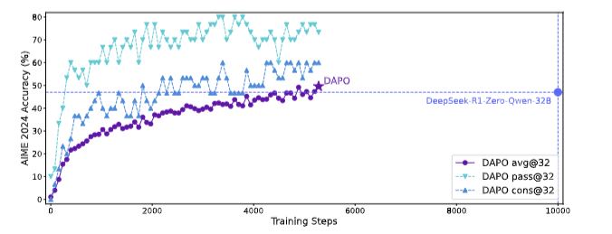
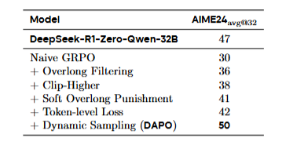

# DAPO又一个强化学习的优化算法
最近，字节豆包团队提出了名为DAPO的新强化学习优化算法， 该算法通过解耦clip范围和动态采样等优化策略，有效提升了长CoT RL场景的性能。这个算法和deepseek的GRPO又有什么区别呢？

## 1 研究背景
大规模强化学习（RL）能赋予大语言模型（LLMs）复杂推理能力，但当前先进推理LLMs的RL训练关键技术细节未公开，社区难以复现结果。研究人员在使用Qwen2.5-32B模型进行初始GRPO训练时效果不佳，发现存在熵坍缩、奖励噪声和训练不稳定等问题。

## 2 DAPO算法
- 提出DAPO算法，通过解耦剪辑范围和动态采样等优化策略。其关键技术包括Clip-Higher、Dynamic Sampling、Token-Level Policy Gradient Loss和Overlong Reward Shaping，分别解决熵坍缩、梯度下降、样本级损失计算缺陷和奖励噪声等问题。
- 对数据集进行转换，从网站收集数学数据并转化为便于解析的整数形式，得到DAPO-Math-17K数据集。
### 2.1 Clip-Higher
所谓的Clip-Higher策略是指将clip范围解耦为下限ε_low和上限ε_high。通过增加ε_high的值，为低概率token的概率提升留出更多空间，从而提升策略的entropy，使模型能够生成更多样化的样本；同时保持ε_low相对较小，避免过度增加它导致低概率令牌概率被抑制至 0，造成采样空间崩溃。
### 2.2 Dynamic Sampling
- 动态采样策略（Dynamic Sampling）就是对提示进行过采样，并过滤掉准确率为1和0的提示。在训练前持续采样，直至批次中充满准确率既不为0也不为1的样本，保证每个批次中提示的有效梯度数量一致。
- 和GRPO对比：GRPO当特定提示的所有输出都正确且获得相同奖励1时，该组的优势为零，这会导致GRPO策略更新没有梯度，降低样本效率。
使用动态采样策略后效果优秀，见下图：

### 2.3 Token-Level Policy Gradient Loss
- 在计算损失时，不再对每个样本内的损失进行平均后再聚合，而是直接考虑每个token对整体梯度更新的贡献。这样，较长序列相比于较短序列，对整体梯度更新的影响更大。从单个token角度看，无论其所在响应长度如何，只要其生成模式会导致奖励增加或减少，都会受到相应的激励或抑制。具体的损失函数如下：

- 相比GRPO：GRPO采用样本级损失计算方式，即先在每个样本内按标记平均损失，再聚合不同样本的损失。在这种方式下，所有样本在最终损失计算中被赋予相同权重。然而，在长 CoT强化学习场景中，这种计算方式存在弊端。显然，DAPO采用的损失计算方式更加合理，因为它考虑了每个token对整体梯度更新的贡献。
### 2.4Overlong Reward Shaping
针对强化学习时超长的生成样本提出的一种惩罚机制，当响应长度超过预定义的最大值时，定义一个惩罚区间。在这个区间内，响应越长，受到的惩罚越大。该惩罚会添加到基于规则的正确性奖励上，以此使模型避免生成过长的响应。惩罚函数见如下：

## 3 实验
- 以数学任务评估算法，采用verl框架，以朴素GRPO为基线，设置一系列超参数。
- 实验结果显示，DAPO训练的Qwen-32B基础模型在AIME 2024上表现优于DeepSeek的GRPO方法（DAPO达到了50分高于GRPO的30分）。且仅用了其50%的训练步数。
- 研究还分析了各技术的贡献，明显动态采样带来的加成最为明显

## 4 结论
豆包开源了包括算法、代码和数据集,以及在Verl上的实现，提出的DAPO算法及关键技术有效提升了长CoT RL场景的性能。个人感觉在GRPO的基础上在一些细节上有了更大的改进，算是锦上添花了，在Verl这个RL框架上的实现还是好评的，可以直接上手尝试了。