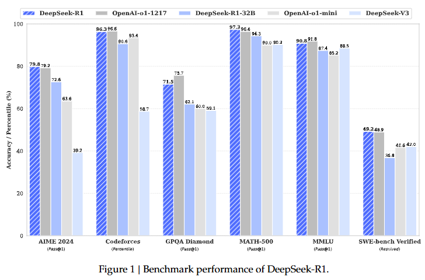
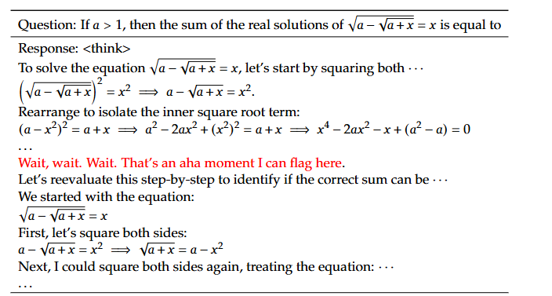
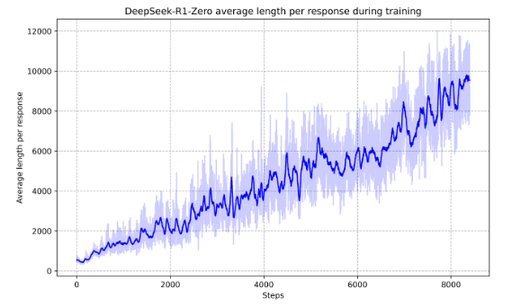
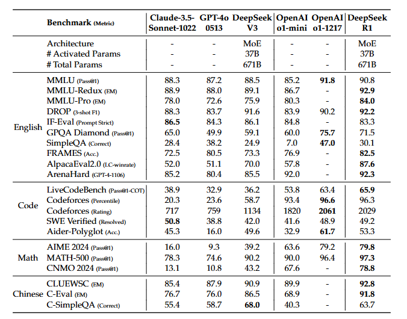
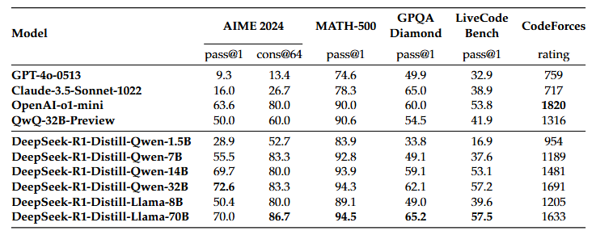

# DeepSeek-R1来啦，这篇技术报告必须得看！

先上[链接](https://arxiv.org/abs/2501.12948)，[github链接](https://github.com/deepseek-ai/DeepSeek-R1)。DeepSeek出品必属精品，赶紧来看看这篇技术报告吧。  
**效果省流版**：

## 研究方法
报告主要介绍了DeepSeek-R1和DeepSeek-R1-Zero两个模型，以及DeepSeek-R1的蒸馏。
### DeepSeek-R1-Zero：  
直接对基础模型应用 RL，不依赖监督微调（SFT），证明了LLM可以在不预先进行SFT的情况下，直接使用大规模强化学习显著提高模型的推理能力。
- 采用分组相对策略优化（GRPO）算法，所谓GPRO策略优化主要是为了节省RL的训练成本，它放弃了critic模型直接从群体分数中去估计baseline。
- 基于规则的奖励系统，包括准确性奖励和格式奖励。
- 训练模板比较有意思，它会要求模型首先生成一个推理过程并放在<think>和</think>之间，然后才是最终答案。
- 论文也提到在实验中会有一个比较有趣的现象叫做"顿悟"的过程,也就是说在模型训练的中间版本中，它会通过重新评估方法，学会为问题分配更多的思考时间。正如图下这个例子中红色字"wait,wait"：
- 当然在RL过程中，模型在训练集上的响应时间也会随着训练的进行而增加，DeepSeek-R1-Zero自然而然就学会了用更多的时间来解决推理任务。
### DeepSeek-R1：  
为解决 DeepSeek-R1-Zero的可读性和语言混合问题，采用冷启动数据和多阶段训练。
- 冷启动阶段收集长思维链数据微调模型,有两个好处：1、增加输出的可读性。2、性能更好。
- 推理导向的RL阶段增强推理能力，引入语言一致性奖励减少语言混合；
- 拒绝采样和SFT阶段收集不同领域数据微调模型；对于推理任务，为了防止模型输出有时混乱，过滤掉了混合语言、长释义和代码块的思维链。对于非推理任务，调用DeepSeek-V3来生成一个潜在的思维链，然后再通过提示来回答问题。
- 所有场景的RL阶段进一步使模型符合人类偏好。
- 蒸馏：  
使用 DeepSeek-R1 生成的 800k 样本对Qwen和Llama等开源模型进行微调，将推理能力从大模型蒸馏到小模型，提升小模型的推理能力。

## 实验评估
评估基准：使用 MMLU、MATH-500、Codeforces 等多种基准测试，涵盖知识、推理、编码等多个领域。
对比基线：与DeepSeek-V3、Claude-Sonnet-3.5-1022、GPT-4o-0513 等多个强基线模型进行比较。

从表中也可以看到DeepSeek-R1 在推理任务上表现出色，在AIME 2024上Pass@1 得分达到79.8%，略超 OpenAI-o1-1217；在MATH-500上得分97.3%，与OpenAI-o1-1217相当。

蒸馏后的小模型也取得了优异成绩，如 DeepSeek-R1-Distill-Qwen-7B在AIME 2024上得分55.5%，超过QwQ-32B-Preview。
## 总结
没想到强化学习也是遵循大力出奇迹的真理，仅仅通过RL就实现了强大的推理能力。还有一个比较大的亮点是蒸馏小模型也是效果显著。但是小模型不蒸馏，直接上强化学习，需要很大算力，效果反而不如蒸馏的好。DeepSeek总能带来新思路呢。

