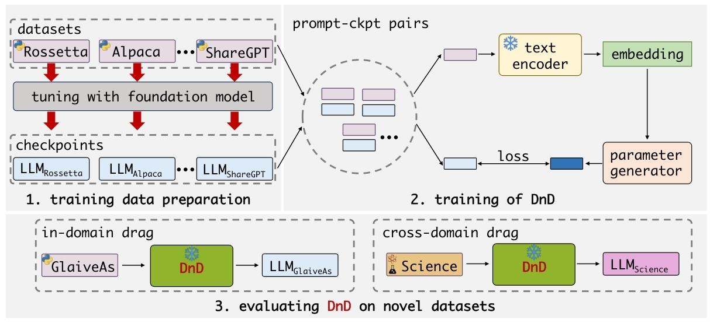
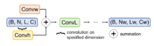
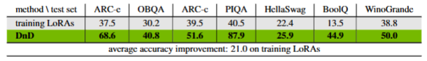
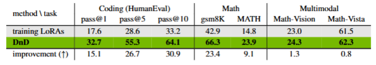

# Drag and Drop: 比lora训练还快还准确的微调方法

## 背景与目标
目前最常用的参数高效微调（PEFT）方法应该就是LoRA了吧。虽然LoRA确实大幅降低了微调大语言模型的成本，但每个下游数据集仍需单独优化运行，计算开销还是有的。哪怕使用LoRA适配最轻的0.5B参数Qwen2.5仍需运行半天。那还能怎么优化呢？这篇"Drag and Drop"的论文提出了一个非常大胆的想法，将LoRA适配器视为训练数据的函数，直接学习从提示到权重的映射，绕过梯度下降。

## DnD方法概述
DnD（Drag-and-Drop LLMs）方法通过创新的训练流程和核心架构，实现大语言模型（LLMs）的高效、零样本任务适配。该方法的训练流程主要包括数据准备、提示嵌入和参数生成与训练这三个关键步骤；核心架构则由轻量级文本编码器和级联超卷积解码器构成。

众所周知，LoRA微调的优化目标是 $\min_{A,B} \mathcal{L}(W_0 + BA, \mathcal{D})$。简单来说，**DnD方法旨在直接生成LoRA的权重更新量** $BA$，通过训练一个参数生成器，将任务提示直接映射到 $BA$，使得权重生成仅需**前向传播**（秒级），而非迭代优化（小时级），确实是一个开脑洞的方法。
### 训练流程
- **数据准备**：收集多种数据集上训练的LoRA适配器检查点，这些检查点来自不同任务的模型训练结果，为DnD提供多样化的监督信号。从各数据集抽取提示批次，这些提示包含数据集特定特征，是数据集（任务）的“代表”。将提示批次与相应检查点随机配对，形成“提示 - 参数”对，作为DnD的训练数据，建立数据 - 参数映射关系 。
- **提示嵌入**：运用轻量级文本编码器（如Sentence-BERT ）处理提示批次，将其转换为条件嵌入。编码器从文本中提取语义特征，生成紧凑且能反映任务核心特征的嵌入向量，为后续参数生成提供关键输入。
- **参数生成与训练**：把条件嵌入输入由级联卷积块组成的参数生成器（超卷积解码器）。参数生成器的结构如下图：

生成器通过多层卷积操作对嵌入进行特征提取与融合，输出预测的模型权重。计算生成权重与原始标记化检查点权重的均方误差（MSE），以MSE损失为优化目标，调整生成器参数，使生成权重接近真实LoRA权重。
### 核心架构
- **轻量级文本编码器**：选择轻量级结构，保证高效处理提示文本。以Sentence-BERT为例，其基于预训练语言模型，能有效抽取文本语义，将长文本浓缩为低维向量，保留关键信息，减少计算开销，快速为参数生成提供合适的条件嵌入 。
- **级联超卷积解码器**：由多个超卷积块级联而成，每个超卷积块含三个超卷积模块，分别在宽度卷积（如融合词汇概念特征 ）、高度卷积（理解文本位置关系）和层间卷积（保证权重协调性）维度处理数据。模块间协同工作，逐步将低维条件嵌入“放大”为高维、适配任务的LoRA权重矩阵，通过卷积操作挖掘权重矩阵结构，实现从提示到权重的有效映射 。 

## 实验验证
赶紧看看相比LoRA微调的效果如何，论文给出的图片如下：

1. **常识推理任务**：
    - **数据集**：ARC-e、OBQA、PIQA等7个数据集。
    - **结果**：DnD平均准确率比训练LoRA高21%，如在ARC-e上从37.5%提升至68.6%。
2. **编码与数学任务**：
    - **编码**：在HumanEval基准上，pass@1从17.6%提升至32.7%，提升15.1%。
    - **数学**：gsm8K准确率从42.9%提升至66.3%，提升23.4%。
3. **多模态与跨域场景**：
    - **多模态**：Math-Vision准确率从23.0%提升至24.3%。
    - **跨域**：从常识推理到科学任务，准确率从35.6%提升至45.3%，提升8.7%。
4. **效率对比**：
    - DnD生成参数仅需秒级，比全量微调开销降低12,000倍。
    - 与基础模型对比，如在ARC-c上超越Qwen2.5-0.5B的38.3%至51.6%。

## 结论
这篇论文确实给出了一种快速迁移LoRA和数据集pair关系到新的定制模型的方法，想法非常新颖。跳过了“数据→梯度→权重”的传统循环，直接通过生成模型实现权重定制，既然我们只是要LoRA的那个adapter，那不如直接生成这个LoRA的adapter。论文的code暂时还未放出来，不过这方法在需要快速适配多任务、数据标注成本高或实时响应的场景中，一定有其用武之地。
