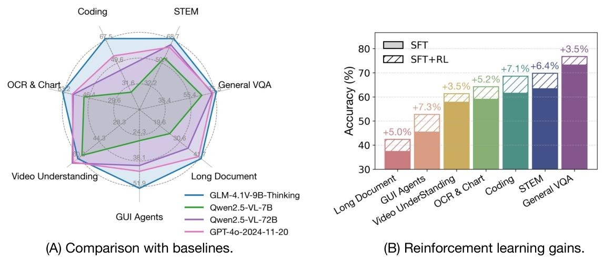
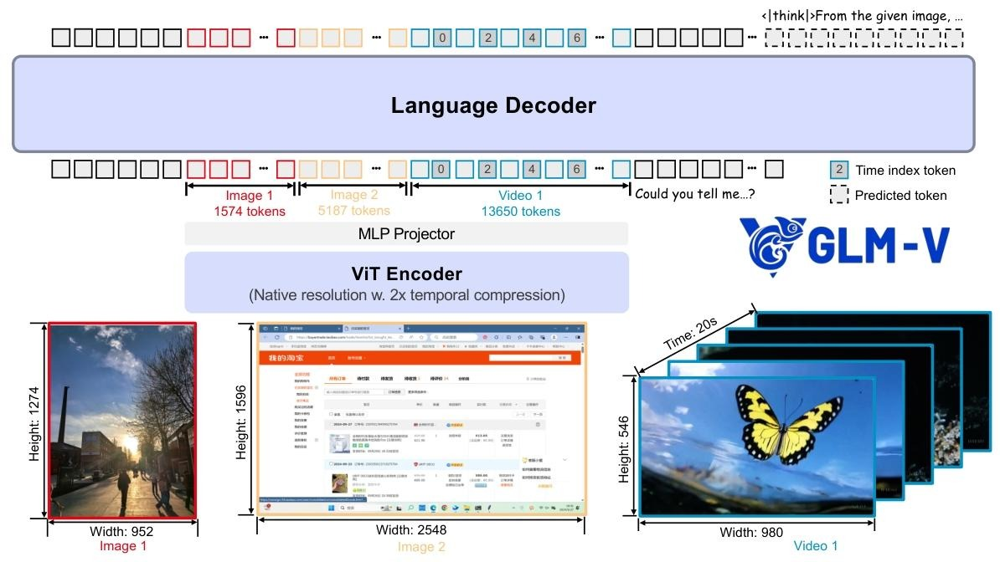
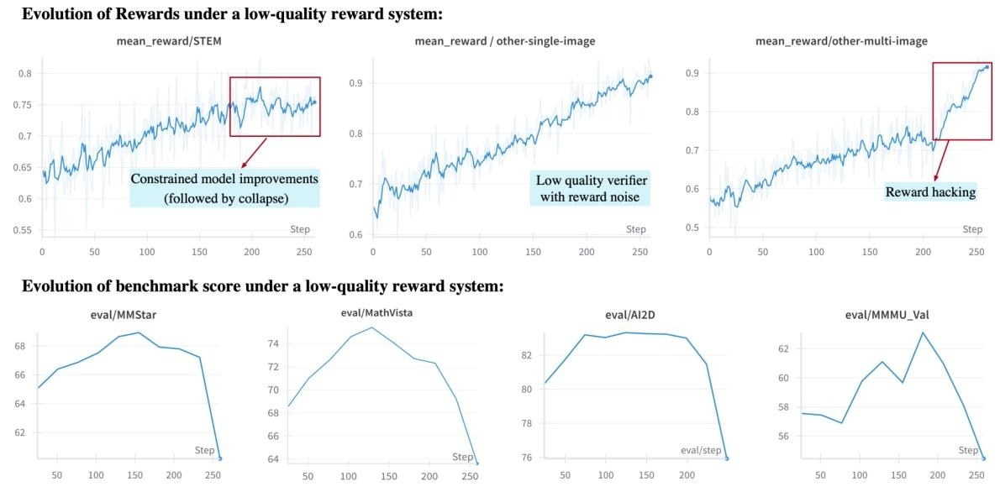
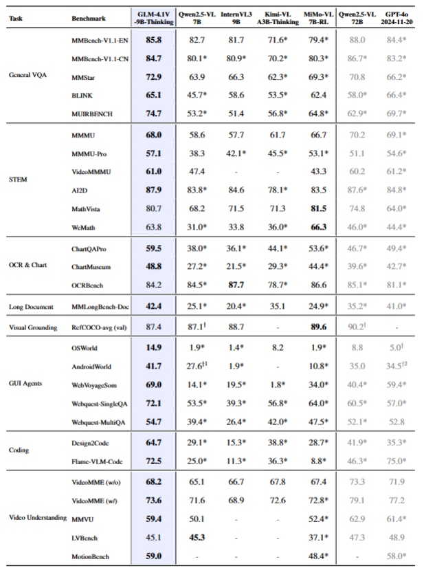

# VL大模型也有思考能力：GLM-4.1V-Thinking技术报告

智谱AI开源新模型啦，视觉语言模型GLM-4.1V-Thinking，其通用多模态理解与推理能力非常强大。主要得益于本文提出的RLCS强化学习方法（Reinforcement Learning with Curriculum Sampling），实现了跨领域任务的综合提升。

## 技术框架与创新点
### 架构设计
- **三组件结构**：

ViT编码器:对于图像，直接通过 Vision Transformer（ViT）结构提取视觉特征；对于视频，采用3D卷积替换2D卷积，实现时间维度的下采样（压缩比例为2倍），既能保留时序信息，又能提升计算效率。
MLP Projector: 将ViT编码器输出的视觉特征映射到语言模型的token空间，实现视觉与语言特征的对齐。其结构就是一个多层感知机。
LLM解码器：处理融合后的多模态token，并生成最终的文本输出（如回答、推理过程）。
- **细节**：在ViT编码器中视频输入还使用了时间索引token放在每帧视频token之后，显式编码帧的时间戳和时序距离（如 “第 0 帧”“第 2 帧” 等），帮助模型理解动态内容的时间逻辑，提升视频理解能力（如动作序列、事件时序推理）。
- **支持任意图像分辨率和宽高比**
融入了2D-RoPE（旋转位置编码）技术，让模型能够有效处理具有极端宽高比（比如超过200:1）或者高分辨率（超过4K）的图像。对于一个被划分为 $H_p\times W_p$ 个补丁的输入图像，每个补丁的整数坐标 $g=(w, h)$ 首先会被归一化到[-1, 1]的连续网格gnorm中，具体计算公式如下：
$$ g_{norm }=\left(w_{norm }, h_{norm }\right)=2 \cdot\left(\frac{w+0.5}{W_{p}}, \frac{h+0.5}{H_{p}}\right)-1 $$

### 预训练策略
- **数据构成**：10亿级图像-文本对覆盖学术图表、自然场景、OCR数据、 grounding数据、视频文本等。视频文本对数据：整合学术、网页视频，通过人工标注补充动作细节、镜头运动等叙事信息，过滤重复内容。对于网页数据通过CLIP相关性筛选语义相关的图文对，剔除广告、低信息密度内容。
- **数据清洗**：训练专用模型迭代优化 caption，去除噪声并保留事实知识
- **预训练**： 分为多模态和长上下文持续训练阶段。多模态预训练阶段训练步数：12 万步，2 路张量并行，全局批量大小1536，序列长度：8192，采用数据打包策略（拼接多样本至最大长度）提升计算效率。长上下文序列长度提升至 32768，支持4K图像及超长视频帧序列。
### 强化学习优化
- **奖励系统**：采用了多领域统一的架构，支持格式校验，答案提取等通用功能。在特定域，比如数学会用sympy进行数值匹配（可以容忍计算误差），OCR任务用编辑距离计算准确率， grounding任务通过IoU（交并比）评估定位精度。同时，还使用特殊token：<|begin_of_box|>标记最终答案，避免LLM提取错误，对格式错误（如混合语言、重复文本）施加惩罚，确保输出规范性，防止reward hacking。
- **RLCS框架**：这里的CS是Curriculum Sampling课程采样的意思，分为两种。一种是离线分级，基于预训练模型性能标注样本难度。还有一种是在线调整，实时评估模型表现，动态提高“中等难度”样本比例（模型在此区间学习效率最高），降低过易/过难样本占比。论文在提高训练效率方面也做了一些尝试，使用动态采样扩展，用EMA计算oversampling比例，优先选择正误分布均衡的样本，避免无效梯度。移除了KL散度的损失，提高重要性采样比率的上截断边界都能有效提高模型的能力上界。
本文还有一点创新是通过添加特殊token<|end_of_solution|>强制模型作出回答，避免长推理被截断导致的零奖励偏差，这一方法有助于在测试时动态控制思考长度。
下图是reward-hacking的验证：

## 性能评估与对比
1. **基准测试覆盖**：28个基准，包括General VQA、STEM、OCR&Chart、长文档等8大类别。
2. **关键结论**
    - 超越Qwen2.5-VL-7B几乎所有任务，在MMMU-Pro、ChartMuseum等任务领先超10分。
    - 18个基准性能优于或媲美72B参数的Qwen2.5-VL-72B，如AI2D得分87.9 vs 87.6。
    - 闭源模型对比：在MMStar、MathVista等任务超越GPT-4o。 

详细得分可以参考下表：

## 总结
这次的GLM-4.1V-Thinking的能力还是非常惊艳的，在多个指标上遥遥领先了Qwen2.5-VL。主要得益于使用thinking的强化学习大大提升了多模态模型的能力上界。在强化学习的一些创新点也是值得学习的，无论是奖励系统的设计还是数据采样的创新。估计Qwen3的VL模型也快出来了吧，到时候再比较一下。
