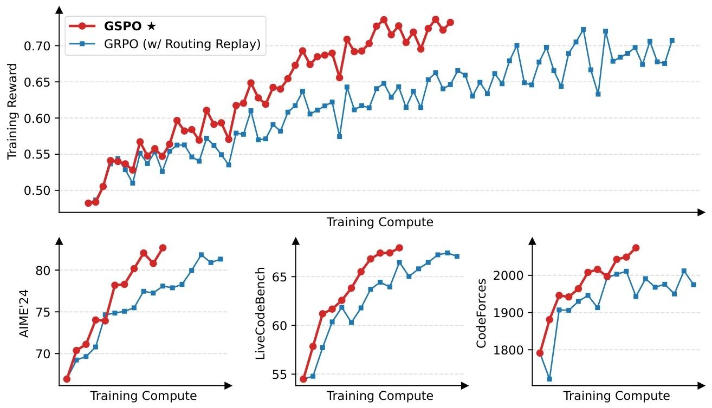
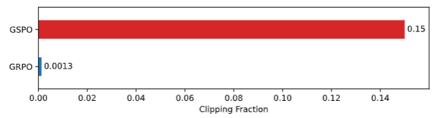

# 针对MOE模型强化学习的优化策略GSPO详解

近日，千问团队又提出了一个新的强化学习算法GSPO，它在稳定性，效率和性能上显著优于GRPO，和采用token级别重要性比率的算法不同，GSPO是采用了基于序列似然定义重要性比率，并执行序列级别的裁剪，奖励和优化。

## 背景
目前最为流行的GRPO算法在训练大参数量的模型时存在严重的稳定性问题。GRPO的不稳定性原因就在于其重要性采样权重的方式会造成高方差的训练噪声，且随着响应长度的增加而逐渐累积，再加上裁剪机制的放大作用，最终导致模型崩溃。因此针对这一问题，本文提出了GSPO算法，其关键创新就是基于序列似然从理论上定义重要性，而且其归一化奖励计算为对同一查询的多个response的优势，确保序列级奖励和优化的一致性。

## GSPO具体详解
GSPO（Group Sequence Policy Optimization）是一种用于训练大型语言模型的强化学习算法，旨在解决传统算法在训练过程中的稳定性、效率和性能问题。
- **基于序列似然定义重要性比率**：
以往算法多采用token级重要性比率，而GSPO基于序列似然定义重要性比率，公式为
 $ s_{i}(\theta)=(\frac{\pi_{\theta}(y_{i}|x)}{\pi_{\theta_{old}}(y_{i}|x)})^{\frac{1}{|y_{i}|}} = exp(\frac{1}{|y_{i}|}\sum_{t = 1}^{|y_{i}|}log\frac{\pi_{\theta}(y_{i,t}|x,y_{i,<t})}{\pi_{\theta_{old}}(y_{i,t}|x,y_{i,<t})}) $。
这反映了从旧策略 $ \pi_{\theta_{old}}(\cdot|x) $ 采样的响应与当前策略 $ \pi_{\theta}(\cdot|x) $ 的偏差程度，与序列级奖励自然契合，也能为裁剪机制提供有效指示，回忆一下GRPO的重要性比率，token级别的重要性权重基于单个样本去进行clip，无法有效校正分布差异。
    - **序列级操作**：对整个response进行裁剪，而非像传统算法那样对单个token裁剪，使裁剪、奖励和优化都在序列级别进行，更好地匹配序列级别的奖励机制，避免引入高方差噪声。
**优化目标**：采用的序列级优化目标为 
$ \mathcal{J}_{GSPO}(\theta)=\mathbb{E}_{x \sim \mathcal{D},\{y_{i}\}_{i = 1}^{G} \sim \pi_{\theta_{old}}(\cdot | x)}[\frac{1}{G}\sum_{i = 1}^{G}min(s_{i}(\theta)\hat{A}_{i}, clip(s_{i}(\theta), 1 - \varepsilon, 1 + \varepsilon)\hat{A}_{i})] $。
其中，$ \hat{A}_{i}=\frac{r(x,y_{i}) - mean(\{r(x,y_{i})\}_{i = 1}^{G})}{std(\{r(x,y_{i})\}_{i = 1}^{G})} $ 是基于组的优势估计，通过这样的设计，能更合理地评估和优化策略。
**梯度分析**：GSPO目标的梯度为 
$ \nabla_{\theta}\mathcal{J}_{GSPO}(\theta)=\mathbb{E}_{x \sim \mathcal{D},\{y_{i}\}_{i = 1}^{G} \sim \pi_{\theta_{old}}(\cdot | x)}[\frac{1}{G}\sum_{i = 1}^{G}(\frac{\pi_{\theta}(y_{i}|x)}{\pi_{\theta_{old}}(y_{i}|x)})^{\frac{1}{|y_{i}|}}\hat{A}_{i} \cdot \frac{1}{|y_{i}|}\sum_{t = 1}^{|y_{i}|}] $ （省略了裁剪部分）。GRPO中token根据各自“重要性权重”加权，权重差异大且影响会累积，导致不稳定；而GSPO对响应中的所有token同等加权，消除了这种不稳定因素。
**GSPO - token变体**：在多轮RL等场景下，为实现更细粒度的token级优势调整，引入GSPO - token。其优化目标为 $ \mathcal{J}_{GSPO - token}(\theta)=\mathbb{E}_{x \sim \mathcal{D},\{y_{i}\}_{i = 1}^{G} \sim \pi_{\theta_{old}}(\cdot | x)}[\frac{1}{G}\sum_{i = 1}^{G}\frac{1}{|y_{i}|}\sum_{t = 1}^{|y_{i}|}min(s_{i,t}(\theta)\hat{A}_{i,t}, clip(s_{i,t}(\theta), 1 - \varepsilon, 1 + \varepsilon)\hat{A}_{i,t})] $  ，其中 $ s_{i,t}(\theta)=sg[s_{i}(\theta)] \cdot \frac{\pi_{\theta}(y_{i,t}|x,y_{i,<t})}{sg[\pi_{\theta}(y_{i,t}|x,y_{i,t})]} $ 。当将响应中所有token的优势设为相同值时，GSPO - token在优化目标、裁剪条件和理论梯度上与GSPO相同，但它具有更高的token级优势调整灵活性。 

## 实验
论文也通过实验来论证GSPO的优势，实验基于从Qwen3-30B-A3B-Base微调的冷启动模型展开，主要对比了GSPO与GRPO算法在训练效果上的差异，并评估了GSPO在实际应用中的表现。
- **实验设置**：以GRPO算法作为基准，对其进行了精心调优以确保公平比较。需要注意的是，GRPO为了使混合专家（MoE）模型的强化学习训练正常收敛，必须采用Routing Replay训练策略，而GSPO则无需这一策略。

- **GSPO的优势体现**：
  - **训练稳定性和效率**：如下图所示:
    GSPO的训练过程始终保持稳定，能够通过增加训练计算量、定期更新查询集和延长生成长度来实现性能的持续提升，而且GSPO的训练效率显著优于GRPO，在相同的训练计算量和消耗的查询下，能达到更高的训练准确率和基准测试性能，在多个任务上表现均由于GRPO。
  - **clip比较**：GSPO对比GRPO的一个关键区别是其对整个response进行裁剪，而非单个token，这使得GSPO的裁剪的token数量如下图所示明显更多，但是GSPO却实现了比GRPO更高的训练效率，这是一个很反常识的现象。合理的解释应该是GRPO的梯度估计本质上有噪声，导致样本利用效率低下，而GSPO序列级提供个更准确的信号方向。
  - **Routing Replay**: 由于MoE模型有多个专家网络，其稀疏激活的特性决定了在强化学习过程中必然会造成波动性而导致无法正常收敛。因此，一般如GRPO算法在训练MoE模型时必须采用路由重放(Routing Replay)，使得每个token在新旧策略中使用相同的激活专家网络，确保梯度更新时对同一网络的优化。而GSPO不存在这个问题，仅关注序列级别重要性比率，对单个token不敏感，不会剧烈波动，仅简化和稳定了训练过程，还能让模型在不受人为约束的情况下充分发挥其能力

## 总结
本文提出GSPO，其基于序列似然定义重要性比率并执行序列级操作，在稳定性效率和性能上都非常出色，尤其对MoE模型训练有显著优势。Qwen3的性能提升也离不开此算法，目前应该还没有集成到各强化学习框架中去，需要自己去复现一下看看实际效果。
