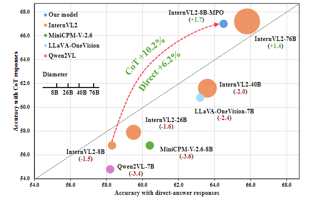

# InternVL2通过MPO增强多模态大模型的推理能力，效果极佳
首先放上[论文链接](https://arxiv.org/abs/2411.10442)  
最近，上海人工智能实验室又出新的多模态大模型啦--InternVL2-8B-MPO。这个模型的重点就在**MPO**（Mixed Preference Optimization)，即通过混合偏好优化过程来增强多模态大语言模型的推理能力，包括设计自动化偏好数据构建管道创建数据集。  
**效果**非常不错：InternVL2-8B-MPO在MathVista上达到了67.0%的准确率，比InternVL2-8B高出8.7个百分点，并且性能与大10倍的InternVL2-76B相当。

## 研究背景与动机
- 现有开源MLLMs虽在各领域有不错表现，但推理能力有限，如在多模态推理基准测试中，使用思维链（CoT）推理时性能下降，主要归因于监督微调（SFT）损失导致的分布偏移。
- 利用偏好优化（PO）技术增强 MLLMs 推理能力面临多模态推理偏好数据有限且标注成本高、缺乏开源方法等挑战。
## 本文创新点
### 1.构建大规模多模态偏好数据集（MMPR）
- 数据引擎：每个样本含**图像**、**指令**、**被选响应**和**拒绝的响应**。图像和指令就不做解释了，被选响应意思是给定图像和指令的情况下，被认为是更优或正确的响应，是模型应该倾向于学习和生成的答案，匹配正确答案的为正集，否则为负集；对于无明确答案的指令，使用Dropout Next-Token Prediction（DropoutNTP）方法，将模型生成的响应视为正集，通过截断响应并让模型完成来生成负集。  
简单来讲模型会根据图像和指令的信息来生成可能的响应，然后再根据一定的标准从中选择出被选响应和被拒响应，以构建数据样本。
- 数据集统计与来源：MMPR约含75万无明确答案样本和250万有明确答案样本，数据来自多个领域任务，确保多样性。其中，无明确真实答案样本被选响应平均有211.4个token，被拒响应平均有171.2个token。有明确真实答案样本被选响应平均300个token，被拒响应平均350.5个token。  

### 2.提出混合偏好优化（MPO）方法
重点讲一下MPO，其核心思想是基于多模态数据构建偏好数据集 MMPR，使模型学习不同模态信息下响应的优劣偏好。在训练中，模型依据此偏好信息调整参数，优化生成符合高质量多模态推理需求的输出。  
- 训练目标：$$L = w_pL_p + w_q L_q + w_g L_g$$结合偏好损失$L_p$、质量损失$L_q$和生成损失$L_g$，通过实验对比选用**DPO**作为偏好损失，**BCO**作为质量损失。
- 偏好损失$L_p$与质量损失$L_q$计算：DPO 使模型学习选择和拒绝响应的相对偏好；  
BCO 帮助模型理解单个响应的绝对质量，通过训练二分类器实。损失公式$$L_q = L_q^+ + L_q^-$$，$L_q^+$和$L_q^-$分别代表了被选响应的损失和被拒响应的损失。
- 生成损失$L_g$计算：使用 SFT 损失帮助模型学习首选响应的生成过程。$$L_g = -log\pi_\theta(y_c|x)/|y_c|$$
- 多模态输入的思维链方法：包括基于背景知识的CoT（适用于科学领域样本）、基于视觉内容的CoT（适用于图表、OCR和文档领域样本）和基于基础事实的CoT（针对一般VQA样本），将生成的响应与普通提示生成的响应混合，既高效融合多模态数据于推理全程，拓展数据多元性；又借背景知识与视觉内容前置提升负响应质量，缩减正负样本质量差距，规避训练低效风险，全方位优化模型多模态推理性能及数据利用效能。
### 3.实验结果
- 主要结果：InternVL2-8B-MPO在多模态推理、复杂视觉问答和幻觉评估任务的多个基准测试中表现优异，如在 MathVista 基准上准确率达67.0%，超过InternVL2-8B 8.7个百分点，接近10倍大的InternVL2-76B的性能。

- MPO和SFT的比较 
MPO在提升多模态推理能力方面比SFT更有效，如在M3CoT基准测试中，MPO训练的模型得分比SFT训练的模型高11.4分。

- DropoutNTP方法与RLAIF-V的分治方法性能相当，但更高效。 
- 分析不同偏好优化算法，发现结合SFT损失时，多数算法能提升CoT推理能力，其中DPO+（+代表了结合SFT损失）和BCO+的CoT性能最佳，MPO进一步提升了整体性能。

- 对纯文本性能的影响：尽管MMPR数据集无纯文本数据，但MPO训练的模型在一系列纯文本基准测试中平均性能优于基线模型，尤其在TheoremQA和IFEval基准上提升明显。
