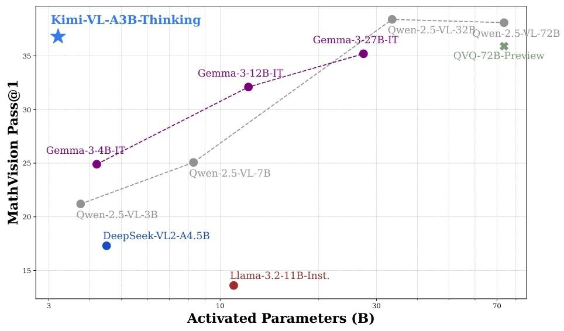
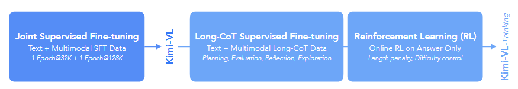

# Kimi-VL模型技术报告解读

最近开源的多模态大模型好多啊，Kimi也发布了一款高效的开源混合专家视觉语言模型，其[模型](https://github.com/MoonshotAI/Kimi-VL)也已经开源。模型的主要特点是其结构由MoonViT视觉编码器、MLP投影仪和MoE语言模型构成。在多模态推理、长文本理解和视觉感知等方面表现出色，在多个基准测试中超越同类模型。而且基于Kimi-VL开发的Kimi-VL-Thinking模型，经长思维链监督微调与强化学习，在复杂多模态推理任务上性能更优。

## 模型介绍
1. **模型架构**
整个工作流程简单来说就是在处理图像时，MoonViT先对图像进行预处理，将其转换为适合模型处理的1D序列。然后，通过自身的架构对图像特征进行提取和编码，这些特征会被转发到MLP投影仪，再传递给MoE语言模型进行后续的训练和处理。

    - **MoonViT**：原生分辨率视觉编码器，能处理不同分辨率图像，避免了像 LLaVA-OneVision 那样复杂的子图像分割和拼接操作。采用NaViT的打包方法，将图像划分为补丁，展平并顺序连接成 1D 序列，这样能与语言模型共享核心计算操作和优化方法。在高度和宽度维度上引入了2D旋转位置嵌入（RoPE），提升对高分辨率图像的处理能力。
    - **MLP投影仪**：通过像素混洗操作和两层MLP，将视觉编码器提取的图像特征投影到语言模型嵌入维度。说白了经过MLP处理后，输出就是经过投影后的图像特征，这些特征在维度、分布等方面更适合后面语言模型处理。
    - **MoE语言模型**：还是常规的MoE架构，基于Moonlight模型，有28亿激活参数，160亿总参数，类似DeepSeek-V3架构，经多模态和文本数据预训练。
2. **训练过程**
    - **优化器**：使用增强的Muon优化器（Muon优化器很新啊，好像比AdamW更高效，具体可查看苏[苏神的解读](https://kexue.fm/archives/10739)），添加权重衰减，调整参数更新比例，采用ZeRO-1优化策略进行分布式实现。
    - **2.1预训练阶段**：分为4个阶段，ViT训练、联合预训练、联合冷却和联合长上下文激活阶段，消耗4.4T令牌。
    **ViT训练**：在图像-文本对上训练MoonViT，文本包括图像替代文本、合成字幕、接地边界框和 OCR 文本。训练有两个目标，即SigLIP损失（一种对比损失变体）和基于输入图像生成字幕的交叉熵损失，最终损失函数为两者加权和。
    **联合预训练阶段**：结合纯文本数据和多种多模态数据训练模型，从加载的 LLM 检查点继续训练，使用相同学习率调度器。
    **联合冷却阶段**：用高质量语言和多模态数据集继续训练模型。语言部分通过经验发现，在冷却阶段加入合成数据可显著提升数学推理、知识型任务和代码生成的性能。
    **联合长上下文激活阶段**：将模型上下文长度从8192（8K）扩展到131072（128K），重置 RoPE 嵌入的逆频率。此阶段分两个子阶段进行，每个子阶段将上下文长度扩展四倍，同时调整长数据比例为25%，其余75%为前一阶段的短数据。
    
    - **2.2后训练阶段**：包括联合监督微调（SFT）、长思维链（CoT）监督微调以及强化学习。
    **联合监督微调（SFT）**：该阶段使用基于指令的微调方法来优化Kimi-VL基模型，使其更擅长遵循指令和进行对话。采用ChatML格式，利用纯文本和视觉语言SFT数据对语言模型、MLP投影仪和视觉编码器进行优化。
    **长思维链（CoT）监督微调**：通过提示工程构建一个高质量的长思维链热身数据集，该数据集包含文本和图像输入的准确推理路径。
    **强化学习**：采用在线策略镜像下降的变体作为强化学习算法，训练模型自主生成结构化的思维链推理。
    
3. **数据构建**
    - **预训练数据**：涵盖字幕、交错、OCR、知识、视频和代理六类数据，通过多种处理管道确保数据质量。
    - **指令数据**：旨在提升模型对话和指令跟随能力，针对不同任务采用不同构建方式。
    - **推理数据**：通过类似拒绝采样和提示工程的方法，构建高质量长CoT数据，用于激活和增强模型多模态推理能力。
4. **模型评估**
    - **对比评估**：与GPT-4o、Qwen2.5-VL-7B等先进模型相比，Kimi-VL在多个基准测试中表现出色，如在InfoVQA上准确率达83.2%，超过GPT-4o（80.7%）。
    - **能力评估**：在大学水平学术问题、通用视觉能力、数学推理、文档理解与OCR、代理任务、长文档和长视频理解、视频感知等多领域展现强大能力。
    - **推理扩展**：Kimi-VL-Thinking通过长CoT激活和强化学习，在复杂多模态推理场景中性能显著提升，如在MathVista上得分71.3%，超过GPT-4o（63.8%）。

|评估领域|部分基准测试|Kimi-VL成绩|对比模型及成绩|
|---|---|---|---|
|大学水平学术问题|MMMU val（Pass@1）|57.0%|GPT-4o：69.1%；Qwen2.5-VL-7B：58.6%|
|通用视觉能力|MMBench-EN-v1.1（Acc）|83.1%|GPT-4o：83.1%；Qwen2.5-VL-7B：82.6%|
|数学推理|MathVista（Pass@1）|68.7%|GPT-4o：63.8%；Qwen2.5-VL-7B：68.2%|
|文档理解与OCR|InfoVQA（Acc）|83.2%|GPT-4o：80.7%；DeepSeek-VL2：78.1%|
|代理任务|OSWorld（Pass@1）|8.22%|GPT-4o：5.03%|
|长文档和长视频理解|MMLongBench-Doc（Acc）|35.1%|GPT-4o：42.8%；Qwen2.5-VL-7B：29.6%|
|视频感知|EgoSchema full（Acc）|78.5%|GPT-4o：72.2%；Qwen2.5-VL-7B：65.0%|
---

## 总结
Kimi-VL在多模态、长上下文和高分辨率任务中确实展现了不错的效果，尤其是kimi最擅长的长上下文窗口高达128K，还有使用了长思维链进行监督微调，大大提升了复杂场景下的推理能力。结构上比较创新的点是使用了mlp去桥接视觉编码器和语言模型，还有增强的Muon优化器。
