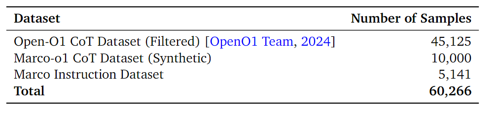
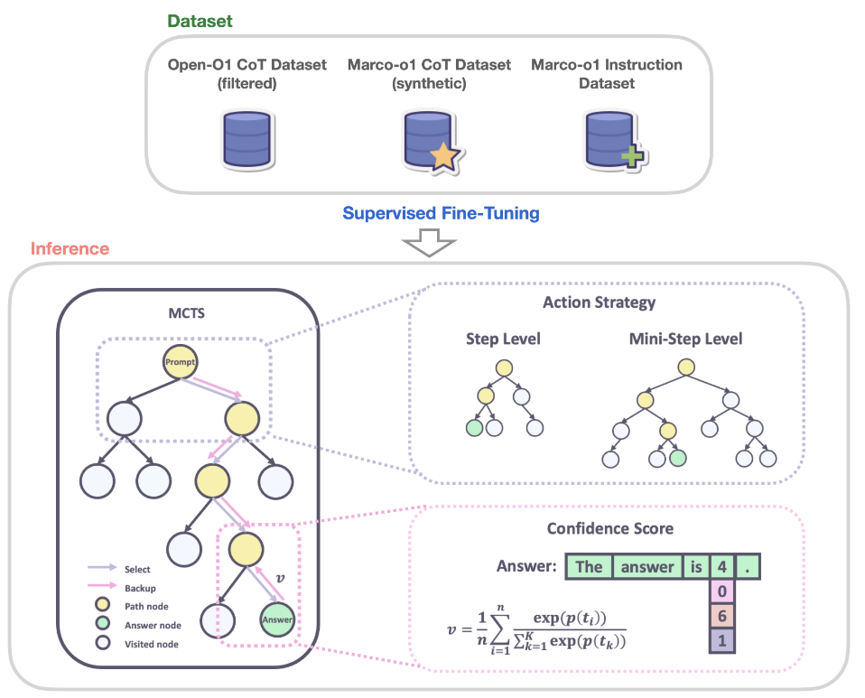
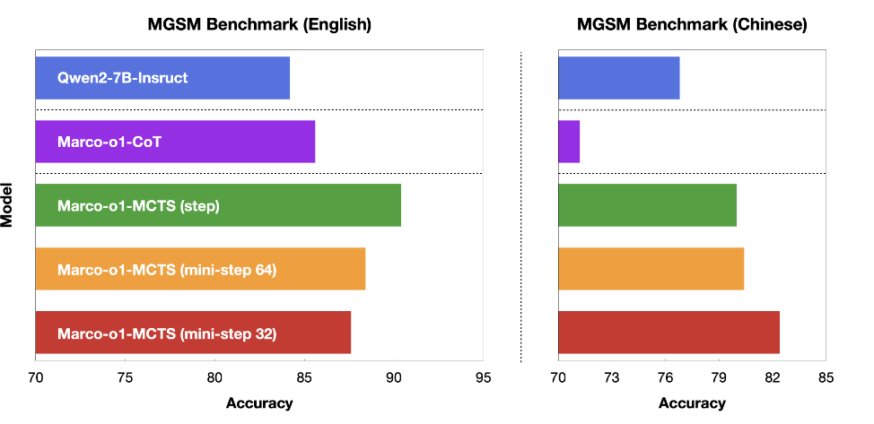
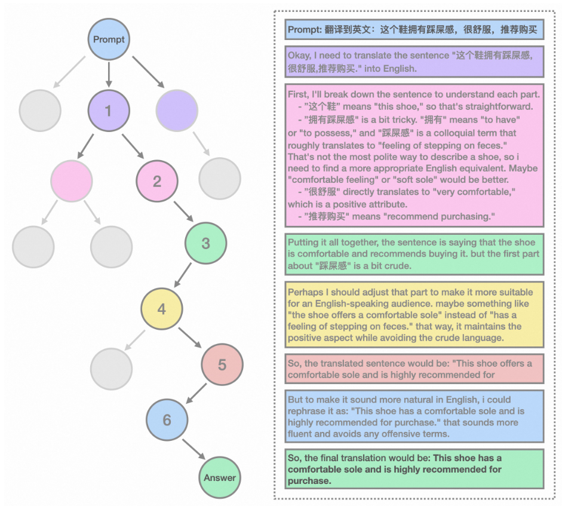

# Marco-o1: Towards Open Reasoning Models for Open-Ended Solutions”
    由阿里巴巴国际数字商务的 MarcoPolo 团队撰写，主要介绍了Marco-o1模型，其旨在解决缺乏明确标准和难以量化奖励的更广泛领域的问题。
## 主要亮点
- 基于开源COT（思维链）数据的微调,微调的模型是Qwen2-7B-Instruct。
- 通过**MCTS蒙特卡洛树搜索**探索更多可能的推理路径,在处理问题时，模型可以基于不同的输出选择更有潜力的方向继续推理，增加找到正确答案的可能性。
- 新颖的推理行动策略和反思机制：推理步骤进一步细分为更小的单位（token级别）。
- 在翻译任务中的应用：在处理口语和网络梗表达的翻译时，模型能够展现出对语境和细微差别的理解能力，提供比传统翻译工具更准确、自然的翻译结果

## 研究背景与目标
OpenAI的o1模型推理能力很出色，阿里团队寻思也搞一个吧，于是就有了Marco-o1。Marco-o1基于此进一步探索大型推理模型（LRM）的技术路线，专注于开放问题，尤其是多语言应用中的有趣现象。尽管当前模型表现出o1-like的推理特征，但仍需持续优化，只能说是先从无到有吧。
## Marco 推理数据集
为提升Marco-o1的推理能力，采用监督微调（SFT）策略，使用多种数据集，包括经过启发式和质量过滤的 Open-O1 CoT数据集、用MCTS生成的Marco-o1 CoT数据集以及指令数据集，以增强模型的结构化推理、复杂推理和指令执行能力。

## 通过MCTS扩展解空间

将LLMs与MCTS集成，节点表示推理状态，动作作为LLM输出。在展开阶段模型从当前节点开始，根据其生成的行动不断推进推理，直到得出一个最终的结论或者无法继续推理为止，然后根据最终结果与正确答案的接近程度或者推理过程的合理性等因素来给予相应的奖励分数R。最后，这个分数R用于在MCTS中评估和选择有前景的路径。重点说一下这个奖励分的计算方式：  
- 对于在展开过程中生成的每个词元，我们通过将softmax函数应用于其对数概率以及前5个备选词元的对数概率来计算其置信度分数。越接近1越代表这个token越有可能被选择。
$$c_i = \frac{exp(p(t_i))}{\sum_{k=1}^{5}exp(p(t_k))}$$
$c_i$是展开过程中第i个词元的置信度分数，$p(t_i)$是大语言模型生成的第个词元的对数概率，$p(k_i)$是第i步中前5个预测词元的对数概率。
- 然后计算所有token的平均置信分数得出总体奖励分数：
$$v=\frac{1}{n}\sum_{i=1}^{n}c_i$$

## 推理行动策略
- 行动选择：以步骤或更小的迷你步骤（32或64个token）作为行动粒度，实验表明不同粒度各有优劣，更细粒度有助于探索复杂推理路径，但目前尚无法确定最佳策略。
- 思考后反思：引入反思机制，在思维过程结尾添加提示语，让模型自我反思，约一半原本答错的难题可通过反思答对，提高了模型自我纠正能力。
## 实验
- 实验设置：基于Qwen2-7B-Instruct，使用训练数据微调得到Marco-o1-CoT，并在MCTS框架中以不同行动粒度进行实验，测试模型在MGSM数据集英、中子集上的性能。
- 主要结果：Marco-o1-CoT在MGSM-en数据集上优于Qwen2-7B-Instruct，在MGSM-zh数据集上因微调数据语言差异性能下降；MCTS增强模型有改进，但不同行动策略在不同子集中表现各异，目前无法确定最优策略，不过MCTS在较少猜测次数下有优势。

- 翻译任务案例研究：在翻译口语和俚语表达时，Marco-o1表现出色，比Google Translate更能理解语境和细微差别，提供更准确自然的翻译。举个例子：

## 总结
整体工作还是比较有意义的，虽然只是和微调对象Qwen2-7B-Instruct比较了一下，也确实具备了一定的逻辑推理能力。我认为最值得借鉴的还是MCTS的思路，这启发了后续基于此改进推理思路的方法。当然，最有趣的还是在翻译上的表现，竟然可以在口语和网络梗的表现还不错，是比较出乎意料的。
