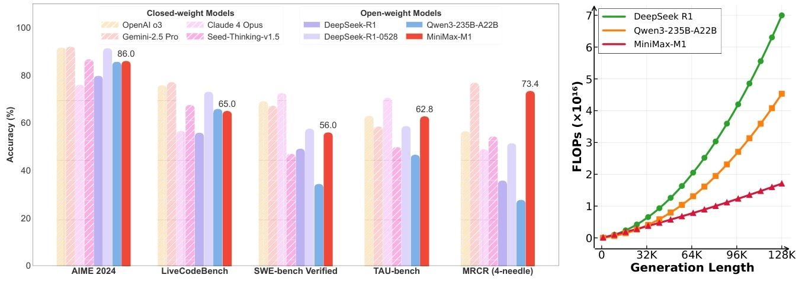
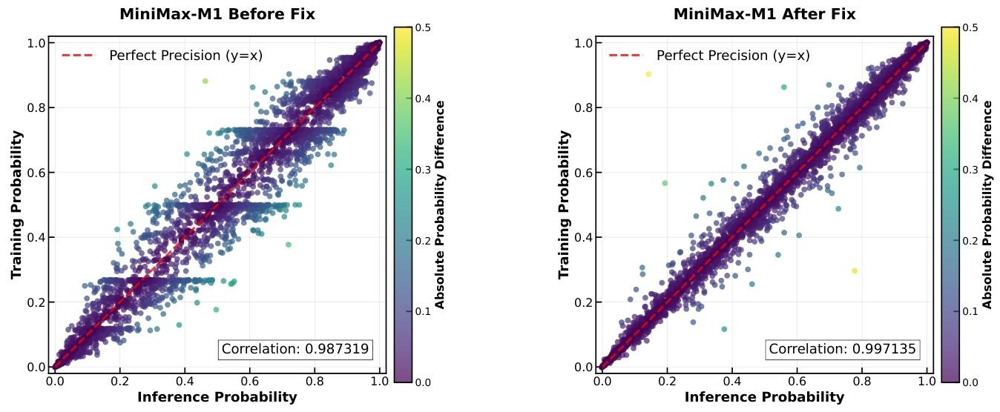
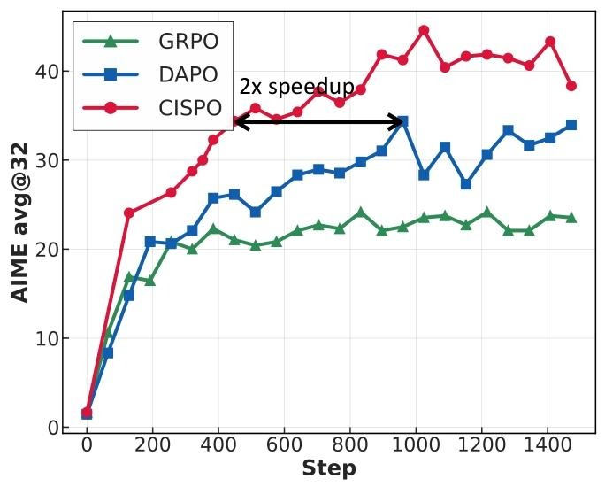

# MiniMax-M1技术报告解读

最近，MiniMax又放大招了，开源了MiniMax-M1，一个基于MiniMax-Text-01的混合MoE架构，支持推理长度扩展至10万token，在多个task上紧追SOTA模型，而且其推理速度非常快远超DeepseekR1和Qwen3，赶紧看看其在模型架构和RL算法上有哪些创新吧。

## 模型架构和能力
在架构上，MiniMax-M1依旧采用了混合MoE（Mixture-of-Experts）架构与Lightning Attention机制，总参数4560亿，每token激活459亿参数，包含32个专家。其设计为每7个带Lightning Attention的转换块后接1个带softmax注意力的Transformer块，理论上支持推理长度扩展至数十万token。
**长上下文能力**：原生支持100万token的上下文长度，是DeepSeek R1的8倍，远超现有开源推理模型。在10万token生成长度时，相比DeepSeek R1仅消耗25%的FLOPs，计算效率显著。

## 技术创新
主要有以下几个点，最重要的是新型的CISPO算法，lightning attention在2024年前minimax就已经在使用了。先简单讲下lightning attention的逻辑吧。

### lightning attention+Softmax attention
混合注意力架构指的是每7个带有Lightning Attention的Transnormer块后，连接1个带传统 Softmax Attention的Transformer块。
所谓的Lightning Attention在两个层面优化了注意力的计算效率。首先注意力计算进行了分块，块内仍是传统计算方式，块间采用线性注意力的核技巧采用右乘方式，避免了累积求和操作拖慢速度。硬件层面优化了内存访问和计算流程。通过Triton的IO-aware平铺技术，将Q、K、V分块从HBM加载至SRAM，利用SRAM的高速访问特性执行计算，减少HBM的IO开销，并在SRAM中累积块间KV矩阵和输出，降低内存读写次数。
而Softmax Attention用于捕捉全局信息，弥补线性注意力在全局依赖性建模上的不足。在混合架构中，它作为 “锚点”，缓解了纯线性注意力可能导致的梯度消失问题。这种混合设计实现了计算效率与表达能力的平衡。Lightning Attention处理主体序列降低计算成本，Softmax Attention捕捉关键全局关系避免信息丢失。
比较有意思的是，为了修复因为混合注意力架构导致的训练模式与推理模式的计算精度不匹配问题，论文将输出头的计算精度提升至FP32。

### CISPO算法
核心目标是解决传统 RL 算法在长序列推理任务中因 token 裁剪导致的训练低效问题，通过优化重要性采样（IS）权重实现更稳定、高效的策略更新。其整体思路和GRPO一样使用组内相对优势函数，计算方式也一致，不同的点在于裁剪方式。
其损失函数定义如下：
  $$
  \mathcal{J}_{\text{CISPO}}(\theta) = \mathbb{E}\left[\frac{1}{\sum|o_i|} \sum_{i,t} sg(\hat{r}_{i,t}(\theta)) \hat{A}_{i,t} \log\pi_\theta(o_{i,t}|q,o_{i,<t})\right]
  $$
其中 $\hat{r}_{i,t}(\theta) = \text{clip}(r_{i,t}(\theta), 1-\epsilon_{\text{low}}^{\text{IS}}, 1+\epsilon_{\text{high}}^{\text{IS}})$ 通过超参数$ \epsilon_{\text{high}}^{\text{IS}}$ 控制权重上界，尽管裁剪了权重，但保留所有token的梯度贡献（尤其是长序列中的低概率token），显著提升了训练稳定性。
  同时，论文还通过引入token级别的掩码$M_{i,t}$来控制token的梯度是否更新，将不同 RL 算法的裁剪策略整合到同一框架中，解决了传统算法在长序列推理中对关键 token 梯度的丢弃问题。该公式的核心目标是通过超参数调优灵活控制梯度保留策略，平衡训练稳定性与探索能力。统一公式如下：
$$
\mathcal{J}_{\text{unify}}(\theta) = \mathbb{E}\left[\frac{1}{\sum|o_i|} \sum_{i,t} sg(\hat{r}_{i,t}(\theta)) \hat{A}_{i,t} \log\pi_\theta(o_{i,t}|q,o_{i,<t}) M_{i,t}\right]
$$
这样既保留了CISPO “全token梯度利用” 的优势，又通过超参数调优灵活平衡训练稳定性与推理探索能力。这一设计尤其适合长上下文模型（如 MiniMax-M1），通过精细控制关键推理节点的梯度流动，实现复杂任务下的高效策略更新。
### CSIPO对比DAPO和GRPO
论文认为GRPO直接裁剪token更新导致低概率推理token（如反思性词汇）的梯度被丢弃，无法学习深度推理链，而DAPO虽增大裁剪上界，但在混合架构下仍无法完全保留关键token（如16轮off-policy更新中易出现梯度衰减）。而正是CISPO只裁剪IS权重而非token，使得模型加速探索到了更复杂的推理l路径。下图就展示了CISPO在相同训练步数下性能优于GRPO和DAPO，且仅用DAPO 一半步数即可达到相当性能：

### 预训练与SFT
基于MiniMax-Text-01继续预训练7.5T tokens，数据中STEM、代码等推理相关内容占比70%，在预训练阶段分四阶段平滑扩展上下文长度至 1M tokens（32K→128K→256K→512K→1M），通过动态调整衰减率解决混合架构下的梯度爆炸问题。通过SFT注入链思维（CoT）模式，强调反思性推理如（Recheck, wait等token），为RL奠定基础。
整个RL使用到的数据集包含两类，一类是可验证任务：数学推理（近5万样本）、逻辑推理（5.3万样本，41种任务）、竞争性编程（3万样本）、软件工程（基于GitHub沙盒环境），通过规则验证提供确定性奖励。还有一类是不可验证任务，包含2.5万复杂样本（如创意写作），使用生成式奖励模型（GenRM）评估，通过pairwise 比较与人类标注基准优化奖励信号。
在RL过程中，通过重复检测（连续3000个token概率>0.99时提前截断）、正负样本梯度平衡、降低梯度裁剪阈值等方法，解决长序列训练中的模式崩溃问题。

**训练效率**：使用512个H800 GPU，3周完成全RL训练，租赁成本约53.47万美元，可以说很经济高效了。解决了混合架构下训练与推理内核的精度不匹配问题，将LM输出头精度提升至FP32，使训练与推理概率相关性从0.9提升至0.99。

**模型版本**：发布40K和80K思考预算的两个版本，80K模型为完整训练版本，40K为中间阶段产物。

### 性能评估与优势领域
| 任务类型       | 关键指标                          | MiniMax-M1-80k表现                                                                 |
|----------------|-----------------------------------|-----------------------------------------------------------------------------------|
| 数学推理       | AIME 2024准确率                  | 86.0%，仅次于DeepSeek-R1-0528，优于Qwen3-235B                               |
| 代码生成       | LiveCodeBench                     | 65.0%，与Qwen3-235B相当，优于DeepSeek-R1                                    |
| 软件工程       | SWE-bench Verified                | 56.0%，略低于DeepSeek-R1-0528，远超其他开源模型                              |
| 长上下文理解   | OpenAI-MRCR (1M tokens)           | 56.2%，超越OpenAI o3和Claude 4，仅次于Gemini 2.5 Pro                         |
| 工具利用       | TAU-bench (airline)               | 62.0%，超越所有开源模型及Gemini 2.5 Pro                                     |

## 总结
Minimax的这篇论文亮点还是颇多的，无论是混合注意力还是CISPO都是相当有创新性的，而且其训练成本进一步得到了降低，尤其是原生支持100万token超长上下文本的同时还提高了推理效率。在多个任务中表现也非常的棒，又是一个很有竞争力的大模型。

