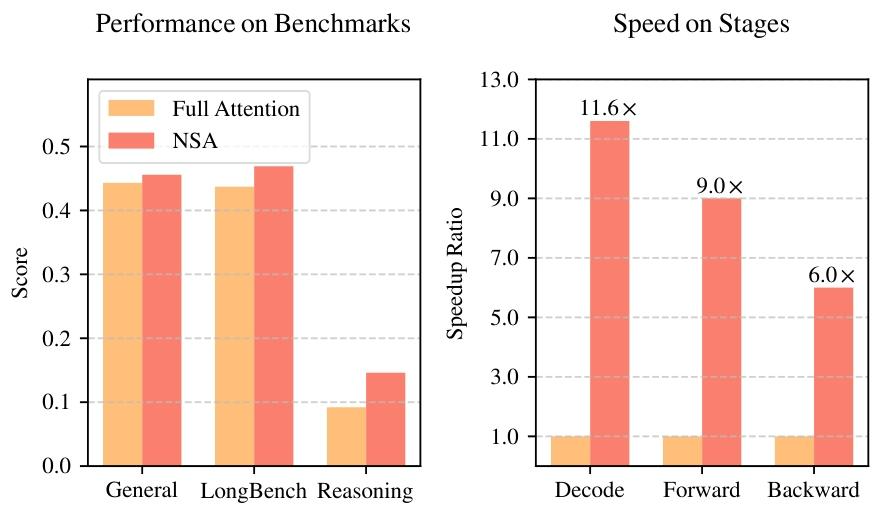
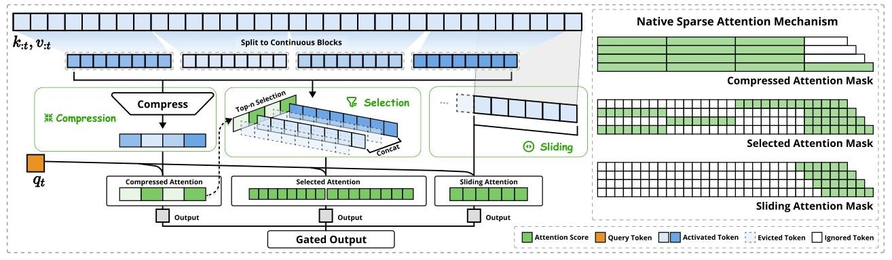
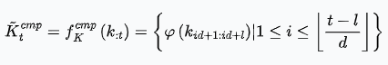
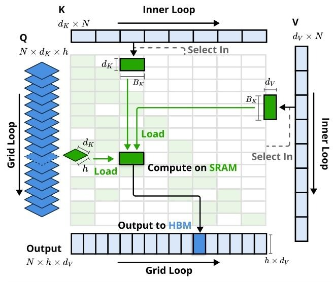
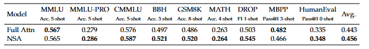
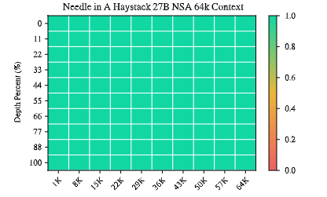
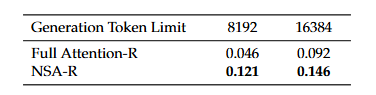
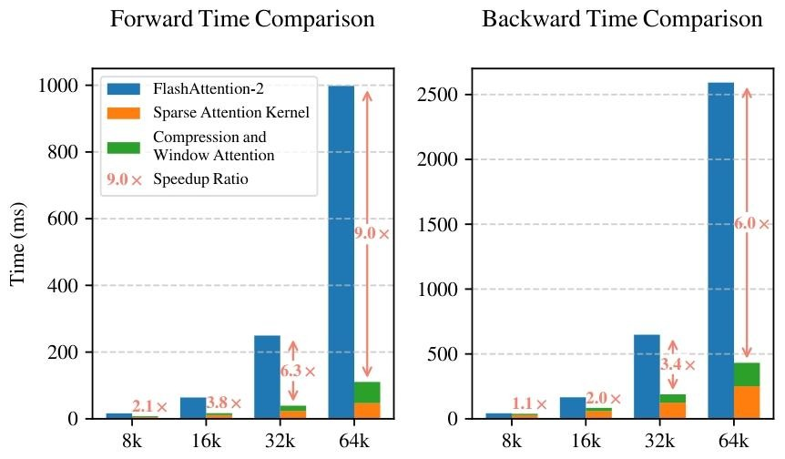

# DeepSeek又上新论文--NSA

DeepSeek又出新论文啦，大老板亲自参与了论文，这不得第一时间来看看，这篇论文主要提出了一种可原生训练的稀疏注意力机制NSA，通过算法创新和硬件优化，实现高效的长文本建模，在保持模型性能的同时提升计算效率。NSA中最为重要的一个概念就是采用**动态分层稀疏策略**，将粗粒度令牌压缩与细粒度令牌选择相结合，以保持全局上下文感知和局部精度。
[论文链接](https://arxiv.org/pdf/2502.11089)

## 研究背景：
长文本建模对下一代大语言模型至关重要，但full attention计算成本太高。原始的full attention无论在decode, 还是forward下由于softmax架构的计算成本，其运行速度是非常慢的。因此稀疏注意力是提高效率的方向，但现有方法在实际部署中存在不足，如推理加速效果不佳、缺乏训练支持等。因此，需要解决硬件对齐的推理加速和训练感知的算法设计两个关键挑战。
## 方法
### 整体框架

NSA将原始的key, value对替换为更紧凑的表示，通过三种映射策略（压缩、选择和滑动窗口）生成优化的注意力输出，维持高稀疏率。
- 压缩模块: 将输入的k, v块进行压缩处理，得到压缩后的键值对。压缩的目的是减少计算量，用更紧凑的表示来替代原始的kv对。具体压缩的方法见如下公式：
  
其中的$l$是块长度，$d$是相邻块之间的滑动步长，$\phi$是一个权重可学习的多层感知机，带有块内位置编码，用于将块中的键映射到单个压缩键，最终得到一个由压缩key组成的tensor。
- 选择模块：在压缩模块的右侧，有“Top-n Selection”，即从键值对块中基于重要性分数选择出前n个重要的块。被选中的块会进行拼接操作。
具体操作如下：  
1. 先计算每个块的重要性分数，其实就是刚刚聚合过的k向量和q向量进行注意力分数的计算
$$s_i = \frac{Q^TK_i^{cmp}}{\sqrt{d_k}}$$
2. 然后根据注意力分数选择前n个重要的块
- 滑动窗口模块：它处理的是输入序列的局部上下文，通过滑动窗口的方式对序列进行处理，捕捉局部上下文信息，防止局部模式干扰其他分支学习，增强模型对长序列的适应性。
通过三个模块分别输出三种attention，这三种attention最终通过门控机制融合，得到门控输出。

### 内核设计
基于Triton实现硬件对齐的稀疏注意力内核，针对GQA和MQA架构，采用分组中心的数据加载、共享的 KV获取和基于网格的外循环设计，提高算术强度。

NSA的内核仍然和flash attention一样，将时间上连续的查询块加载到静态随机存取存储器（SRAM），关键就在于使用了一种不同的GQA策略：对于查询序列上的每个位置，将GQA组内的所有查询头（它们共享相同的稀疏kv块）加载到SRAM中,主要有以下三个关键特征：
1. 以group为中心的数据加载，对于每个inner loop,加载组内所有的Q以及它们共享的稀疏kv块。
2. 共享kv获取，按顺序将连续kv块加载到SRAM中，避免重复的kv获取
3. 基于网格的外循环，由于不同查询块的内循环长度（与所选块的数量n成正比）几乎相同，将output和Grid Loop放入Triton的网格调度器中，以简化和优化内核。
## 实验
以full attention和其他稀疏注意力方法为基线，从通用基准性能、长上下文基准性能和思维链推理性能三个方面评估NSA。实验结果表明，NSA在大多数指标上优于基线模型，在长上下文任务和推理任务中表现出色。
- 在预训练阶段的通用基准性能看，NSA也比full attention在多个任务上性能更高

- 在长上下文任务上，NSA表现惊艳，在64k长度下进行特定信息的检索也能做到全对！

- 思维链推理能力：采用从DeepSeek-R1进行知识蒸馏的方法，使用长度为32k的100亿个数学推理token进行SFT,产生了两个具有可比性的模型：Full Attention-R和NSA-R,结果NSA-R也是效果更好  

### 效率分析
在训练速度上，NSA 在 64k 上下文长度下，前向和反向加速分别达到 9.0 倍和 6.0 倍；解码速度方面，64k 上下文长度下速度提升高达 11.6 倍，内存访问效率优势随序列长度增加而放大。
- 和flash attention2相比，NSA也显著降低了所有上下文长度下的延迟，并且随着输入长度的增加，这种提升愈发明显。

## 结论
NSA这种新型的硬件对齐的稀疏注意力架构，实现了训练和推理加速，在通用基准、长上下文评估和推理能力上表现优异。个人感觉NSA在长上下文场景下的表现太强了，又快又准，这对于目前针对长文本任务推理慢的改进来说是飞跃性的。
