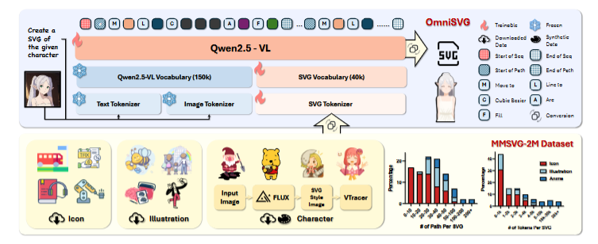
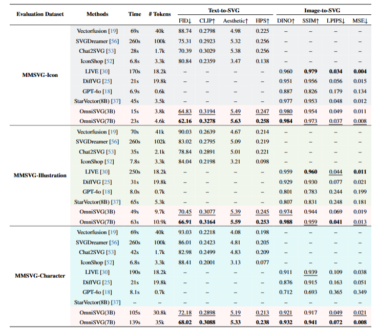
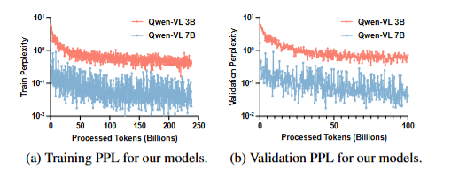
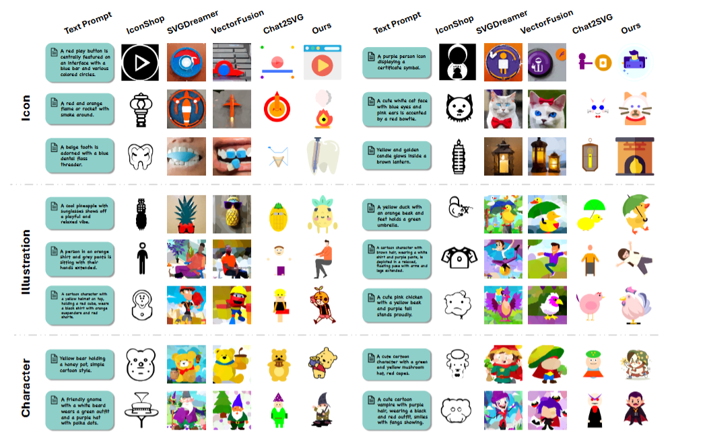

# 专业生成SVG的大模型: OmniSVG
--- 
首先介绍一下SVG，SVG是一种基于XML的图像描述语言，用于描述二维图形。它在现代的网页开发中得到了广泛的应用。然而，SVG的创建和编辑过程非常复杂，需要手动绘制和编辑，这使得SVG的应用场景受到了一定的限制。如果可以通过大模型自动生成SVG，对于非专家来说可以大大提高效率，岂不美哉？
此[论文](https://arxiv.org/pdf/2504.06263)的作者为此训练了这个模型，模型参数还没开源，训练数据倒是开源了，有时间可以复现一下。
## OmniSVG模型
### SVG参数化
将SVG简化为5种基本命令（“Move To”、“Line To”、“Cubic B´ezier”、“Elliptical Arc”、“ClosePath” ）和 1 种填充命令 “Fill” 。把每个命令表示为包含类型标识符和位置参数的组合，如$(C_{i}^{j}=(U_{i}^{j}, V_{i}^{j}))$。为缩短 SVG 序列长度，将点坐标通过映射函数$<x,y>\to x×w + y$（w为图像宽度）合并为一个标记，还为每个命令类型（包括 {M, L, C, A, Z, F}）分配特殊标记，并在SVG序列两端添加$<SOP>$和$<EOS>$作为起始和结束标识符，以此将SVG脚本转化为有序的SVG标记序列。
熟悉SVG的朋友都知道SVG脚本通常非常长，这么做的好处就是减少序列长度，提高模型处理复杂路径信息的能力。
### 模型架构
以Qwen2.5-VL架构为基础。在处理输入时，先将交错的文本和图像输入进行token化和嵌入，转化为前缀标记；同时，利用SVG标记器将SVG脚本标记化为序列，并连接到前缀标记的末尾；最终，将完整的序列输入到解码器语言模型中进行处理，进而生成精确且紧凑的SVG输出。

### 训练目标和缩放
与传统LLMs类似，OmniSVG通过最小化next-token预测损失来训练模型。训练目标为$\theta^{*}=arg max _{\theta} \prod_{i=1}^{L} P\left(x_{s,i} | x_{s,<i}, x_{c}\right)$ ，其含义是在给定前缀标记 $x_{s,<i}$ 和上下文信息 $x_{c}$ 的情况下，最大化生成下一个标记$x_{s,i}$的概率，以此让模型学习如何根据已有信息生成合理的后续标记，实现多模态SVG的生成。

## MMSVG-2M数据集
- 数据收集：从Iconfont、iconsount、Freepik等网站收集SVG样本，涵盖网站图标、插图、动漫角色等，共200万个样本，分为MMSVG - Icon、MMSVG - Illustration和MMSVG - Character三个子集。
- 数据简化：使用picosvg去除复杂语法，将SVG命令简化为原子命令，并统一填充属性。
- 基准测试：建立MMSVG-Bench，包括Text-to-SVG、Image-to-SVG和Character-Reference SVG Generation三项任务，使用多种评估指标进行全面评估。重点说下Text2SVG任务评估，使用了Frechet初始距离（FID）来测量视觉质量，用CLIP分数测量文本-SVG对齐，用审美分数和HPS（人类偏好分数）来测量。
## 实验结果
### 基线比较
- Text-to-SVG任务：
与VectorFusion、SVGDreamer、Chat2SVG、IconShop等方法相比，OmniSVG在所有评估指标上均表现优异，生成的SVG在忠实度、语义一致性和视觉质量方面更优。
- Image-to-SVG任务：
与LIVE、DiffVG、StarVector、GPT-4o等方法相比，OmniSVG在质量和效率上均优于传统图像矢量化方法和多模态大型语言建模方法，能够高效地将各种类型的图像转换为高质量的SVG。
- Character-Reference SVG Generation任务：
通过训练能够根据自然字符图像生成字符SVG，并使用GPT-4o评估输入字符图像和生成SVG之间的对齐程度，结果显示生成结果与输入参考图像具有较高的相似性。

### 消融实验
- SVG参数化：
对坐标和颜色属性分别进行不同组合的参数化处理，设置了4种实验条件：不进行任何参数化、仅参数化颜色、仅参数化坐标、同时参数化坐标和颜色（full param即OmniSVG采用的方法）。
同时参数化坐标和颜色属性效果最佳，能在保证质量的同时减少标记长度，提高计算资源利用率。
- 模型规模scaling：
选择不同规模的模型在MMSVG-2M数据集上进行评估，模型包括从FLAN-T5-base（223M）到Qwen2.5-VL-3B-Instruct（3.7B）和Qwen2.5-VL-7B-Instruct（8.3B），随着模型规模增大，生成样本的质量提高，表明扩大生成式自回归训练规模对多模态SVG生成任务有效。

- VLM架构：
用包括CLIP ViT-B/32、VQGAN等不同的基于LLM的架构，替代OmniSVG中的Qwen2.5-VL架构，在MMSVG-Illustration数据集上进行训练实验，重点比较不同架构生成 SVG 输出的性能。Qwen2.5-VL架构在所有评估指标上均优于其他替代架构，其强大的图像编码器支持和多图像输入能力是关键优势。

## 真实用户反馈
为评估OmniSVG生成SVG的有效性和实用性，文章通过选取多样样本、邀请用户评价和分析反馈数据的方式，对比了OmniSVG与基线模型的性能。通过对参与者反馈的整理和分析，得出不同模型在各个评价维度上的得分情况。研究结果显示，OmniSVG 在用户偏好、生动性和对齐度方面均获得了较高的分数，表明志愿者更倾向于 OmniSVG 生成的 SVGs，认为其更生动且与输入文本或图像的视觉对齐度更高。

## 总结
个人认为OmniSVG模型主要的创新点就是对SVG进行了参数化，解决了输入序列过长，过于复杂的问题，用VL模型结构也是比较常规的。同时，开源的这个MMSVG-2M数据集质量也是非常高的，数量和维度都很丰富。基线实验也证明了OmniSVG在多模态SVG生成任务上的有效性和实用性。