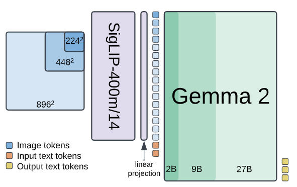
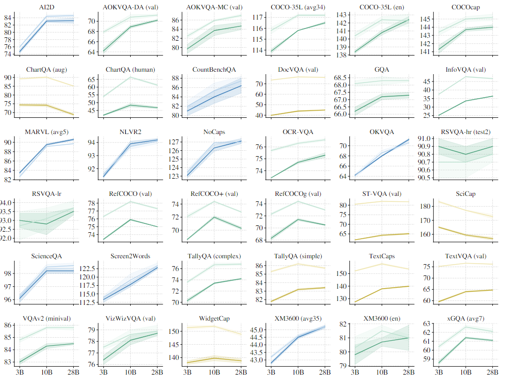
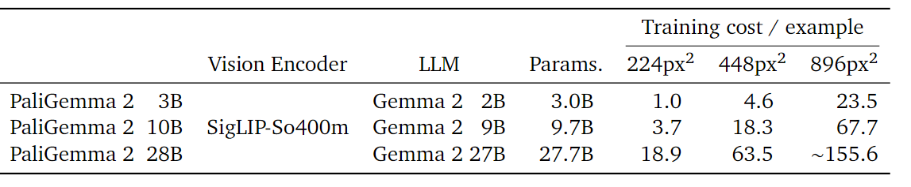
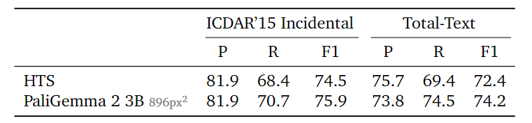

# PaliGemma 2: A Family of Versatile VLMs for Transfer
Google DeepMind团队近日推出了VLM视觉语言模型PaliGemma的重大升级，[论文](https://arxiv.org/abs/2412.03555)介绍了PaliGemma 2系列视觉语言模型。主要基于Gemma 2语言模型家族，结合SigLIP-So400m视觉编码器，通过多阶段训练，在多种任务上展现出卓越性能，尤其在新探索的任务中取得了最先进的成果。

## 模型概述

- 升级与改进：PaliGemma 2是PaliGemma的升级版，采用Gemma 2家族语言模型替代原有语言模型组件，生成了3种不同大小（3B、10B、28B）和 3 种不同分辨率（224px²、448px²、896px²）的基础 VLM。
- 训练方式与阶段：沿用 PaliGemma 的 3 阶段训练方法，包括单模态预训练、多模态联合训练及针对目标任务的微调。第 1 阶段联合训练视觉和语言模型；第 2 阶段提升分辨率并增加任务权重；第 3 阶段将第 1 或 2 阶段的检查点微调至目标任务。
- 模型架构与处理流程：输入文本和图像经SigLIP-400m编码器处理后，通过线性投影连接，再由Gemma 2语言模型生成输出。
## 训练方法
重点讲一下PaliGemma2的多阶段训练方法。其实还有个一个**阶段0**：对多模态组件的单模型的预训练，这里就不再赘述。  
### 1、阶段一
联合训练视觉和语言模型。将预训练的SigLIP-So400m和Gemma 2的checkpoint（原始checkpoint，无训练后步骤）相结合，在由10亿个示例组成的多模态任务混合数据上进行联合训练。此阶段图像分辨率为 224px²，训练时不冻结任何参数，目的是让模型初步学习视觉和语言信息的联合表示，为后续的多模态任务处理奠定基础。
### 2、阶段二
提升分辨率并调整任务权重。先在分辨率为448px²的数据上训练5000万个示例，然后在分辨率为896px²的数据上训练1000万个示例。任务混合成分保持不变，但对受益于高分辨率的任务增加权重，同时增加输出序列长度（例如，促进长序列视觉文本的OCR学习），使模型能够适应更高分辨率的输入，并进一步优化在不同任务上的表现。
### 3、阶段三
针对目标任务微调。根据目标任务的需求，对阶段一或二的检查点进行微调，使其能够更好地适应特定任务，如常见的字幕生成、视觉问答任务，以及新探索的文档相关任务、长字幕生成和医学图像理解等任务。
### 优化器与学习率调整
优化器仍旧使用了Adam优化器，在阶段1和2，根据模型大小对学习率进行调整。具体而言，对于 PaliGemma 2 3B模型，将 PaliGemma在这两个阶段使用的学习率$2\cdot 10^{-5}$乘以 0.5；对于 PaliGemma 2 10B和28B模型，则乘以0.25。还有之前PaliGemma使用过的logit soft-capping技术，只在阶段一和阶段二使用，在阶段三的微调阶段可能因任务特性或模型已经学习到足够的特征表示而不再适用。
## 实验与结果
### 模型规模和分辨率影响
**省流版**: 超参仍旧用的一代模型，仅调一个学习率，scaling law不一定起效，在涉及高级语言或视觉推理的任务下分辨率和模型大小决定效果，而在某些任务中出险3B到10B提升较大，再提升到28B反而下降。但总体2代模型性能比1代更好。

- 实验设置：
在30多个学术基准上，对3种模型变体（3B、10B 和28B）在两种分辨率（224px² 和448px²）下进行微调，探索不同任务对模型规模和分辨率的敏感性。
- 任务与参数调整
这些任务主要聚焦于自然图像、文档、信息图表和视频上的区域分割等等。为提高效率还是使用了PaliGemma的工作成果，直接复用其最优超参数，仅对学习率进行调整，范围为{0.03, 0.06, 0.1, 0.3, 0.6, 1.0, 3.0}*10e-5。
- 结果分析  
多数任务受益于分辨率和模型规模的增加，部分文本、文档相关任务主要受益于分辨率提升，而一些涉及多语言或高级视觉推理任务则更受益于模型规模增大。  
增大模型规模至28B，改进效果相对有限，且28B模型的可迁移性较差，可能与其基础Gemma 2 27B模型从头训练有关。
较大模型的最优迁移学习率通常较低，PaliGemma 2 3B的最优迁移学习率小于PaliGemma。
与PaliGemma相比，相同分辨率和模型大小下，PaliGemma 2性能更好。

### 新任务探索
**亮点**在于在各种多模态的新任务上，PaliGemma2展现出了非常出色的实力。
- 文本检测与识别：  
在高级OCR任务中，PaliGemma 2 3B（896px²）在ICDAR’15和Total-Text测试集上超越了现有技术水平，证明了模型的通用性和OCR预训练的优势。

表格结构识别：在表格结构识别任务中，PaliGemma 2在两个常用数据集上达到了新的最先进水平，模型在处理表格数据时表现出色。

- 分子结构识别：  
在分子结构识别任务中，PaliGemma 2 10B（448px²）超过了现有技术水平，显示了模型在处理化学结构数据方面的能力。
光学乐谱识别：在光学乐谱识别任务中，PaliGemma 2的错误率随分辨率提高而降低，最佳成绩在 896px²分辨率下取得，表明模型对乐谱图像的处理能力随分辨率提升而增强。
- 生成长、细粒度的字幕：  
在 DOCCI 数据集上进行微调后，PaliGemma 2模型生成的字幕在事实一致性上优于许多流行的VLM，且模型规模和分辨率的增加均能提高事实一致性。
- 空间推理：  
在视觉空间推理（VSR）基准测试中，PaliGemma 2表现出色，超过了先前的微调模型，且大模型在语言理解方面表现更好，但分辨率提升效果不明显。
- 放射学报告生成：  
在胸部 X 射线报告生成任务中，PaliGemma 2取得了最先进的RadGraph分数，分辨率和模型规模的提升均带来了适度改进，显示了模型在医学影像领域的潜力。
### CPU 推理和量化
- 推理速度测试：  
使用gemma.cpp框架在不同CPU架构上测试PaliGemma 2 3B（224px²）的推理速度，结果展示了不同处理器上的预期性能。
量化效果评估：比较了f32到f16量化和gemma.cpp混合量化，发现量化后模型质量无明显差异，证明了量化策略的有效性,论文推荐使用 gemma.cpp 混合量化方法来部署模型。
# 结论
PaliGemma 2作为一个开源的多模态模型，能够具有大中小的模型尺寸和输入分辨率，而且在多种视觉语言任务中表现出色，尤其在新探索的任务领域表现突出，是非常难能可贵的。这为之后微调视觉语言模型去做应用提供了非常强大的预训练基础。