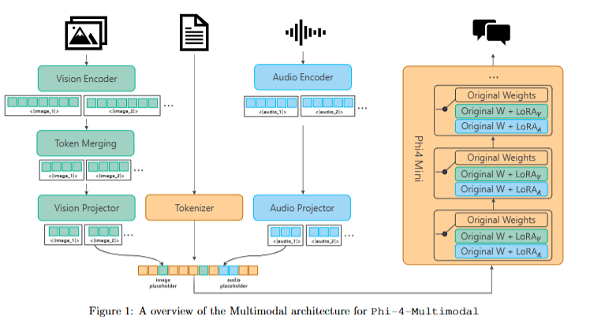
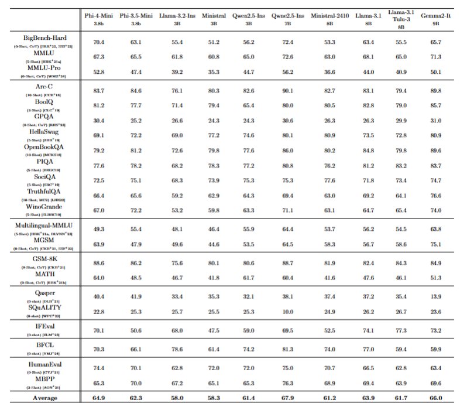
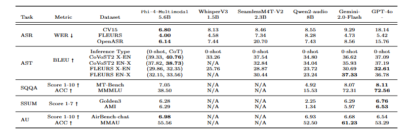
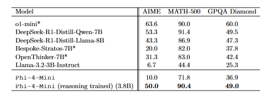

# Phi4-mini技术报告
在QwQ-32B的技术报告出来前，我们先看个小模型的技术报告吧，Phi4-mimi和Phi4-multimodal。[论文链接](https://arxiv.org/pdf/2503.01743)
## 一、模型概览
### Phi-4-Mini（3.8B参数语言模型）
- 核心特点：
多模态模型参数量小只有56亿参数，量化后大小仅3G ，相对轻便，但效果却不差
专为复杂推理设计，在数学和编码任务上超越同尺寸模型，媲美两倍参数的模型
词汇量扩展至20万token，支持多语言和多模态应用
采用分组查询注意力机制（GQA），长序列生成效率提升3倍
支持128K上下文长度技术（LongRoPE）
###  Phi-4-Multimodal（多模态模型）

- 创新设计：
    - 首创"混合LoRA"技术，高度的可扩展性，可以无缝集成新的lora以支持视觉，语音等模态，且不影响现有模态。
    - 视觉模块支持动态多裁剪策略（最高处理1344x1344分辨率的16帧图文输入）。
    - 语音模块具备单模型处理30分钟长音频的能力，80ms语音帧率。
## 二、关键技术
### 模型架构：

- 语言模型：
结构上比较常规，32层Transformer，隐藏层维度3072，24个Q头+8个KV头的GQA配置
采用分数维RoPE设计（确保25%维度无位置编码）优化长上下文

- 多模态架构：
    - 视觉模块：440M参数编码器 + 370M LoRA适配器
    - 语音模块：3层时空卷积+24层Conformer编码器（支持8倍下采样）
    - 语音投影层：2层MLP映射到文本空间

### 训练策略：
#### 多阶段训练：
1.视觉：4阶段训练（图文对齐→联合预训练→单帧微调→多帧训练）
2.语音：两阶段设计（3亿小时ASR预训练 → 亿级SFT数据指令微调）
3.推理增强：60B CoT预训练 → 20万高质量CoT微调 → 30万DPO偏好对齐
#### 数据策略：
- 语言模型：5万亿token合成数据（增强数学/代码比例）
- 视觉训练：5千亿图文交错数据 + 3千亿指令数据
- 语音合成：通过TTS生成百万级问答对，WER质量控制
## 三、核心优势
1. 多模态统一性：
单模型支持图文问答（DocVQA 93.2分）、视频理解稍差些（VideoMME 55分）、语音文献摘要（AMI 6.29/7分）
2. 领域突破：
- 视觉：在OCR密集场景（InfoVQA）超越GPT-4o 2.3个点
- 语音：OpenASR榜单新SOTA（5.5%相对WER（Word Error Rate）提升）
语音摘要：首个开源30分钟长音频摘要支持，质量接近GPT-4o
3. 性能表现：
- 语言能力：在MMLU基准（65.8）接近7B模型水平

- 多模态综合：
图文理解超InternVL2.5-8B 4.1%（MMBench 76.2 vs 72.1）
语音翻译BLEU达到41.6（CoVoST2），超越SeamlessM4T 3.4点
音频理解（AIR-Bench）83.7分，领先Qwen2-Audio 11.3%

- 推理能力：
相比蒸馏过的deepseek-7B模型表现几乎可以平起平坐：

## 四、技术影响
开源价值：首个3B级全模态开源方案，参数量仅5.6B（视觉+语音模块共900M）
研究启示：验证了LoRA混合拓展范式（冻结基座模型同时实现96%全参数微调效果）
应用前景：适用于端侧设备（ASR延迟降低58%）、教育场景（数学推理提升11%）、多语言服务（支持8种语音互译）
## 总结
Phi4-mini展示了在小规模参数下实现多模态SOTA的创新路径，这个可集成的lora适配多模态任务真的不错方便后面随时微调优化，而且小模型更适合我们这些个人开发者去使用。