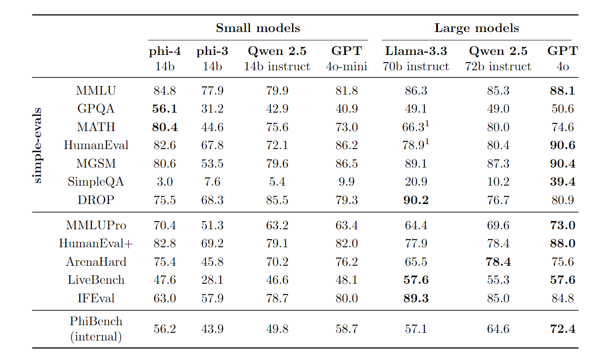
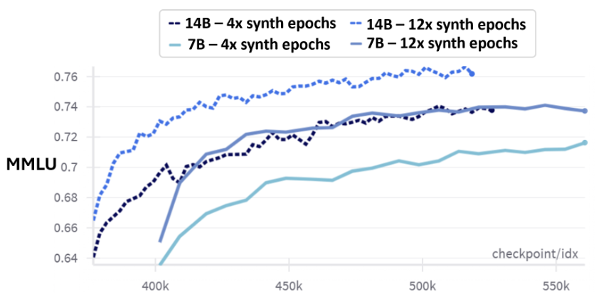
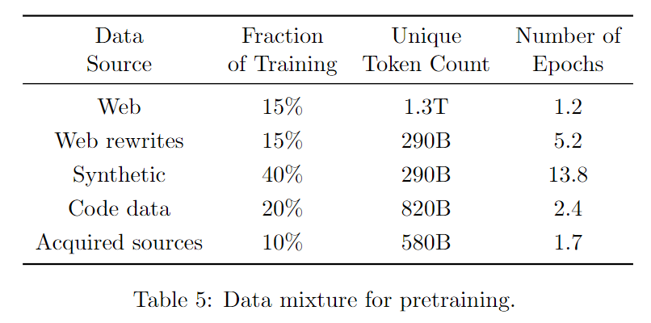
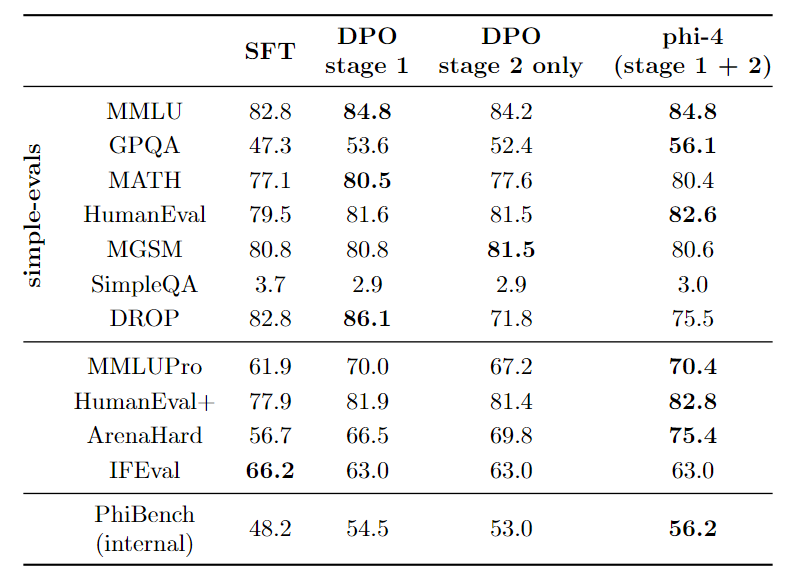
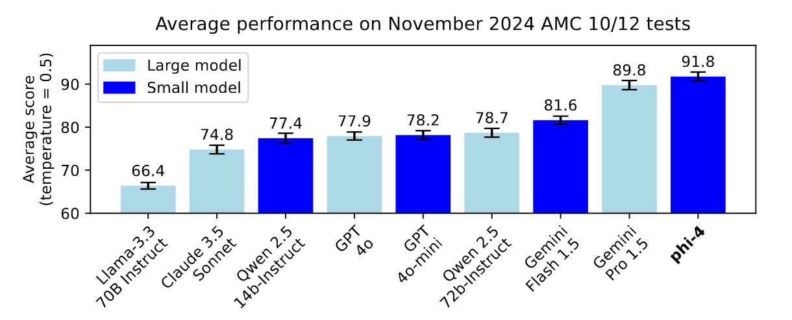

# Phi-4 Technical Report

[论文链接](https://arxiv.org/abs/2412.08905)

微软最近推出了Phi-4，号称最先进的小型大模型，专攻数学推理，甚至超越了同类更大模型。。本文就主要来精读一下这篇技术报告，内容其实也比较简单，主要介绍了Phi-4的训练过程和模型性能。这款140亿参数的大模型在训练过程中大量使用合成数据，通过创新的合成数据生成方法、优化训练课程和数据混合以及引入新技术，在推理相关任务上表现出色。我们主要看看他的数据策略和训练方法。

## 模型亮点
重点还是在于数据策略创新和训练方法优化，模型的结构还是和Phi-3一样。一句话总结就是数据质量是关键，用高质量的数据生成合成数据来训练。

**数据策略创新**：训练数据已经以合成数据为主了，通过多种技术生成，包括多智能体提示、自我修订工作流和指令反转，同时精心策划和筛选有机数据作为补充，确保数据的多样性、准确性和相关性。
- **多智能体提示等技术运用**：运用多智能体提示、自我修订工作流和指令反转等技术生成合成数据。例如在生成代码相关合成数据时，通过指令反转技术，利用现有代码片段生成相应指令，确保指令与输出的一致性。
- **数据生成原则**：生成合成数据时遵循多样性、细微差别与复杂性、准确性和思维链等原则。如在种子策划阶段，从多个领域获取高质量种子，涵盖网页、书籍和代码库等，种子数据通过多步提示工作流程被转化为合成数据。这一过程涉及对给定段落中大部分有用内容进行改写，将其转变为练习、讨论或结构化推理任务。确保数据的多样性和高质量。
- **有机数据来源广泛**：数据来源是非常精挑细选的，包括网页内容、许可书籍和代码库等。
为了增强模型根据指令生成输出的能力，采用了指令反转技术。所谓指令反转，就是基于原始的高质量文本生成相应的指令，特别适用于代码相关的任务。
- **多语言数据的处理**：为确保模型能处理多种语言，从CommonCrawl和Wikipedia获取多语言数据集，并通过语言识别模型和分类器进行筛选和处理。从大量网页数据堆中选取一小部分高质量文档，使用基于约106个由大语言模型生成的注释训练的小型（非大语言模型）分类器。此方法往往会过度索引与STEM相关的关键词，因此创建了一个专门的管道来增强高质量的非STEM内容。

## 训练方法：
- 先列实验的一些数据和超参数：  
140亿参数，默认上下文长度为4096（在中间训练阶段扩展到16K）。使用tiktoken分词器，词汇表大小为100,352（包括未使用的标记），并在4K上下文长度上使用全注意力机制。预训练约10T的tokens，采用线性预热和衰减策略，峰值学习率为0.0003，恒定权重衰减为0.1，全局批量大小为5760。训练超参数通过短时间运行的插值调整，并在学习率预热阶段进行压力测试以确保稳定性。

- **两阶段训练法**  
重点是采用了**两阶段训练策略**，外加最后一轮post-training（主要是SFT和DPO，目的是转变为用户交互友好）根据数据的质量和效果调整训练过程，增加合成数据的分配，同时对高质量有机数据进行筛选和处理，提高模型的泛化能力。    
第一阶段主要使用过滤后的网页数据，第二阶段则以合成数据为主，并分配少量超过滤和推理密集型网页数据。并且是在第一阶段预训练的checkpoint上继续进行的，使用同样数量的tokens，然后对合成的数据进行更多的迭代。在第二阶段训练中，随着合成数据规模和复杂性的增加，发现对 phi-3 系列模型而言，增加合成数据的迭代次数比提供更多网页数据更有益。 
图中看到12轮合成数据的迭代比4轮的效果更好。
- 数据混合比例调整依据：  
通过消融实验确定训练数据的混合比例，根据不同来源数据（合成、网页改写、过滤网页、目标获取和有机数据、代码数据）对模型性能的影响来分配训练令牌。最终确定的 phi-4 预训练数据混合方案为，将 30% 的训练令牌分配给网页和网页改写数据源，40% 来自合成数据，20% 给代码数据，10% 给目标获取来源。
比例结构可见下图。

在所有的训练运行中，独特合成token的数量是固定的（是完整合成数据的一个子样本），但对这些数据的重复次数有所不同，分别为4个和12个轮次（epoch）。而其余的训练tokens则是来自网页来源的全新独特tokens。
- 上下文长度扩展与数据适配：在训练过程中包含一个中间训练阶段，将模型上下文长度从 4K 扩展到 16K。为此进一步筛选高质量非合成数据集，分离出长上下文样本，并创建满足长序列要求的合成数据集。同时调整训练参数，如降低学习率，增加训练token数量。
- post-training  
先一轮SFT：使用从高质量数据（涵盖数学、编码、推理、对话、模型身份和安全等领域）生成的约8B tokens，同时添加40种语言的多语言数据，所有数据格式化为chatml格式。  
再是两轮DPO，第一轮通过关键token搜索（Pivotal Token Search, PTS）方法生成偏好数据，该方法针对数学、问答和编码等任务，筛选出具有一定难度范围（正确率在0.2-0.8)的问题，识别出对模型答案正确性有重大影响的关键tokens，将其转化为偏好数据对，用于优化模型在这些任务中的表现。第二轮为judge-guided DPO，从各种公开可用的指令调整数据集收集约850k对期望和不期望的输出，再用GPT-4o来对给定的响应进行标记，主要还是为了更好地学习人类偏好和避免不良行为。

## 效果
推理能力提升：在推理相关任务上表现优异，如在GPQA和MATH基准测试中超过其教师模型GPT-4o，在AMC-10和AMC-12数学竞赛中表现出色，证明其推理能力并非源于过拟合或数据污染。

## 模型不足
事实性知识幻觉：在处理事实性知识时可能出现幻觉，例如对人名相关问题可能给出虚构的回答。  
指令遵循能力不足：在遵循详细指令方面不够熟练，特别是涉及特定格式要求的任务。  
推理错误：即使在推理任务中也可能出现错误，如最经典的3.11和3.9哪个大。

## 总结
Phi-4的这篇技术报告主要亮点和创新点是在合成数据的运用上，使用了大量文本模型和教师模型去生成合成数据，并使用指令反转等方法来生成指令，从而实现更丰富的数据集。属于是师夷长技以制夷了。这也给我们一个新的训练范式，在高质量的文本数据已经挖掘的差不多的情况下，大量使用合成数据反而可以提高模型在某些方面的能力。尤其是数学推理方面，高质量的数据加上合成数据比单方面增加原始数据量效果要好的多。