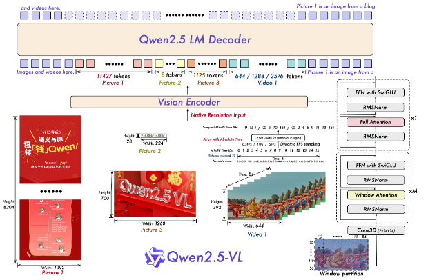
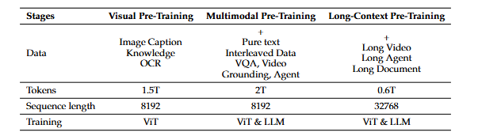
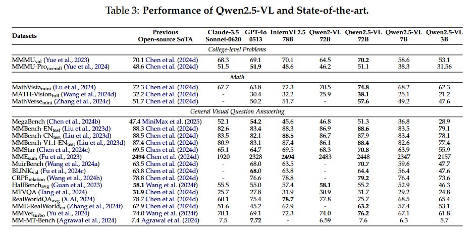

# Qwen2.5-VL技术报告解读

先上[论文链接](https://arxiv.org/pdf/2502.13923)
阿里云Qwen团队VL模型出技术报告啦。该报告介绍了Qwen2.5-VL的技术细节、优势及应用潜力，其在多方面取得显著进展。
## 研究背景：
当前大型视觉语言模型存在计算复杂、上下文理解有限、细粒度视觉感知差和处理不同长度序列性能不稳定等问题。Qwen2.5-VL旨在探索细粒度感知能力，提升模型性能。

## 模型架构

主要由三部分组成: 大语言模型、视觉编码器和基于MLP的视觉语言合并器  
- 大语言模型：还是用了Qwen2.5的训练权重作为初始化，将1D-RoPE改进为与绝对时间对齐的多模态旋转位置嵌入(MRoPE)，能更好地融合时间和空间信息，提升对多模态输入的理解和处理能力。**mark**这里解释一下MRoPE：将位置嵌入分解为时间、高度、宽度三个维度，以更好地对多模态输入进行建模。比如在处理图像时，时间ID在所有视觉token中保持不变，高度和宽度ID根据每个token在图像中的空间位置进行分配。
- 视觉编码器采用重新设计的ViT架构，引入窗口注意力和2D-RoPE，2D-RoPE有助于模型有效捕捉2D空间中的位置关系，窗口注意力机制则将计算开销从与图像大小的二次方相关优化为与patch数量呈线性关系，提升了计算效率。  
- 基于MLP的视觉-语言合并器：先将空间上相邻的四个patch特征进行分组，再将这些分组后的特征拼接起来，通过一个两层的多层感知机（MLP）进行处理。  
将 MRoPE 扩展到 3D 处理视频数据；通过 MLP 压缩图像特征序列，降低计算成本。

## 数据介绍及筛选
- 预训练数据量从1.2万亿tokens大幅扩展到约4万亿tokens，通过清洗原始网络数据、合成数据等多种方式构建。涵盖图像字幕、交错图像文本、OCR、视觉知识、多模态学术问题、定位、文档解析、视频描述、视频定位以及基于智能体的交互数据等多模态数据。

### 数据管道
数据筛选管道是提升Qwen2.5-VL模型训练数据质量的关键组件，它通过多阶段处理确保进入模型训练的数据具备高质量、高相关性和适宜复杂度。
- 第一阶段：特定领域分类：利用从Qwen2.5-VL-72B派生的专门分类模型Qwen2-VL-Instag，对问答对进行层次化分类。先将问答对划分到如编码与规划等八个主要领域，再细分至 30 个细粒度子类别，像编码领域会细分为代码调试、代码生成、代码翻译和代码理解等。这种层次结构为后续针对不同类别定制筛选策略提供便利，增强监督微调（SFT）数据集的质量和相关性。
- 第二阶段：领域定制筛选
    - 基于规则的过滤：运用预定义的启发式规则，去除低质量或有问题的条目。在文档处理、OCR 和视觉定位相关数据集里，识别并移除重复模式的数据，避免干扰模型学习；排除包含不完整、截断或格式错误响应的条目；同时摒弃不相关或可能导致有害输出的查询和答案，确保数据集符合伦理准则并满足任务需求。
    - 基于模型的过滤：借助基于Qwen2.5-VL系列训练的奖励模型，从多个维度评估多模态问答对。评估查询的复杂性和相关性，保留具有适当挑战性和上下文相关性的示例；从正确性、完整性、清晰度、与查询的相关性以及实用性等方面评估答案；在视觉定位任务中，特别关注对视觉信息的准确解释和利用。通过多维度评分，只有高质量数据才能进入SFT阶段。
- 补充策略：拒绝采样  
在需要复杂推理的任务数据集中实施拒绝采样，如数学问题求解、代码生成和特定领域的视觉问答。利用 Qwen2.5-VL 模型的中间版本评估生成的响应与真实答案的匹配度，仅保留匹配的样本；  
同时，排除包含代码切换、过长或重复模式的响应，确保思维链（CoT）推理过程清晰连贯；还通过基于规则和模型驱动的过滤策略，验证中间推理步骤对视觉和文本模态的有效整合，尽管模态对齐仍面临挑战，但该方法能显著提升模型的推理能力。
## 预训练
预训练主要分三个阶段，逐步增强模型能力。
- 第一阶段：视觉编码器训练，让其与语言模型更好地对齐，为多模态理解奠定基础。精选数据集训练培养其视觉表示能力。
- 第二阶段--多模态数据训练：所有模型参数被解锁，模型在多样化的多模态图像数据上进行训练，以增强处理复杂视觉信息的能力。引入了更复杂且需要推理的数据集，如交错数据、多任务学习数据集、视觉问答、多模态数学、基于智能体的任务、视频理解和纯文本数据集等。  
- 第三阶段--长序列推理训练：为进一步提升模型对长序列的推理能力，引入视频和基于智能体的数据，并增加序列长度。在这个阶段，数据被动态打包到语言模型，以平衡计算负载，适应模型处理长序列的能力提升。
## 后训练
后训练还是标准的两段式，先SFT再DPO。SFT通过特定格式转换和数据过滤，使模型适应下游任务；DPO利用偏好数据使模型符合人类偏好。
## 实验结果
综合能力评估：在常见的多个任务上，Qwen2.5-VL-72B与当前最先进模型相比表现出色，在多模态任务和纯文本任务上均展现强大实力。

其实值得注意的是上海人工智能实验室的InternVL2.5这个之前做过系列论文精读（当时还是[V2](https://zhuanlan.zhihu.com/p/9788788411))的模型实力也很强啊，基本和Qwen一个水平，分数差距很小。
专项能力评估：在通用视觉问答、文档理解与 OCR、空间理解、视频理解与定位和智能体能力等专项任务评估中，Qwen2.5-VL系列模型在不同规模下均表现优异，部分任务超越同类模型，就不再多提了，感兴趣的可以查看论文。
## 研究结论
Qwen2.5-VL这个模型在多模态任务上表现还是不错的，但其实并没有说有断代的领先，开源出来也是给我们一个更多的选择。