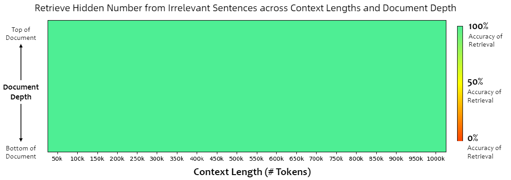

# Qwen2.5 技术报告解读
来了，他来了，国内最好的大模型之一Qwen2.5的技术报告终于来了，先放[链接](https://arxiv.org/abs/2412.15115)，赶紧一起来看看吧。

## 模型概述
Qwen2.5不用多介绍了吧，包括开源的密集模型（0.5B - 72B 参数）和用于API服务的混合专家模型（MoE），如Qwen2.5-Turbo和Qwen2.5-Plus。值得注意的是Qwen2.5-Turbo也支持长达100万tokens的上下文长度，能够处理超长文本。同时还提供了更多不同精度的版本（有3B，14B，32B模型），更多选择对于不同任务的支持。

- 性能优势：  
预训练数据从7万亿tokens扩展到18万亿tokens，为模型提供了更丰富的知识和更强的推理能力基础。在post-training阶段，通过精心设计的监督微调、多阶段强化学习等技术，显著提升了模型对人类偏好的对齐能力。Qwen在长文本生成、结构化数据分析和指令遵循等方面表现出色。

## 模型架构与分词器
模型架构和其他的密集型LLM都差不多一样，简单介绍下：基于Transformer解码器架构，采用了**分组查询注意力（GQA）、SwiGLU激活函数、旋转位置嵌入（RoPE）、QKV偏差和RMSNorm**等技术，确保高效的训练和推理。混合专家模型则通过将标准前馈网络层替换为专家层，实现了更高效的参数利用和性能提升。这些架构创新使得模型在不同规模下都能展现出优异的性能。
- 分词器：使用Qwen的tokenizer，实现了字节级字节对编码（BBPE），词汇表包含151,643个常规tokens，并扩展了control tokens集（从3个增加到22个，主要用于控制模型的生成过程、指示特定的任务等），增强了模型对不同任务和功能的处理能力，同时确保了跨模型的一致性。

## 预训练数据处理
- 高质量数据筛选：  
利用Qwen2-Instruct作为数据质量过滤器对训练样本进行打分和评估，通过多维度分析评估和筛选训练样本，提高了数据质量，尤其在多语言数据处理上表现更优。
- 更好的数学和代码数据
相比Qwen2增加了高质量的数学和代码数据，增加其数学推理和代码生成方面的能力。
- 领域平衡策略：  
文章只写了通过对不同领域数据的重新采样，平衡了数据分布，但并没有给出具体的领域数据比例。说是减少了过度代表领域（如电子商务、社交媒体）的数据，增加了高价值领域（如技术、科学）的数据，从而优化了预训练数据的组成。
- 合成数据增强：  
从Qwen2-72B-Instruct和Qwen2-Math-72B-Instruct生成高质量合成数据，并使用专有奖励模型和Qwen2-Math-RM-72B模型进行严格过滤，增强了模型在数学、代码和知识领域的能力。
- 超参数优化：  
Qwen2.5的预训练也参考了Scaling law，基于得到的最优超参数预测结果，将最终损失建模为模型架构和训练数据规模的函数。通过这个函数来确定不同模型架构的最优超参数，如确定不同规模的dense model和MoE模型的关键训练参数（比如批量大小，学习率），以提高训练效率和模型性能。

- 长上下文预训练：  
采用两阶段预训练方法，除Qwen2.5-Turbo外，模型在初始阶段使用4,096tokens上下文长度训练，最后阶段扩展到32,768个tokens，并调整RoPE frequency（从10000增加到1000000)。Qwen2.5-Turbo则采用渐进式上下文长度扩展策略(从32768个tokens到262144个tokens上下文长度），通过精心设计的数据组合和训练方法，使模型能够有效处理长序列数据。同时，使用YARN和Dual Chunk Attention（DCA）等技术提高了模型对长序列的处理能力，确保在不同长度输入下的性能一致性。  
## 后训练
- 监督微调（SFT）  
数据构建：构建了超过100万个样本的大规模数据集，重点就是为了解决Qwen2在一下领域的局限性。主要涵盖长序列生成、数学、编码、指令遵循、结构化数据理解、逻辑推理能力、跨语言转移和系统指令稳健性提高等多个关键领域。

- 模型以32,768个tokens的序列长度进行了两轮微调。为了优化学习过程，学习率从7e-6逐渐降低至7e-7。为了解决过拟合问题，还应用了0.1的权重衰减，并且将梯度范数裁剪至最大值1.0。

- 离线强化学习（Offline RL）：  
通过执行反馈和答案匹配等策略确保响应质量，利用 SFT 模型对新查询重新采样响应，构建包含约150,000个训练对的数据集。使用人类和自动化审查过程确保训练信号的可靠性和准确性，训练模型以提高其在推理、事实性和指令遵循等方面的能力。
- 在线强化学习（Online RL）：  
开发了遵循严格标注标准的奖励模型，确保模型生成的响应符合伦理和用户需求，涵盖真实性、有用性、简洁性、相关性、无害性和去偏性等方面。利用 Group Relative Policy Optimization（GRPO）进行训练，根据奖励模型评估的响应分数方差确定查询处理顺序，提高了模型生成高质量响应的能力。
- 长上下文微调：  
为扩展Qwen2.5-Turbo的上下文长度，在后训练中引入更长的SFT示例，采用两阶段微调方法，结合短指令和长指令，提高了模型在长上下文任务中的指令遵循能力。在RL阶段，由于计算成本和奖励信号的限制，主要关注短指令训练，发现其对长上下文任务中的人类偏好对齐仍有显著提升。

## 模型评估
- 评估方法与基准：  
使用包括通用开源基准和内部数据集的综合评估套件，对预训练的基础模型和后训练的指令调整模型进行评估，评估过程自动化程度高。为防止数据泄漏，采用n-gram匹配方法排除潜在污染数据。
- 基础模型评估：  
对Qwen2.5系列不同规模的基础模型（72B+、14B - 30B+、7B+、较小模型）与其他领先模型进行比较，结果显示 Qwen2.5 模型在各规模下均表现出色。例如，Qwen2.5-72B在多个任务中超越同类模型，且在参数数量仅为Llama -3-405B-Instruct的五分之一的情况下，性能与之相当；

Qwen2.5-7B一般来说都是个人开发者最长使用的模型了，因为其参数量刚好够一张卡来进行推理，在多项基准测试中表现都不错，不愧是Qwen；

较小模型如Qwen2.5-0.5B和1.5B也在各自规模下保持了较强的性能。

任务表现分析：评估涵盖自然语言理解、编码、数学、科学知识、推理和多语言能力等多个任务领域，Qwen2.5在这些任务中展现出良好的性能，尤其在数学和编码任务上表现突出，表明其在专业领域知识和技能方面的强大能力。
- 指令调整模型评估：  
在MMLU-Pro、MMLU-redux、LiveBench0831等通用基准，以及数学、编码、指令遵循和人类偏好对齐等特定领域基准上进行评估。Qwen2.5-72B-Instruct在多个关键基准测试中表现出色，超越了更大规模的Llama-3.1-405B-Instruct；

- 内部自动评估：  
千问团队还开发了内部数据集专门评估模型在知识理解、文本生成、编码等方面的能力，包括英语和中文评估以及多语言评估。结果显示 Qwen2.5 系列模型在不同语言和任务中的性能优势，如Qwen2.5-32B在中文指令跟随方面有显著改进，Qwen2.5在多语言知识和数学推理方面表现出色，但在捕捉文化细微差别方面仍有提升空间。

- 奖励模型评估：  
千问团队还对Qwen2.5系列使用的奖励模型在多个基准上进行评估，发现当前奖励模型评估存在局限性，如在特定基准上的过度优化可能导致在其他基准上性能下降，且现有评估基准无法准确预测 RL 模型的性能，文章强调了开发更全面评估方法的必要性。
- 长上下文能力评估：  
使用 RULER、LV-Eval 和Longbench-Chat基准测试评估模型的长上下文处理能力，结果表明Qwen2.5模型在配备长度外推技术（DCA + YARN）后，在长上下文任务中表现不可思议啊。Qwen2.5-Turbo甚至在1million的tokens密码检索任务中达到100%准确率，并通过稀疏注意力机制显著提高了推理速度。

## 总结
Qwen2.5大模型真的是我国开源大模型之光啊，可以说是使用量最多的开源大模型了。这篇技术报告花了比较大的篇幅在不同参数在不同任务上和其他模型以及自身的表现上了，使用的技术也基本上是目前最主流的了。主要亮点个人感觉还是在使用了两阶段预训练提高了长文本处理能力上，文章也多次强调了Qwen2.5的长文本能力。