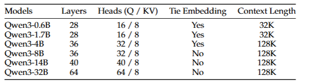
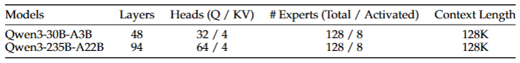
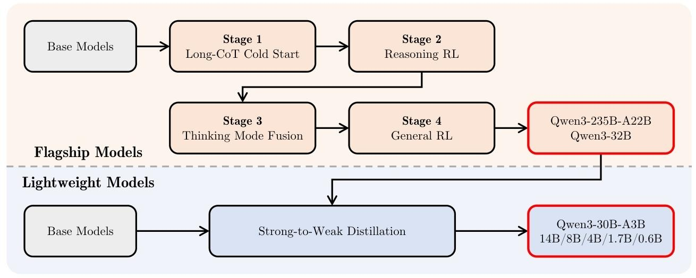
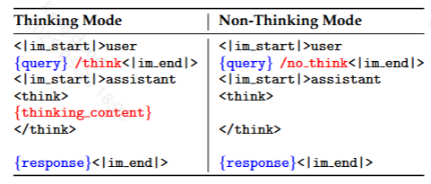

# Qwen3技术报告解读
Qwen3终于来了，赶紧来看看技术报告，都有哪些新的亮点呢？[论文链接](https://arxiv.org/pdf/2505.09388)
## 一、模型架构与核心创新
Qwen总算是也训练了moe架构的模型，一共发布了8款不同大小的模型，包含6 款稠密模型（0.6B-32B）和2 款 MoE 模型（30B-A3B、235B-A22B），其中旗舰模型 Qwen3-235B-A22B 总参数 235B，每 token 激活 22B 参数，兼顾性能与效率。

### 混合架构设计
MoE模型采用 128 专家 / 8 激活设计，通过全局批量负载均衡损失促进专家专业化。
稠密模型沿用Qwen2.5 架构（GQA、SwiGLU、RoPE），引入QK-Norm 稳定注意力训练；
### 双模式统一框架
- 思考模式：支持复杂多步推理，通过长链思维（CoT）冷启动训练和推理强化学习（RL）优化，适用于数学、编码等任务。
- 非思考模式：针对快速响应场景，直接生成结果，延迟更低。
- 动态切换：通过聊天模板（如/think和/no_think标签）或用户查询自动切换模式，支持思考预算控制（如设置最大思考 token 数）。
## 二、训练数据与策略
预训练数据覆盖119 种语言及方言，包含 36 万亿 token，较 Qwen2.5 数据量翻倍、语言数从 29 增至 119。
- 数据构成：通用文本（70%）、STEM 与编码（20%）、长上下文数据（10%），通过 Qwen2.5-VL 提取 PDF 文本、Qwen2.5-Math/Coder 生成领域数据。

### 三阶段预训练
- 阶段 1（通用）：30 万亿 token，4K 上下文，构建基础语言能力。
- 阶段 2（推理）：5 万亿 token，聚焦 STEM 和编码，提升推理能力。
- 阶段 3（长上下文）：1 万亿 token，上下文扩展至 32K，采用 YARN 和双块注意力（DCA）支持 128K 推理。所谓的YARN(Yet another RoPE extensioN method)是一种计算高效的扩展上下文窗口的方法，通过修改 RoPE 公式，利用原始预训练模型在少量数据上微调实现上下文窗口扩展。DCA 主要解决 RoPE 内相对位置编码的差值矩阵问题，能够使模型支持超过 10 万个 token 的上下文输入，且无需持续训练。
### Post-training策略

- 长 CoT 冷启动：构建含数学、编码的验证数据集，通过 QwQ-32B 生成候选响应并经过人工经验过滤保留高质量推理路径。
- 推理强化学习：筛选未用于冷启动的3995个高难度查询-验证对，采用 GRPO 算法进行训练，还结合了结合离线数据增强，训练也使用了混合精度训练。AIME’24 得分从 70.1 提升至 85.1。
- **思考模式融合**：
就是这关键一步使得Qwen3能够做到将thinking和非thinking整合到同一个模型，且可以动态切换。主要是通过混合思考与非思考数据（主要是指令跟随，创意协作等样本）比例控制在3:7。
然后，设计聊天模板实现模式统一，引入/think和/no_think标签，强制模型按模式生成（如/think: 请详细推导数学公式；/no_think: 请简短回答天气问题）。ThinkFollow任务（多轮模式切换）准确率达 98.9%，非思考模式延迟降低了40%。
- 通用 RL：目标是为了提升在开放领域的综合能力，包括指令跟随，工具调用等。这次的奖励系统设计得也非常复杂，主要分为规则奖励、参考答案奖励和偏好奖励，覆盖 20 + 细分任务。IFEval 指令遵循得分83.4%，较冷启动阶段提升12%。
### 轻量级模型（0.6B-14B）的蒸馏
使用了两阶段蒸馏：先离线蒸馏（学生模型模仿教师模型的logits分布来学习推理路径和风格）。然后再做在线蒸馏(学生模型在生成时动态对齐教师模型的中间层激活值，优化局部推理逻辑),训练还引入了动态温度调整，在后期降低随机性，提升收敛稳定性。
重点是用蒸馏的方式，GPU成本仅为 RL 的 1/10，同时轻量级模型性能也接近大模型，如Qwen3-8B 在 LiveCodeBench v5 得分 65.7，媲美 Qwen2.5-14B（62.7）。
## 三、关键性能与对比
**省流版**：
Qwen3-235B-A22B 在编码、数学、通用能力等基准评估中表现更优，如在 AIME’24 数学竞赛测试中得分 85.7，超越 DeepSeek-R1 等；在 LiveCodeBench 代码评测突破 70 分大关，超越 Grok3；在 ArenaHard 人类偏好对齐测评 95.6 分，力压 OpenAI-o1。不过在部分表现上仍不及 Gemini-2.5-Pro。在通用任务、数学和科学任务、多语言任务和代码任务上全面超越，且参数规模更小，仅有 DeepSeek-V3 参数规模（6710 亿）的 35% 左右
Qwen3-30B-A3B激活参数仅为 QwQ-32B 的 10%，但在前述多项测试中表现更胜一筹。
Qwen3-8B/4B/1.7B-Base 在超过一半的基准测试中甚至超越了更大尺寸的 Qwen2.5-14B/7B/3B Base 模型，尤其在 STEM 相关和编码基准测试中表现突出。
Qwen3和之前的版本对比。
| 任务/模型          | Qwen3-235B-A22B (思考) | Qwen3-32B (非思考) | Qwen2.5-72B-Instruct | 对比优势                  |
|---------------------|-------------------------|---------------------|-----------------------|---------------------------|
| **代码生成 (LiveCodeBench v5)** | 70.7                    | 35.3                | 30.7                  | 思考模式提升超130%         |
| **数学推理 (AIME’24)**        | 85.7                    | 40.1                | 18.9                  | 思考模式提升353%           |
| **多语言 (MGSM)**          | 83.53                   | 70.2                | 65.3                  | 全模式提升显著            |
| **长上下文 (RULER 128K)**   | 90.6                    | 83.5                | 88.4                  | 思考模式下保持高准确率     |

## 总结
Qwen3这次的更新主要就是在首次实现了思考模式和非思考模式的动态切换。面对简单任务时，能快速响应，节省资源；遇到复杂任务，则启用深度计算模块，确保结果精准严谨，提升了响应效率。Qwen3也终于推出了MoE架构的模型，更是节省了激活的参数，像Qwen3-30B-A3B仅激活3B参数，就能达到上代 Qwen2.5-32B 模型的性能，这对于个人开发者真的太友好了。

