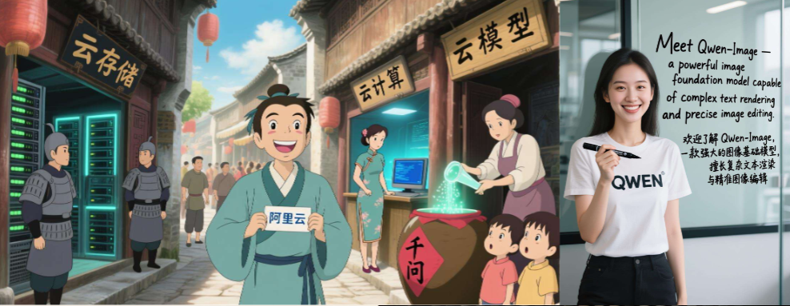
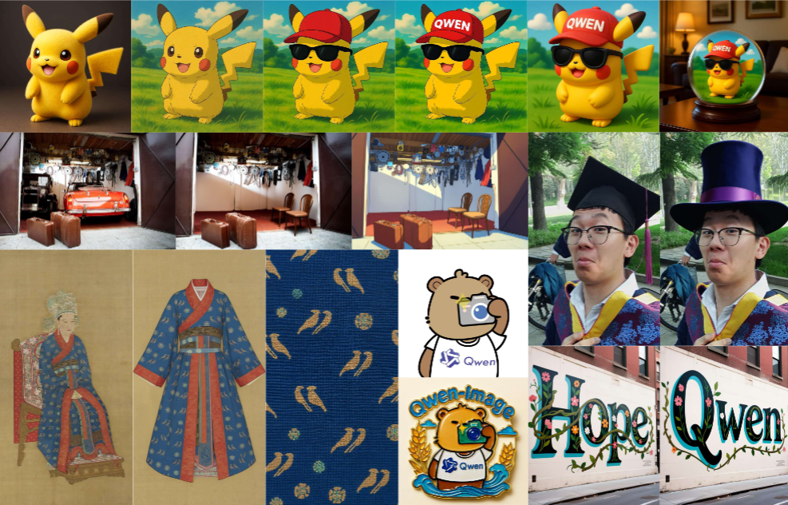
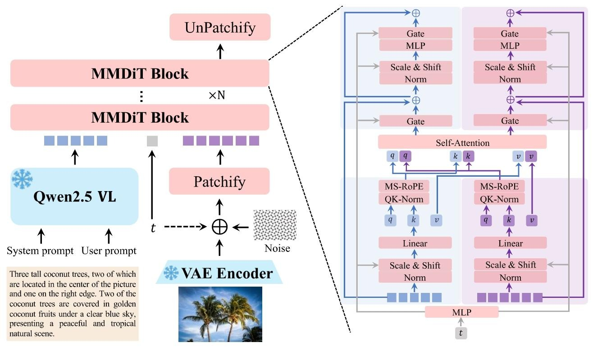
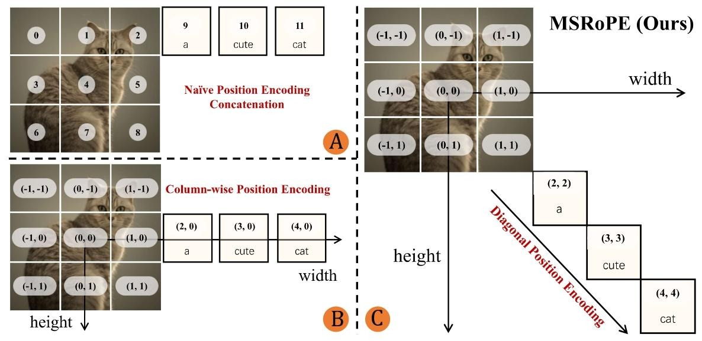
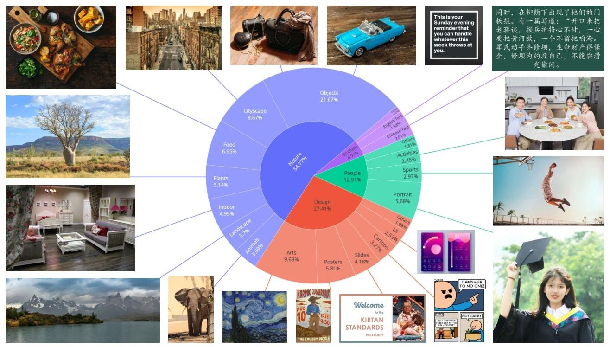
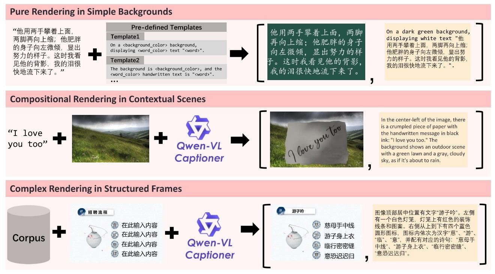

# Qwen-Image技术报告解读

Qwen又开源新模型了，这次是Qwen-Image，一个图像生成模型。以往的图像生成模型在复杂文本渲染上效果不佳，但是Qwen-Image在复杂文本渲染和精确图像编辑上效果很强大，快来看看是怎么做到的吧。

## 主要亮点
- **卓越的文本渲染能力**：Qwen-Image 在复杂文本渲染方面表现出色，包括多行长文本布局、段落级语义表达以及精细的细节呈现。它能高精度支持英语等字母语言和中文等表意文字的渲染，如下图所示：

- **一致的图像编辑性能**：通过改进的多任务训练范式，Qwen-Image在编辑操作中能出色地保持语义完整性和视觉真实性，实现精准且上下文协调的图像修改,比如替换文字，变换风格，衣服替换等等，如下图：

- **跨基准的优异表现**：在多个基准测试中，Qwen-Image 持续优于现有模型，在各类生成和编辑任务中均展现出强大性能，为图像生成领域奠定了坚实的基础模型地位。

## 模型架构
Qwen-Image的模型架构采用了双流多模态扩散MMDiT架构，通过两条并行的处理流分别处理文本和图像信息，最终实现跨模态的联合建模。如下图所示：
- 文本输入的特征表征经由冻结的Qwen2.5-VL网络进行解析文本语义。
- 图像输入的特征表征经由VAE自编码器生成，将原始图像压缩为潜在空间的向量表示，用于后续的扩散过程。这个编码器采用了Wan-2.1-VAE的架构，具体而言就是一个单编码器、双解码器架构。这种设计使用一个适用于图像和视频的共享编码器，以及针对每种模态的专用解码器，本文仅对图像解码器进行微调。
- 接着就是MMDiT结构，传统的 MMDiT 模块中，文本标记直接拼接在扁平化的图像位置嵌入之后，未考虑两者的空间关联性，可能导致文本与图像的位置对齐不准确。本文在此基础上引入了多模态可扩展旋转位置编码（**MSRoPE**）。首先，MSRoPE是从图像中心位置开始编码，增强对图像中心区域的敏感性，然后将文本编码沿网格对角线排列，文本输入被视为二维张量且两个维度共享相同的位置ID，使文本与图像的位置信息在对角线上自然融合，强化文本与图像在空间语义上的关联性，如下图右半部分所示，a cute cat在对角线上和图像的位置信息融合了。

## 数据
说完了模型结构，我们来看看训练数据是怎么处理的。
数据类型主要分为四个部分，自然占比55%，包含物体景观，动植物等等；设计占比27%，主要包括海报，用户界面，ppt等艺术形式；人物占比13%，合成数据占比5%，具体如下图所示：
### 数据清洗
数据清洗共有7个阶段：
- **初始预训练数据筛选**：训练图像调整为256p分辨率（含多种宽高比），通过一系列过滤器去除低质量或无关图像、消除重复或近似重复图像-文本对，以及排除包含色情、暴力等冒犯性内容等等。
- **图像质量增强**：重点提升数据集图像质量，通过“旋转过滤器”移除因EXIF元数据显示存在明显旋转或翻转的图像；“清晰度过滤器”丢弃模糊或失焦图像；“亮度过滤器”排除过亮或过暗图像；“饱和度过滤器”消除色彩饱和度异常高（常表明是人工渲染或不真实数字操作）的图像等等。
- **图像-文本对齐改进**：为平衡训练数据分布，将数据集按标题来源分为原始标题拆分、重新标题拆分和融合标题拆分。对原始标题拆分应用中文CLIP过滤器和SigLIP 2过滤器移除不匹配的图像-文本对，还包括消除过长标题，丢弃含异常内容的标题。
- **文本渲染增强**：将刚刚处理好的数据集按图像中文本的存在和语言分为英语拆分、中文拆分、其他语言拆分和非文本拆分，以确保不同语言环境下的平衡训练。纳入合成文本渲染数据，并应用“密集文本过滤器”和“小字符过滤器”移除文本过于密集或过小（难以准确标注和清晰渲染）的图像。
- **高分辨率优化**：模型开始使用640p分辨率图像训练，通过“图像质量过滤器”消除有曝光过度、曝光不足、模糊、压缩伪影等质量缺陷的图像；确保所有图像满足最低分辨率要求，排除构图或视觉吸引力差的图像，移除含水印、二维码、条形码等干扰观看元素的图像。
- **类别平衡和肖像增强**：通过错误分析识别表现不佳的类别后，将数据集重新分为通用、肖像、文本渲染三个主要类别，以便训练时进行基于类别的再平衡。利用基于关键词的检索和图像检索技术扩充数据集，增强代表性不足类别的覆盖范围，同时为提升肖像生成质量，检索真实感肖像等图像并生成强调人物细节的合成标题，还移除有面部马赛克或模糊的图像。
- **平衡多尺度训练**：模型联合训练640p和1328p分辨率的图像，设计分层分类系统对阶段6的所有图像进行分类，在每个类别中仅保留质量和美学吸引力最高的图像，并采用专门的重采样策略平衡含文本渲染的数据，以在适应高分辨率输入的同时保留已学的通用知识并确保稳定收敛。
### 数据标注和生成
- 在完成数据清洗后，还使用了Qwen2.5-VL模型进行标注，将captioning和元数据提取结合，以JSON等结构化格式生成详细信息，标题中捕获物体属性、空间关系等关键细节以及可见文本的逐字转录，结构化格式中报告图像类型、风格、水印存在情况、异常元素等关键属性。
- 数据合成分为三种如下图所示，分别是：
  - 纯渲染，使用文本段落，利用动态布局算法将其渲染到干净背景上，生成新的图像。
  - 组合渲染，模拟文本被书写或打印在纸张、木板等各种物理介质上，然后无缝合成到多样化背景图像中，创建视觉连贯的场景。
  - 复杂渲染，基于预定义模板（如 PowerPoint 幻灯片、用户界面原型）进行程序化编辑，设计全面的基于规则的系统，在自动替换占位文本的同时，保持布局结构、对齐方式和格式的完整性。

## 训练

### 预训练
预训练阶段采用**流匹配（flow matching）训练目标**，通过常微分方程（ODE）实现稳定的学习动态，同时保持与最大似然目标的等价性。Qwen-Image也使用了基于Ray的分布式框架分离数据预处理与模型训练。同时，结合了数据并行和张量并行，使用Transformer-Engine库实现多头自注意力的头级并行，减少同步开销。预训练策略仍旧是多阶段式的：
- 从低分辨率到高分辨率
- 从非文本到文本
- 从大规模数据到精细化高质量的数据
- 不平衡的数据集到平衡的数据集
- 从真实数据到合成数据

### 后训练
后训练包括**监督微调（SFT）** 和**强化学习（RL）** 两个阶段，进一步提升模型的生成质量和指令遵循能力。  
1. **监督微调（SFT）**  
   - 构建分层语义类别的数据集，结合人工标注筛选清晰、细节丰富、逼真的图像，引导模型生成更真实、精细的内容。  
2. **强化学习（RL）**  
   - 采用两种策略：直接偏好优化（DPO）和组相对策略优化（GRPO）：  
     - **DPO**：  
       - 数据准备：同一提示下生成多幅图像，由人工标注最佳 $x_0^{win} $ 和最差 $x_0^{lose}$ 样本。  
       - 目标函数基于流匹配准则，通过对比预测速度差异优化模型：  
         $
         \mathcal{L}_{DPO} = -\mathbb{E} \left[ \log \sigma\left(-\beta \left( Diff_{policy} - Diff_{ref} \right) \right) \right]
         $
         其中$Diff_{policy}$ 和 $Diff_{ref}$ 分别为当前模型和参考模型的速度误差差异， $\beta$为缩放参数。  

     - **GRPO**：  
       - 在DPO基础上进行细粒度优化，对一组生成图像 $( \{x_0^i\}_{i=1}^G $ 计算优势函数，通过轨迹采样和KL散度约束更新策略：  
         $
         \mathcal{L}_{GRPO}(\theta) = \mathbb{E} \left[ \frac{1}{G} \sum_{i=1}^G \frac{1}{T} \sum_{t=0}^{T-1} \left( \min(r_t^i A_i, \text{clip}(r_t^i, 1-\epsilon, 1+\epsilon) A_i) - \beta D_{KL} \right) \right]
         $
       - 采样过程改为随机微分方程（SDE），引入噪声增强探索能力。  

## 实验效果
Qwen-Image在多个测试数据集上与其他模型进行了全面的实验对比，以评估其在图像生成、文本渲染和图像编辑等方面的性能。结果显示，Qwen-Image在多项测试中表现非常优秀。
**通用图像生成测试**
   - **GenEval**：Qwen-Image在RL（强化学习）后得分0.91 ，高于Seedream 3.0、GPT Image 1等所有对手，展示出其在对象-centric文本到图像生成任务上的优势，能够更好地处理包含多样对象属性的组合提示。
   - **DPG**：Qwen-Image得分为88.32 ，领先于GPT Image 1（85.15）与FLUX.1（83.84）。该基准包含1K密集提示，能对提示遵循的不同方面进行细粒度评估，表明Qwen-Image提示遵循能力非常强。
   - **OneIG-Bench**：在该测试的英中双赛道上，Qwen-Image总分均排名第一。在Alignment和Text类别中也位居榜首。
**文本渲染测试**
   - **CVTG-2K（英文）**：Qwen-Image在该基准测试中，英文渲染性能与当前最先进的图像生成模型相当。
   - **ChineseWord（中文）**：Qwen-Image在这个专门评估模型渲染中文字符能力的新基准上表现出色。在不同难度层级的汉字渲染中，均获得最高准确率，远超Seedream 3.0和GPT Image 1，绝对是中文渲染的首选。
   - **LongText-Bench**：在评估长文本渲染性能的LongText-Bench上，Qwen-Image在长中文文本渲染上准确率最高，在长英文文本渲染上位居第二 。
**图像编辑测试**
   - **GEdit**：在GEdit-Bench测试中，Qwen-Image在语义一致性（SQ）、感知质量（PQ）和总体得分（O）上均排名第一，在英语和中文排行榜上都名列前茅，对多语言用户指令的泛化能力良好。
   - **ImgEdit**：Qwen-Image在ImgEdit基准测试中，在涵盖九种常见编辑任务的综合评分上排名最高，紧跟其后的是GPT Image 1。
   - **Novel view synthesis（新视角合成）**：在基于GSO数据集的新视角合成测试中，Qwen-Image的PSNR、SSIM和LPIPS指标表现出色，与其他模型相比，实现了最先进的性能，在处理复杂多对象的真实世界场景时，能保持全局一致性，包括文本保真度和光照结构。
**综合测试**：在AI Arena平台上，Qwen-Image作为唯一的开源图像生成模型，排名第三。虽然落后于Imagen 4 Ultra Preview 0606，但相比GPT Image 1和FLUX.1 Kontext等模型，有显著优势，作为一个开源模型非常强了。

## 总结
Qwen-Image在多个测试数据集上表现非常优秀，归功于其采用的VAE编码双流MMDiT架构、MSRoPE位置编码等设计。在数据处理筛选方面阐述的非常详细、训练策略方面也有一定的参考意义。

