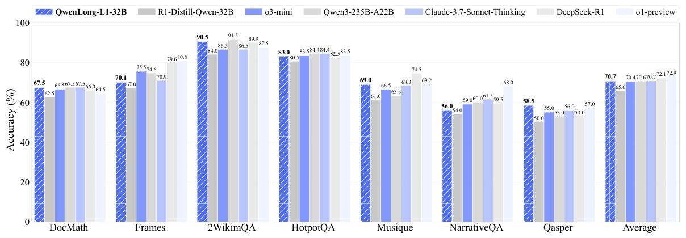
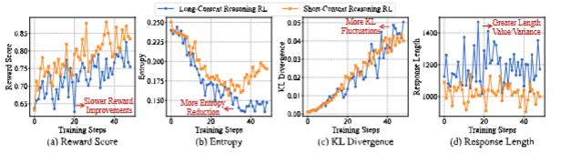
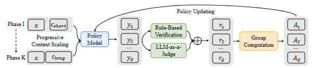
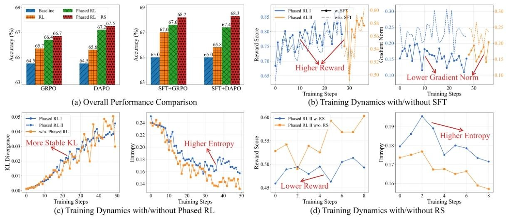

# QwenLong-L1技术报告解读

## 研究背景与挑战
现有大型推理模型（LRMs）通过强化学习在**短上下文推理任务**中表现优异，但在**长上下文场景**（如120K tokens）中面临两大核心挑战：  
- **训练效率低下**：奖励收敛慢，输出熵减少限制策略探索（分别对应下图a、b）。 
- **优化过程不稳定**：KL散度波动大，输入长度不均导致方差放大（分别对应下图c、d）。  

## QWENLONG-L1训练方式 
**省流**：通过**渐进式上下文扩展**实现短到长上下文的稳定过渡。 
### 核心策略有哪些 
- **预热监督微调（SFT）**：使用5.3K高质量样本（平均长度13,064 tokens）训练初始策略，提升上下文理解和答案提取能力。目标就是为后续的强化学习提供一个稳定的起点，使模型训练能更快收敛。
- **课程引导分阶段RL（饭要一口一口吃）**：  
  - 分K阶段递增输入长度（如阶段I：20K tokens，阶段II：60K tokens）。  
  - 每个阶段仅训练对应长度区间的样本，确保策略逐步适应。 
这样做的好处就是避免出现KL散度波动过大，保持稳定的优化状态。 
- **难度感知回溯采样**：根据样本的难度评分（diff = 1 / 平均奖励），从前期训练阶段的样本中筛选出高难度样本。这种机制使得模型在训练后期能够更多地接触到复杂的推理模式，激励模型进行探索，避免陷入局部最优解。

### 技术细节
- **强化学习算法**：GRPO和DAPO都用了，通过对奖励进行归一化来估计优势，在长上下文场景下更高效地进行策略优化。  
- **混合奖励机制**：  
  - **规则验证（ $r_{rule}$ ）**：精确字符串匹配答案，确保精度，匹配成功则奖励为1，否则为0。  
  - **LLM裁判（$r_{LLM}$）**：使用Qwen2.5-1.5B模型评估语义等价性（1 表示等价，0 表示不等价）平衡召回率。  
  - **组合奖励**：取两种奖励的最大值作为最终奖励 $r_φ = max(r_{rule}, r_{LLM})$，提升评估鲁棒性。组合也不是乱组合的，策略如下：若规则匹配成功（$r_{\text{rule}}=1$），直接采纳高精度结果，无需 LLM 介入，若规则匹配失败，触发LLM裁判，避免因表述差异误判正确答案。

## 实验设置
- **训练数据**：  
  - **DOCQA-RL-1.6K**：包含数学（600题）、逻辑（600题）、多跳推理（400题），平均长度11,437 tokens。  
  - **SFT数据集**：5,305个样本，平均长度13,064 tokens。  
- **评估基准**：7个长上下文DocQA任务，包括DocMath（数学）、HotpotQA（多跳）、Qasper（复杂问答）等，输入长度最高120K tokens。  
- **基线模型**：  
  - **专有模型**：Claude-3.7-Sonnet-Thinking、OpenAI-o3-mini、Gemini-2.0-Flash-Thinking。  
  - **开源模型**：DeepSeek-R1、Qwen3-32B、R1-Distill-Qwen-32B。  

### 关键实验结果
- **性能对比**（表4）：  
  | 模型                | DocMath | Frames | 2Wiki  | HotpotQA | Musique | NarrativeQA | Qasper | **平均** |  
  |---------------------|---------|--------|--------|----------|---------|-------------|---------|----------|  
  | R1-Distill-Qwen-32B | 62.5    | 67.0   | 84.0   | 80.5     | 61.0    | 54.0        | 50.0    | 65.6     |  
  | **QWENLONG-L1-32B** | **67.5**|**70.1**|**90.5**|**83.0**|**69.0**|**56.0**|**58.5**|**70.7**|  
  - **效果省流版**：相比基线模型，平均准确率提升**5.1%**，超越OpenAI-o3-mini（70.4%）、Qwen3-235B-A22B（70.6%），与Claude-3.7（70.7%）持平。  
- **消融实验**(见下图)：  

  - **SFT+RL组合**显著优于单一优化，RL对长上下文推理起决定性作用。  
  - **渐进式扩展策略**可稳定KL散度，明显提升了Entropy，验证其对训练稳定性的贡献。  

## 总结
没想到QwenLong-L1在长上下文场景下表现如此优秀，仅仅32B的大小几乎可以在长上下文推理的指标上追上之前刚发布的自家的Qwen3-235B-A22B模型。个人感觉还是主要得益于，训练方式的精益化，（强化训练也是分阶段式地从短到长），然后奖励函数也设计的有新意，融合了领域规则约束与模型自主评估的混合奖励机制。这给我们之后去做后训练提供了更多可参考的思路。

