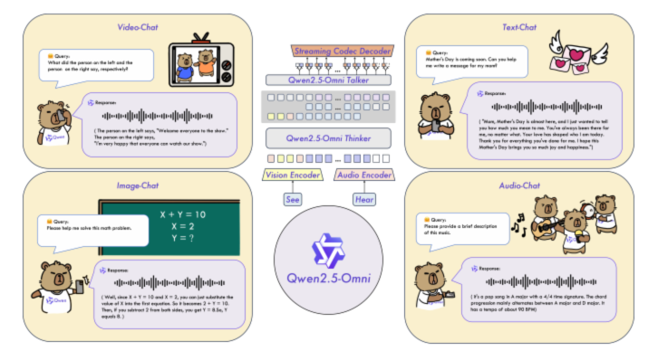
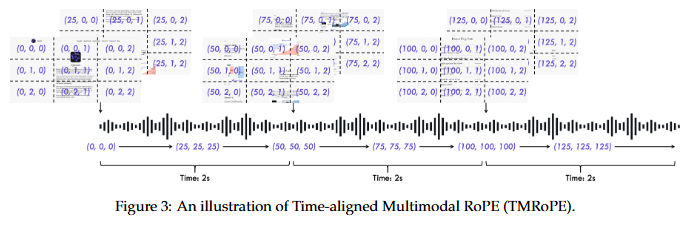
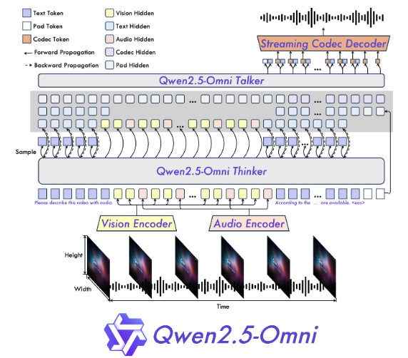
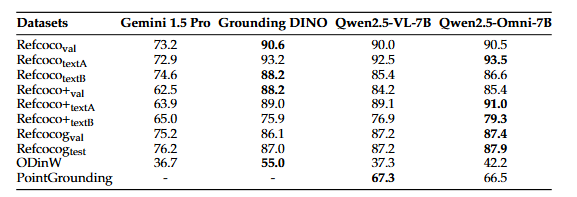

# Qwen-Omni技术报告解读
## 1. 模型概览
[论文链接](https://arxiv.org/pdf/2503.20215)Qwen家族又添新模型，Qwen2.5-Omni是一个端到端多模态模型，支持文本、图像、音频和视频输入，并能在流式处理中实时生成文本和自然语音响应。其核心创新在于高效的多模态融合、时间对齐机制及流式生成架构。

## 2. 关键技术
### **多模态处理与时间对齐（TMRoPE）** 
在多模态处理中，视频和语音输入需保持时间同步，而传统位置编码难以处理动态时间关系。
**TMRoPE**的方案是用时间对齐的位置嵌入算法，将音频和视频帧按2秒分块，交替排序，通过三维Rotary Position Embedding（高度、宽度、时间）对齐模态间时序。动态调整视频帧的时间ID（每ID对应40ms），确保多模态输入的时间一致性。对不同模态的位置ID初始化方式统一（文本/音频保持单一时间ID，视频按帧动态分配）。

### **流式生成架构（Thinker-Talker）**
分为Thinker和Talker两个模块。  

**Thinker**：类似于大脑，作为语言模型，处理所有模态输入，转换为一系列隐藏表示和文本响应，本质还是decoder，通过自回归采样生成文本。
**Talker**：类似人的嘴巴，从结构看它是一个双路径自回归decoder，以流式方式接受Thinker提供的隐藏表示来预测内容的语气和态度，实现更自然的流式生成过程，Talker还使用了专门设计的qwen-tts-tokenizer来高效表示语音关键信息，并通过因果音频解码器解码为语音流。

设计上避免文本和语音生成的干扰（类似人类语言与发声器官的协同机制）。流式语音解码采用滑动窗口DiT模型（保留近4个块的信息），减少初始延迟。

### 支持长序列的块处理

**音频编码器**：每2秒分块处理，块内注意力。
**视觉编码器**：采用Flash Attention和MLP合并策略（合并邻近2×2 patches），支持动态帧率视频输入。
**跨模态编码**：文本、音频、视频输入按模态顺序拼接，长度上限32K tokens。

## 3. 训练策略
依旧是标准的两段式训练,但是单独对于多模态生成结构talker进行了多阶段训练。
**预训练阶段**：锁定LLM参数，单独训练音频/视觉编码器（基于音频-文本、图像-文本数据）。全参数联合训练：解冻所有参数，加入多模态混合数据（800B图像/视频、300B音频、100B视频-音频），增强模态交互。长序列强化：引入32K长序列数据（包含长音频/视频），提升复杂序列处理能力。
初始化：LLM组件使用Qwen2.5的参数进行初始化，视觉编码器与Qwen2.5-VL相同，音频编码器则使用Whisper-large-v3进行初始化。两个编码器先在固定的LLM上分别训练各自的适配器，之后再进行整体训练。
**后训练阶段**:
Thinker的指令微调：采用ChatML格式的多模态对话数据（文本、视觉、音频混合指令），适配复杂交互场景。
Talker的多阶段训练：
阶段一: 上下文感知的自回归训练（语音接续任务）。
阶段二: 基于DPO的强化学习，结合词错误率（WER）和停顿准确性优化语音稳定性。
阶段三: 多说话人微调，提升音色可控性和自然度。

## 4. 性能评估
**文本→文本**：
在MMLU-Pro（47.0）、GSM8K（88.7）、MATH（71.5）、HumanEval（78.7）等评测中，表现接近或超越同尺寸纯文本模型（如Qwen2-7B），部分任务优于Gemma2-9B、Llama3.1-8B。
**音频→文本**：
ASR（语音转文字）：虽然在CommonVoice等数据集上仍低于专业的ASR模型如Whisper-large-v3和 Qwen2-Audio，如Fleurs_zh测试集仅为3.0。但是在语音交互如在VoiceBench上平均得分74.12，远超同类模型。而且在语音指令执行能力上也缩小了与纯文本输入的差距（如GSM8K得分88.7 vs. Qwen2-7B的91.6）。
**图像→文本**：
OCR与视觉问答：在 MMBench-V1.1-EN（81.8%）、TextVQA（84.4%）等任务中超越多数开源模型，接近Qwen2.5-VL-7B。视觉定位：RefCOCO/RefCOCOg等benchmark中准确率超90%。
**视频→文本**：在 Video-MME（72.4%）、MVBench（70.3%）等任务中超越开源模型，部分指标超过 Qwen2.5-VL-7B。
多模态综合（OmniBench）：在OmniBench多模态基准中以56.13%的平均分大幅领先其他模型（如Baichuan-Omni-1.5的 42.9%）。
**生成任务（输入→语音）**
流式语音生成：
在SEED测试集上WER达 1.42%（中文）和 2.33%（英文），优于 MaskGCT 和 CosyVoice 2。语音自然度（NMOS）中文分数在4.46-4.51，接近真人水平。

## 5. 总结
Qwen2.5-Omni最具亮点的其实是它的模态全覆盖。通过创新的架构设计（TMRoPE、Thinker-Talker）和训练策略，在多模态理解与生成任务中都达到了SOTA水平，尤其在语音交互和流式处理上表现突出，语音生成的延迟很低。而且7B的参数规模下能保留这么强的文本模型核心能力是非常强的。
