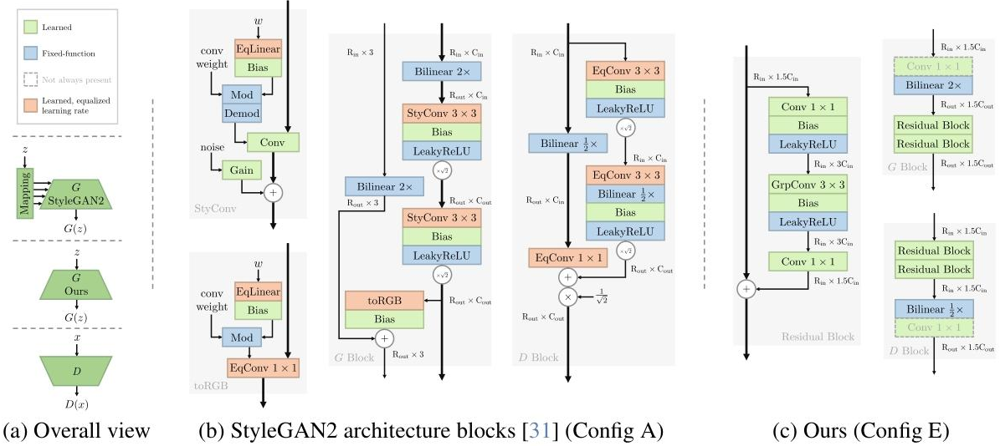
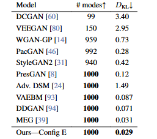
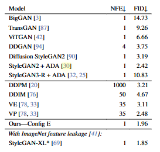
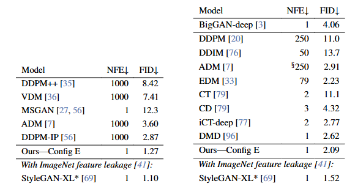
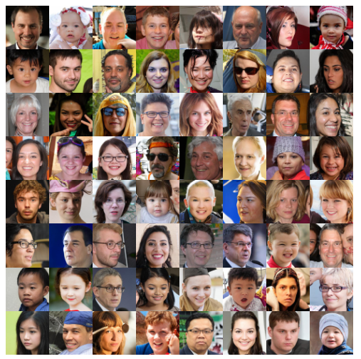

# 谁说GAN已经dead了，一种新的基线GAN网络R3GAN
## 引言
现在这个时间点能看到GAN相关的论文真是不多见了，必须看一下。这篇[论文](https://arxiv.org/abs/2501.05441)提出了一种新的生成对抗网络（GAN）基线模型R3GAN，通过改进损失函数和网络架构，提高了GAN的训练稳定性和性能，在多个数据集上取得了不错的效果。论文也公布了[github链接](https://github.com/brownvc/R3GAN)
## 目前GAN存在的问题
GAN在训练过程中存在模式崩塌和不收敛等问题，其目标函数难以优化。现有流行的GAN架构使用了许多缺乏理论依据的经验技巧，且骨干网络相对过时。
论文主要提出新的损失函数，并在StyleGAN2的基础上简化了部分结构作为新的骨干网络。
## R3GN的解决方案
### 损失函数
采用了结合零中心梯度惩罚的相对配对RpGAN损失来解决模式丢失问题，即$RpGAN+R_1+R_2$。$R_1$和$R_2$是正则惩罚项，其中的重点**RpGAN**损失函数如下：
$$\mathcal{L}(\theta, \psi)=\mathbb{E}_{\substack{z \sim p_{z} \\ x \sim p_{\mathcal{D}}}}\left[f\left(D_{\psi}\left(G_{\theta}(z)\right)-D_{\psi}(x)\right)\right]$$
这个损失函数的原始[论文](https://arxiv.org/pdf/1807.00734)通过理论分析证明具有局部收敛保证，有效解决了模式崩塌和不收敛问题，不再需要传统GAN中如StyleGAN2使用的一些临时技巧来维持训练稳定性。 
**那这个损失函数是怎么做到的呢**，文中说RpGAN通过耦合真实和虚假数据引入了一种简单的解决方案，即一个虚假样本是通过其**相对**于真实样本的真实性来进行评判的，这有效地在每个真实样本的邻域内维持了一个决策边界，而之前GAN的损失函数仅要求判别器区分所有真实样本和虚假样本，导致生成器仅仅将所有虚假样本勉强移动到单一边界外。
### 骨干网络
去除了StyleGAN2中的许多非必要特征和技巧，如风格生成（mapping network、style injection 等）、图像操作增强（mixing regularization、path length regularization）和一些特定的tricks（z normalization、minibatch stddev、equalized learning rate、lazy regularization）。R3GAN用ResNet架构作为骨干网络、适当的重采样（如通过双线性插值）、分组卷积等技术，并避免使用归一化层，采用fix-up初始化方法来稳定训练，使网络架构更加简洁和现代化。  
### 网络主要细节：     

- 生成器G和判别器D采用了完全对称的设计，每个都有2500万参数  
- 每个分辨率阶段都有一个过渡层和两个残差块。过渡层由双线性重采样和一个可选的 1×1 卷积组成，用于改变空间大小和特征图通道   
- 残差块包含五个操作：Conv1×1→Leaky ReLU→Conv3×3→Leaky ReLU→Conv1×1，且最后一个 Conv1×1 没有偏置项
- 4×4 分辨率阶段，G的过渡层被基础层取代，D的过渡层被分类器头取代。

## 实验结果
- 模式恢复：
在StackedMNIST数据集上，R3GAN能够实现1000个模式的完全覆盖，相比其他GAN模型在模式恢复能力上表现更优，且在 KL 散度指标上也取得了更好的结果。

- FID指标
在FFHQ-256数据集上，经过优化的R3GAN模型（Config E）的FID达到 2.75，优于StyleGAN2 等现有方法；在FFHQ-64数据集上也优于EDM模型。  

- 在CIFAR-10数据集上，R3GAN的FID为1.96，超过了许多其他GAN模型，且在模型容量相对较小的情况下表现出色。   

- 在ImageNet-32和ImageNet-64数据集上，R3GAN的FID分别为2.09和1.27，与其他模型相比具有竞争力，尽管模型规模较小，但在FID指标上超过了一些大型的扩散模型。   

召回率：在各个数据集上，R3GAN的召回率与扩散模型相当或略低，但优于现有的 GAN 模型，表明其在样本多样性方面具有较好的表现。
## 样例
  
这些生成的人像可以说是完全无法辨别真伪了。
## 总结
这篇论文可以说是大道至简了，通过改进损失函数，简化网络结构，无需复杂的技巧（风格注入功能被舍弃了）即可实现稳定训练，就能构建一个强力的GAN模型，并在多个传统数据集上获得不错的性能。  
不过其实也存在一些问题，论文并没有在更高分辨率的数据集上进行实验，也缺乏一些下游应用的特定功能，只是生成人脸啥的，对于目前的多模态模型来说，并不是太有亮点。

