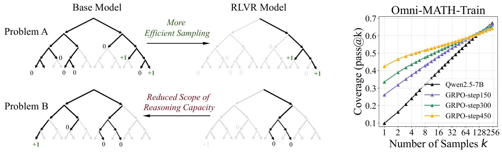
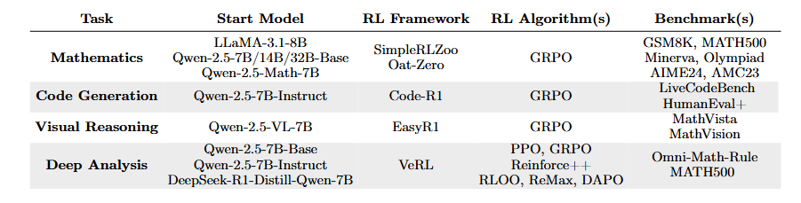
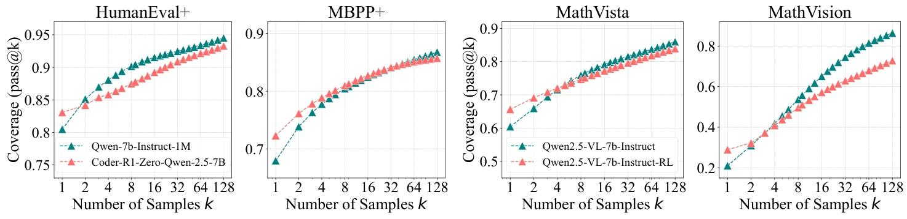
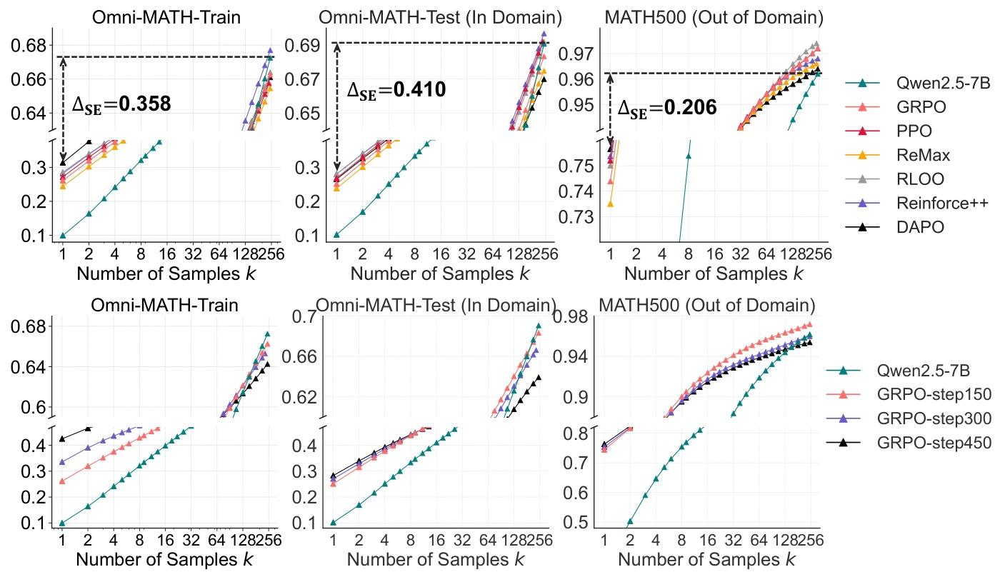
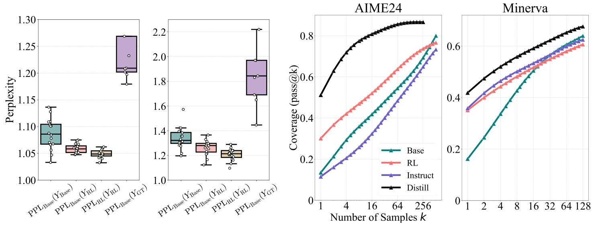

# 强化学习真的能让大语言模型获得超越基础模型的推理能力吗？

## 研究背景与目的
强化学习结合可验证奖励（RLVR）在提升LLMs的数学和编程任务推理能力方面现阶段几乎已经成了一个必然的选择了，但是否真正带来新的推理能力实际还存在疑问。这篇论文就是通过测量不同模型、算法和基准下的pass@k指标，探讨RLVR训练是否能超越基模型的推理能力边界。

## 实验方法

- **评估指标**：
采用pass@k指标,所谓pass@k就是指从模型中采样k个输出，若k个样本中至少有一个通过验证（如数学问题中答案正确、代码生成中通过单元测试等），则该问题的pass@k值为1，否则为0。将数据集上所有问题的 pass@k值取平均 ，就能反映模型在k次尝试内解决数据集中问题的比例，进而严格评估LLMs的推理能力覆盖范围。
- **实验设置**
任务，使用的模型，rl框架，算法和评价基准如下：

涵盖数学、代码生成和视觉推理三大领域，涉及多个LLM家族、模型规模和RL算法。对于数学任务，使用不同基模型和RLVR模型在多个基准上进行比较；对于代码生成任务，评估基于Qwen2.5-7B-Instruct的RLVR模型在相关基准上的表现；对于视觉推理任务，选择特定框架训练模型并在过滤后的数据集上评估。所有采样过程使用相同的温度和top p值，避免在基模型评估中使用少样本提示以确保公平比较。

## 实验结果

### RLVR对推理能力的影响

- 数学推理：在小k值时，RL训练模型优于基模型，但随着k增大，基模型逐渐赶上并超过RL训练模型。例如，在Minerva基准下，32B大小的基模型在$k = 128$时比RL训练模型高约9%。进一步分析表明，RLVR模型可解问题的覆盖范围是基模型的近似子集，且RLVR主要提高采样效率而非引入新推理能力，同时会缩小推理边界。

- 代码生成：RLVR对三个代码生成基准的影响与数学基准类似，在单样本性能上有提升，但覆盖范围缩小，潜力不如原始模型。
- 视觉推理：RLVR对视觉推理的影响与数学和代码基准一致，原始模型的可解问题覆盖范围更广。
- 不同RL算法的效果：实验了同算法和不同RL训练步数的影响，用采样效率差距 $\Delta_{SE}$ 衡量算法接近最优采样效率的程度，$\Delta_{SE}$越低越好。虽然不同RL算法在pass@1和pass@256上略有差异，但整体差异不大，且都远未达到最优采样效率。以GRPO 算法为例，随着训练步数从150步增加到450步，训练集上的pass@1从26.1提升到42.5。但在域内和域外测试集上，450步训练后的pass@1相比150步提升不明显，且pass@256在三个数据集上都下降，说明训练步数增加可能导致模型过拟合训练集，同时模型的输出熵和探索能力下降，推理边界缩小。

- 蒸馏的作用：与RLVR不同，蒸馏能引入新知识。从下面的右图可以看到蒸馏模型的pass@k曲线始终显著高于基础模型。这表明与受限于基础模型推理能力的RLVR不同，蒸馏能从更强的教师模型中引入新的推理模式，使蒸馏模型能够超越基础模型的推理边界。

## 原因分析

RLVR模型的可解问题覆盖范围是基模型的近似子集，且通过困惑度分析发现RLVR生成的推理路径已存在于基模型输出分布中，只是RL训练提高了采样效率，但也限制了探索能力，导致推理边界变窄。蒸馏能突破基模型推理能力的限制，是因为它注入了更好的先验知识。 

与传统RL的区别：传统RL在环境中的动作空间相对较小且可从零开始训练，而LLMs的动作空间巨大且RLVR从预训练模型开始，预训练先验既有助于引导合理响应，也可能限制探索新推理模式。

## 总结
在当下，强化学习已经成为LLM后训练时的必备阶段，此论文能在大量实验的基础上研究RL到底有没有给基础模型引入reasoning能力是非常有价值的。最后的得出的结论也比较有意思，RL并未引发根本性的新推理模式。但我个人感觉在指标设计和实验设置上有一定主观性，不过重要的是实验过程确实能证明RL主要是提高了LLMs采样现有正确推理路径的效率，蒸馏在引入新推理模式和扩展推理边界方面有重要作用。

