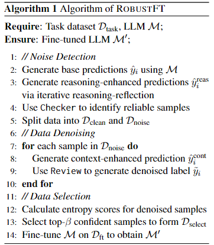

# ROBUSTFT:噪声鲁棒的 LLM 监督微调
[论文链接](https://arxiv.org/abs/2412.14922), [github链接](https://github.com/luo-junyu/RobustFT)  

最近关于SFT的框架有篇最新的论文，提出了一种名为ROBUSTFT（噪声鲁棒的LLM监督微调）的框架，在对大模型进行SFT的时候应对数据中的噪声。

## 背景：
监督微调（SFT）对使大型语言模型适应特定领域或任务是最常用的训练方式，但实际应用中收集的数据不可避免地包含噪声，严重影响模型在下游任务中的性能，因此论文作者提出了这一框架来解决数据中的噪声。
## 方法：

### 噪声样本识别
- 多专家协作是指利用多个不同的LLM对数据样本进行独立的预测和分析，汇总它们的结果，以提高噪声检测的准确性和可靠性。
- 然后引入推理增强模型，它在噪声检测过程中采用特殊推理方式的模型，会迭代地结合推理和反思过程，首先进行逐步推理，然后对推理路径进行自我反思，并且在这两个阶段之间不断迭代，以获得更强大的推理能力。
- 然后是一致性检查阶段，分析多个来源，包括原始标签$y_i$,基础LLM预测的$\hat{y_i}$，推理增强模型的$\hat{y^r_i}$，通过一致性度量计算$r_i=Checker(y_i,\hat{y_i},\hat{y^r_i})$。其中$r_i$为0-1之间的值，1表示预测高一致性，根据一致性结果将样本分为潜在噪声样本和干净样本。
### 数据去噪
- 上下文增强策略:  
1、用一个encoder把$D_{clean}$和$D_{noise}$中的查询投影到共享潜在空间。  
2、然后对于每个噪声样本从$D_{clean}$中检索k个最相似样本作为推理上下文。  
3、基于上下文信息，模型生成更可靠的响应$\hat{y^c_i}$。  
4、结合之前获得的推理增强预测$\hat{y^r_i}$，审查代理会全面考虑查询、上下文相关的预测$\hat{y^c_i}$以及推理增强预测$\hat{y^r_i}$，对噪声样本进行重新评估和标记，得到重新标记的预测$\hat{y^c_i}$
### 数据选择
- 基于响应熵的有效数据选择机制  
对于每个经过上下文增强得到的响应$\hat{y^c}$，计算其熵分数来评估模型预测的不确定性。熵分数越低，说明模型对该响应的预测越确定。计算公式：
$$H(\hat{y^c_i})=-\frac{1}{N}\sum^N_{j=1}logp(y_{ij}|q_i, y_{i<j})$$
- 根据计算得到的熵分数对去噪样本进行排序。然后，通过设置一个选择比例$\beta$来确定最终保留的样本数量，筛选出排名靠前（即熵分数较低、置信度较高）的样本。  
**完整的算法见下图**  

## 实验：
- 数据集：在五个不同的基准数据集（MMLU、ARC、PubMedQA、Drop 和 FPB）上进行实验，涵盖多种领域和任务类型，并构建不同噪声率的实验。
- 模型架构和baseline：使用不同模型架构（如Gemma2-9B、Llama3.1-8B、Llama3.2-3B），baseline包括直接模型推理的Vanilla、利用补充数据改进LLM性能的SFT增强解决方案（如Hermes-3、Tulu3）、使用潜在噪声训练数据的标准 SFT、去噪方法（如NoiseAL、SelfLabel、SelfSelect）、使用训练数据增强推理上下文的自我增强方法（SelfRAG）。
### 结果分析：
ROBUSTFT在所有数据集上表现始终更优，噪声管理对LLM微调至关重要，LLM本身的噪声检测能力有限，增强的SFT方法缺乏一致改进，推理增强方法有一定提升，去噪方法结果不一。
- 不同架构和参数大小比较：较大模型不一定更鲁棒，Gemma2-9B经ROBUSTFT后在特定领域表现优于Llama3.1-8B，说明去噪对小模型在特定领域训练的重要性。

- 消融研究：完整的ROBUSTFT框架在所有设置下都能达到最佳性能；选择组件很关键；检查器组件对模型性能有显著贡献；审查器组件有一定作用；上下文增强重新标记（CER）和推理增强LLM（REL）组件都很重要。
- 敏感性分析：模型性能在选择比例$\beta$为40-50%时达到峰值，上下文长度k在3-5时提供足够推理支持。  

- 困惑度分析：噪声显著增加困惑度，ROBUSTFT在增加噪声时仍保持相对较低的困惑度，其分布更集中，在不同数据集上具有一致性。
- 类别性能分析：不同知识领域受噪声影响差异大，ROBUSTFT在所有类别上表现平衡且扩展。]
- 稳定性分析：ROBUSTFT在不同噪声条件下保持一致性能，方差增加极小。]