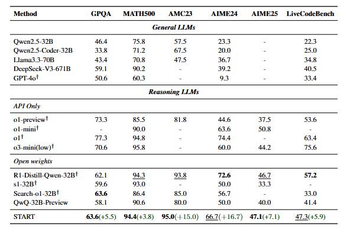

#  START: 自学成才的带工具的推理大模型
[论文链接](https://arxiv.org/pdf/2503.04625)

## 研究背景
使用过deepseek-r1这类reasoning大模型都知道会有一个较长的思维链，在一些轻量级问题上显得有些效率低下，存在幻觉。
论文所述的START是一种新型的自学习工具集成推理模型（Self-Taught Reasoner with Tools），旨在通过结合长链思维（long CoT）和外部工具（如Python解释器）来解决现有大型推理模型（LRM）的局限性。

## 核心创新点

### Hint-infer（提示推理）
- 概念：代码和数学数据由QWQ处理：
数学和代码问题作为输入，输入到QwQ-32B-Preview模型中进行推理。一方面生成 Long CoT（长思维链），并利用Hint-Library（提示库）插入提示；另一方面生成包含答案的Long CoT，同时生成代码并通过 Python代码解释器处理。这个步骤旨在利用提示库和模型推理生成初步的推理结果和代码。
- 作用：
作为测试时扩展方法，通过延长推理步骤提高模型性能（例如插入多轮思考提示）。
支持复杂计算、多方法探索、自我检查和调试（如生成代码后验证结果）。  
### Hint-RFT（提示拒绝采样微调）
- 流程：
1.利用Hint-infer生成的结果经过打分和筛选出不借助工具推理失败，但在Hint推理下成功的数据，构建初始数据集 $D_{seed}$。
2.再用 $D_{seed}$ 对QwQ-32B-Preview进行监督微调（SFT），得到START-0模型。
3.新的数学和代码问题输入到START-0模型中，推理结果再次经过打分、筛选和修改，得到$D_{START}$ 数据集，最后用这个数据集对模型进行再次微调，得到最终的START模型。这一步通过进一步增加数据多样性和数量，提升模型的性能 。
### 提示设计（Hint Library）

针对数学任务：在模型反思节点（如"Wait"、"Alternatively"）插入提示，激发外部计算。
针对编程任务：在代码生成前插入提示模板，鼓励模型自我测试（如执行测试用例）。
- 使用方法：在hint-infer时，模型在生成 Long CoT（长思维链）时，会从 Hint - library 中选取合适的提示插入其中。这样一来，模型生成的推理过程会更加符合预期的推理逻辑，也有助于模型更好地利用外部工具，比如 Python 解释器来处理代码，从而提升模型在数学和编码等复杂推理任务上的表现。

## 训练与评估
- 数据集：包含数学和代码两部分。数学数据来自之前的AIME问题（2024年之前）、MATH和Numina-MATH；代码数据源自 Codeforces、代码竞赛以及 LiveCodeBench。为降低测试数据泄露风险，对训练集采用了相同的去噪处理方法。最终得到40K道数学题和10K道代码题。
训练参数：全参数微调，学习率7e-6，32张A100 GPU，3个epoch。
- 实验细节：使用温度0.6和top-p 0.95的采样参数，进行16轮采样，对采样得到的长TIR数据评分，过滤掉重复模式的响应，手动修改不合理内容，每个问题最多保留一个响应，得到数据集$D_{START}$
## 实验成果
- 基准测试
科学QA（GPQA）：准确率63.6%（超过QwQ-32B-Preview 5.5%）。
数学竞赛（AMC23/AIME24/AIME25）：分别达95.0%、66.7%、47.1%。
编程（Live-CodeBench）：47.3%（较基线提升5.9%）。

- 相同思考时间（token数量）下的准确率比较
在ACM23,24,25三个数学基准测试中，START 模型在相同或相近的平均思考时间下，准确率大多高于QwQ-32B-Preview模型，表明START在数学推理任务上表现更优。

3.关键结论
工具调用必要性：单纯增加训练数据（无工具）的RFT仅提升0.2-0.3%。
测试时扩展效果：通过多轮Hint-infer延长思考步骤，模型准确率随步骤增加而提升。
局限性
1.工具单一性：仅使用Python解释器，未整合搜索引擎或专业工具。
2.提示依赖：人工设计提示可能干扰原始推理流，需更自动化的优化策略。
3.评估范围：实验限于少数基准，通用性有待验证。
## 总结
START使用的这个通过工具集成和自学习机制，为复杂推理任务提供了高效可靠的解决方案，虽然只是在小范围实验上评估，但已经在数学和编程等领域取得了显著的性能提升。后续可以优化的点也挺多，可以扩展除了python解释器之外的工具类型，也可以开发自适应提示生成策略，减少人工干预等等。