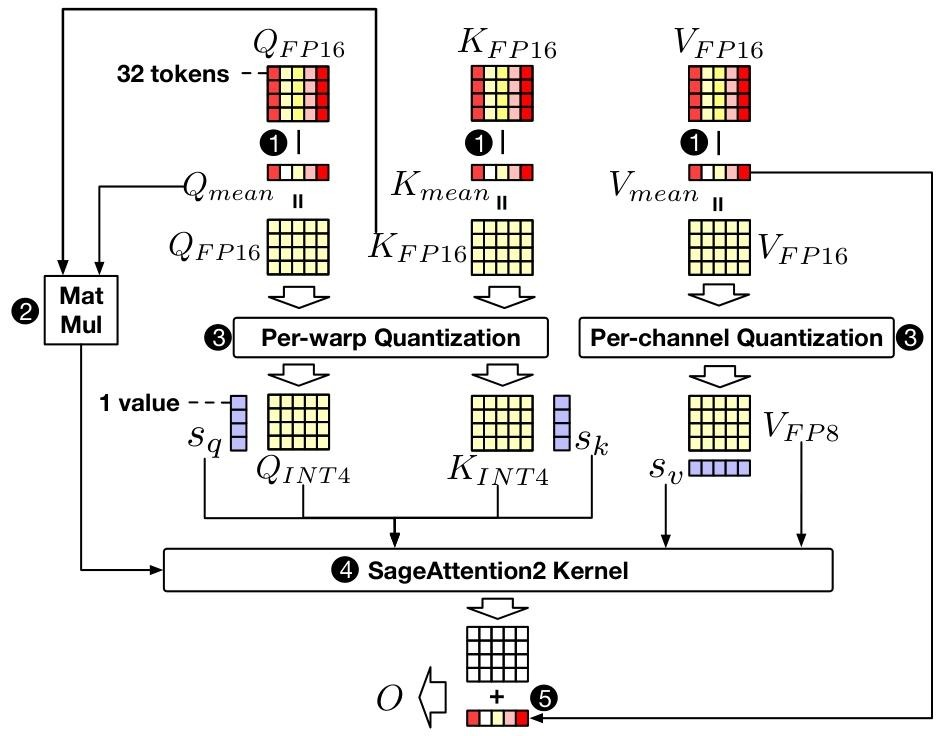
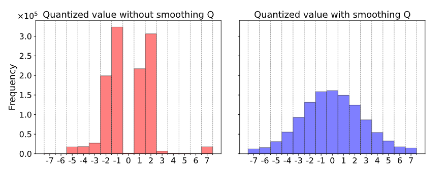
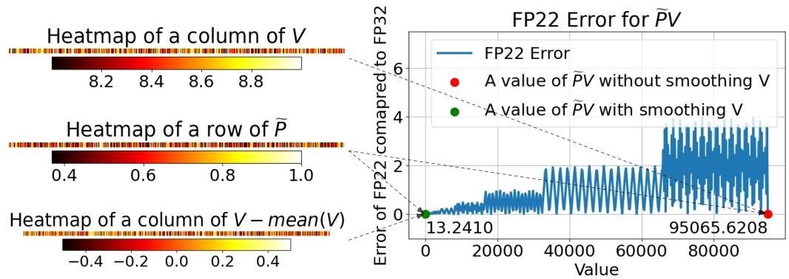
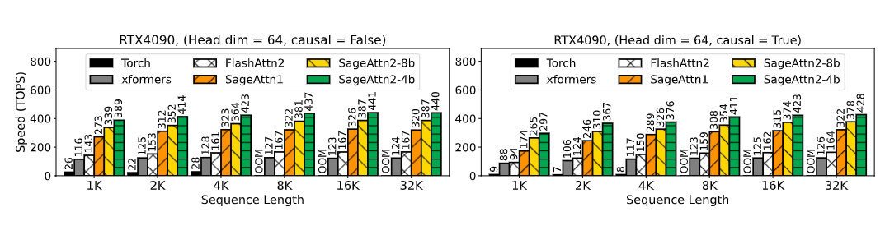
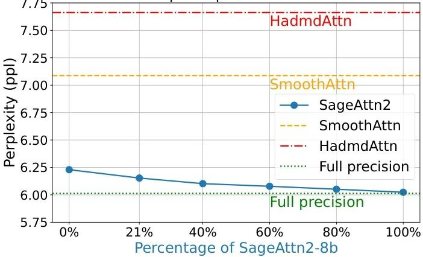

# SageAttention2 Technical Report: Accurate 4 Bit Attention for Plug-and-play Inference Acceleration

SageAttention2竟能比FlashAttention2的OPS再快上3倍！那么代价是什么呢，我们来看看它在量化的同时，精度到底怎么样呢？  

最近清华大学的statistical AI团队提出的[SageAttention2](https://arxiv.org/abs/2411.10958)，作为用于加速注意力计算的方法，通过4位矩阵乘法和精度增强技术，在保持精度的同时显著提高了计算效率。开源的代码：[链接](https://github.com/thu-ml/SageAttention)
## 研究背景与动机
注意力计算的二次复杂度使其在长序列应用中面临效率挑战。尽管已有多种策略来缓解计算需求，但适用范围有限。广泛使用的注意力方法如 FlashAttention 等通过优化硬件利用来提升速度和精度，但仍有改进空间。为克服这些问题，SageAttention2 被提出。
- SageAttention 存在两个弱点：INT8 矩阵乘法速度仅为 INT4 的一半；
- FP16 矩阵乘法与 FP16 累加器仅兼容特定 GPU。
## SageAttention2 方法  
FlashAttention 通过将 Q、K、V 从token维度分块为$Q_i, K_j, V_j$（块大小分别为$b_q、b_kv、b_kv$），并使用在线softmax来逐步计算，以避免对的内存IO操作。而SageAttention2做了以下改进。
### 1.量化策略
- INT4 量化：提出按线程束（Per-warp）粒度将矩阵 Q、K 量化为 INT4，相比之前的块级量化更精确，且无额外开销。所谓线程束粒度，简单说就是把之前的block又被进一步分割，每个片段都由GPU的一个线程束计算。高度概括就是给GPU的计算分配更细了。
- FP8 量化：将矩阵P,V 量化为 FP8，选择 E4M3 数据类型，对P采用块级量化，对 V 采用通道级(Per-channel)量化。所谓通道级量化是指：由于发现 V 的每个通道存在异常值，这些异常值可能影响量化精度，通过通道级量化可以更好地处理这些通道间的差异，使量化后的结果更准确，换句话说就是为了提高表示精度。因为它能够根据每个通道的实际数据情况进行合适的缩放，从而使计算结果更接近真实值，在保证计算速度的同时，能较好地维持注意力计算的整体精度。

### 2.平滑处理
- 平滑 Q：通过减去 Q 的通道均值来消除异常值影响，再把修正项添加到注意力计算中，修正项指的应该是将Q减去均值后与K^T进行乘法计算得到的结果。从而使 INT4 量化范围利用更充分，提升注意力计算精度。下图就是平滑前和平滑后的量化后的Q的分布。

- 平滑 V：针对FP8量化过程中精度损失的问题，通过减去V的通道均值$V_m$再进行量化，使得PV计算结果更接近零，从而提高了表示精度，最后为了保持注意力计算的正确性，需要加上之前减去的均值V_m。一句话概括就是先通过减去均值使V围绕0中心化，让PV点击结果更接近零，提高准确性，最后再把均值给还回去，既平滑了V，又避免了精度损失。

- 自适应量化：分析发现不同层和时间步的量化误差不同，提出根据模型中每层和时间步的平均精度，对精度较低的层和时间步采用 8 位量化（SageAttn2 - 8b），其他采用 4 位量化（SageAttn2 - 4b）的自适应策略。
举个具体例子：  
首先评估 SageAttn2 - 4b 在Llama3.1 模型内每个（层，时间步）组合下与全精度注意力相比的平均精度（对于该语言模型，主要评估层维度）。通过多个随机输入进行评估后，根据（层，时间步）组合的CosSim*(1-L1)值进行降序排序，确定最小的比例的组合（文中针对 Llama3.1 模型使用的是30%）。对于这些确定的组合，在所有其他提示中统一应用 SageAttn2 - 8b。
### 3.实验结果
- 速度提升：在 RTX4090 和 L20 GPU 上进行实验，SageAttention2 的每秒操作数（OPS）分别比 FlashAttention2 和 xformers 高出约 3.1 倍和 5.4 倍，达到 485 TOPS 的峰值性能。

- 精度保持：在多种模型（包括语言、图像、视频生成模型）上进行端到端评估，SageAttention2 在采用自适应量化技术时，性能与全精度注意力相当，强的离谱。

## 整体结论
代码也开源了，有时间找个大模型量化实测以下速度，相较于FlashAttention又多了一个不错的选择。整体思路还是延续了FlashAttention的分而治之，这个平滑处理确实是个非常厉害的思路。

