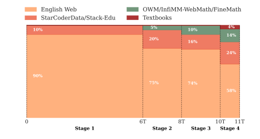

# SmolLM2--如何训练好一个”小“模型
近期，huggingface的团队推出了在多个评测数据集分数上超过Qwen2-1.5B的”小“模型--1.7B大小的SmolLM2，并且公开了训练数据集和训练方法，赶紧来看下，模型还是采用了和Llama2一样的架构，可以说是非常标准的训练模板，具有不错的学习借鉴意义。

## 研究背景
最近大参数量的大模型如Deepseek等取得了很大突破，但训练和推理成本相对来说还是高昂。于是huggingface团队近期研究致力于开发性能良好的小型语言模型，以降低计算成本并在更多设备上运行。这对于我们这些个人用户也是一个好消息。  
数据是影响语言模型性能的关键因素，对于小型模型尤为重要。这篇论文证明了除网络文本外，纳入专业数据可提升模型在推理和世界知识相关任务上的表现。  
## 模型训练
### 预训练数据集
文章在提高训练数据集的质量上花费了很多笔墨，也给我们提供了一些不错的思路。
- 首先，对现有的数据集（FineWeb-Edu, DCLM, 数据数据OpenWebMath, InfiMM-WebMath)进行了消融实验来得出最佳的混合比例。具体来说就是在相同的条件下在每个数据集上训练模型，在多种基准测试评估，测试不同混合比例，最终得出 60% FineWeb-Edu 和 40% DCLM 混合效果较好的结论。

- 对于数学数据OpenWebMath, InfiMM-WebMath，也是先做了退火消融实验，在GSM8K和MATH等任务上评估模型性能。发现 InfiMM-WebMath 在 GSM8K 上峰值准确率达 14% 高于OWM的10%，而OWM在MATH上略胜一筹，但两者性能仍落后于先进的小型模型。针对上述问题开发了FineMath数据集。先从Common Crawl中提取相关文本。然后是筛选阶段，使用基于Llama-3.1-70B-Instruct注释训练的分类器，通过5分制提示筛选出具有推理过程和初高中至本科阶段内容的页面。再使用MinHash LSH去重，并通过fastText语言分类保留英文内容，去除低质量数据，最终得到多个 FineMath 变体，如 FineMath4 + 和 FineMath3+。下图是这些数据集在不同基准测试中的表现。

- 对于代码数据集，作者利用FineWeb-Edu的分类器过滤策略，从StarCoder2Data构建聚焦教育和详细文档代码的Stack-Edu数据集。选择15种最大的编程语言，训练15个语言特定分类器对代码的教育质量进行0 - 5分评分，过滤得到约125B tokens的Stack-Edu数据集。然后再进行退火消融实验评估代码数据集的效果，筛选后的数据集效果提高不少，见下图：

### 预训练过程：
- 采用多阶段训练方法，在11万亿token上训练SmolLM2。根据性能驱动调整数据集混合，在退火阶段对高质量数学和代码数据进行上采样，并在训练中期引入中等规模数据集。

- 四个阶段分别如下：   

    - 阶段 1（0 - 6T tokens）：基于英语网络消融实验和已有文献，采用 60% FineWeb-Edu 和 40% DCLM 的网络数据比例，融入 10% StarCoderData 作为代码数据，未加入数学数据。训练后评估发现，知识和推理性能符合预期，但编码和数学性能较差。  
    - 阶段 2（6T - 8T tokens）：添加 5% OWM 到混合数据中，提高代码数据比例。该阶段代码性能在多数语言上有所提升，但 OWM 对数学性能影响不明显。此外，通过额外的退火消融实验，发现增加 DCLM 相对 FineWeb-Edu 的比例可略微提升 MMLU 的 MCF 成绩。  
    - 阶段 3（8T - 10T tokens）：添加 InfiMM-WebMath 的文本部分，使数学数据总比例约达 10%。调整英语网络数据中 FineWeb-Edu 与 DCLM 的比例为 40/60，用 Stack-Edu 替换 StarCoderData，并添加 Jupyter Notebooks。该阶段虽有性能提升，但出现了损失尖峰，原因未明，不过多数评估指标在阶段结束时恢复。  
    - 阶段 4（10T - 11T tokens）：将学习率线性衰减至 0，引入高质量数学数据集 InfiWebMath-3 + 和 FineMath 4+，扩大 Stack-Edu 覆盖的编程语言范围，调整各数据比例，数学内容占比 14%，Stack-Edu 占 24%，英语网络数据占 58%，Cosmopedia v2 占 4%。该阶段所有基准任务均有提升，尤其是编码和数学性能。
四个阶段的训练表现：

- 为了支持长上下文本应用，长度从2k扩展到8k个tokens，混合40%的长上下文数据在阶段4的checkpoint继续训练。
### SFT及对齐
这块文章并没有太多着墨，只是说用了batch_size为128，序列长度8192，学习率3e-4进行微调。对齐方面使用了DPO方式，训练了2个epoch,学习率1e-6，beta为0.5，序列长度1024。 

## 模型评估
- 基础模型评估：将SmolLM2与类似规模的模型进行比较，在多个基准测试中表现出色，如在 HellaSwag、ARC 等任务上优于Qwen2.5-1.5B，在数学和编码基准测试中也具有竞争力。

其他规模模型：还训练了SmolLM2-360M和SmolLM2-135M两个较小的模型，它们在各自规模类别中也处于领先地位，采用了不同的数据处理和训练策略。
## 研究结论：
SmolLM2的这篇论文对于预训练阶段的数据集构建多阶段训练写得非常详细，是一份非常好的实操手册。通过反复退火消融精心策划数据集的比例和多阶段训练，即使小模型也能取得比较不错的表现。