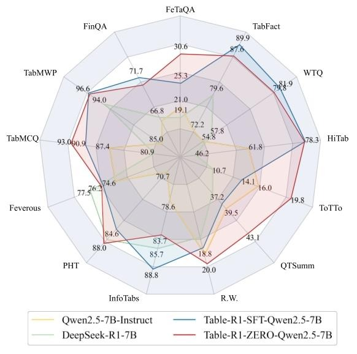
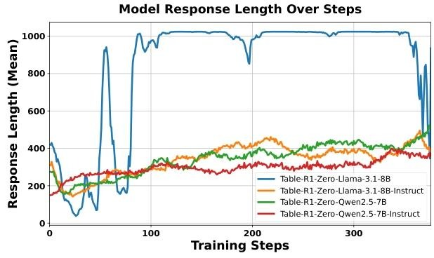
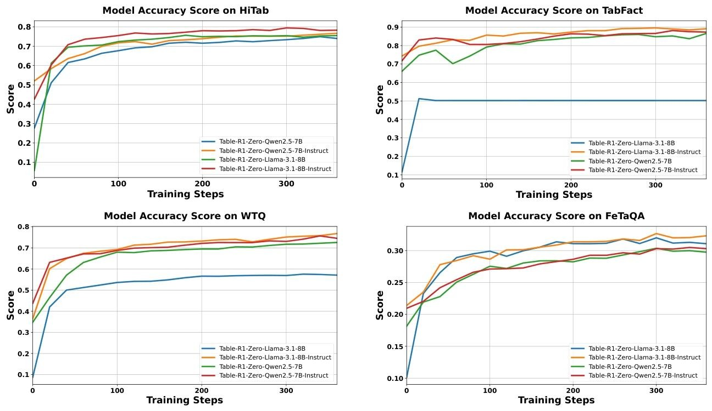

# AI自动数据分析的关键一环，表格数据问答--TableR1
近期，耶鲁大学nlp实验室推出了一款专用于表格数据问答的大模型：TableR1，通过延长模型生成推理链条的时间/步数，在多个表格数据问答任务上取得了SOTA性能，而且模型参数量仅7B和8B，[huggingface地址](https://huggingface.co/Table-R1)。
## 主要背景
- **核心挑战**：表格推理常需处理多列数据对齐、数值运算、逻辑判断等复杂需求（如跨行列聚合、时间序列分析），这对于哪怕是Reasoning的通用大模型来说也是一个极其难的问题。
- **创新方向**：这篇论文首次探索表格推理的推理时间扩展，即通过将复杂查询拆解为子任务（如先定位数据列，再计算比例，最后验证逻辑）和更长的推理链条，模型可更精准解析模糊术语，提出两种训练策略来提升：  
    - **监督微调（SFT）**：基于大模型生成的推理轨迹数据优化模型。  
    - **可验证奖励强化学习（RLVR）**：结合任务特定奖励函数与GRPO算法，提升推理稳定性与泛化性。  

## Table-R1模型训练过程
### 监督微调（Table-R1-SFT）
- **数据构建**：使用DeepSeek-R1生成33,601条包含**COT**的推理轨迹，覆盖短问答（TQA）、事实验证（TFV）、自由问答（FF-TQA）三类任务，数据经自动评估过滤确保正确性。  
- **训练细节**：基于Qwen2.5-7B-Instruct和Llama-3.1-8B-Instruct，批次大小256，学习率1e-5，训练3轮。  
在经过SFT之后，模型学会了模仿 DeepSeek-R1 的推理模式，格式一致性也得到大幅提高，模型输出合规率从基线的65%提升至92%。
## 可验证奖励强化学习（Table-R1-Zero）
采用**GRPO算法**，结合**DAPO**改进（token级损失、非对称clip），移除GRPO中KL散度惩罚以鼓励探索。  
**重点：奖励设计**：  
  - **准确性奖励**：TQA任务中使用精确匹配，若模型输出的答案与正确答案完全匹配，则给予1分的奖励，否则为0分。TFV事实验证任务中，预测标签与真实标签一致时奖励为1，不一致则为0。FF-TQA任务使用归一化的BLEU和ROUGE-L分数的平均值来衡量模型输出与参考答案的语义重叠程度，以此确定奖励分数。 
  - **格式奖励**：通过正则表达式检查输出格式（如JSON结构），根据输出逐步满足结构要求的程度给予部分分数，完全符合要求时给予满分，以此确保输出一致性。  
如此设计的奖励函数，可以确保奖励具有可解释性和稳健性，减少训练过程中的不稳定性和奖励作弊行为。
- **训练细节**：所有模型使用了verl框架进行训练，批次大小256，16次滚动采样，学习率1e-6，训练2轮，使用4块A100 GPU。  

## 实验与结果
### 基准测试与对比模型
- **数据集**：  
  | 任务类型       | 数据集          | 样本数 | 核心挑战               |  
  |----------------|-----------------|--------|------------------------|  
  | 短问答（TQA）  | WTQ, HiTab      | 13,706+6,793 | 数值提取、多步推理    |  
  | 事实验证（TFV）| TabFact         | 20,740 | 逻辑判断               |  
  | 自由问答（FF-TQA）| FeTaQA        | 7,324  | 长文本生成、语义对齐   |  
- **对比模型**：  
  - **专有模型**：GPT-4.1、GPT-4.1 mini  
  - **开源模型**：Qwen2.5-7B/32B、DeepSeek-R1、Llama-3.1-8B、TableLlama等  

### 关键性能指标 
| 模型                | FeTaQA (BLEU) | TabFact (Acc) | WTQ (EM) | HiTab (EM) |
|---------------------|---------------|---------------|----------|------------|
| GPT-4.1             | 25.1          | 86.5          | 68.0     | 84.7       |
| DeepSeek-R1          | 26.2          | 90.8          | 79.6     | 82.4       |
| **Table-R1-Zero (Qwen2.5-7B)** | **30.6**      | **87.6**      | **79.8** | **78.1**   |
| **Table-R1-Zero (Llama-3.1-8B)** | 32.7          | 87.6          | 81.2     | 81.4       |  

- **测试亮点**：  
  - Table-R1-Zero在FF-TQA任务(FeTaQA数据集)中超越DeepSeek-R1获得了32.7分，说明其在生成开放式回答的任务中表现突出，能够依据表格信息生成高质量、语义更准确的答案。在TFV任务(TabFact数据集)中得分最好的是Table-R1-SFT,非常接近于最佳的DeepSeek-V3的92.4。在短格式问答（WTQ、HiTab），已经接近了最好的QWQ-32B的85.4分了，毕竟其只有7B的参数量啊。
  - **跨领域泛化**：在未训练数据集（如FinQA、Feverous）上，Table-R1-Zero平均准确率比SFT版本高5-8%。 
  -明显Table-R1使用Qwen2.5作为基座模型的效果很好，从侧面也说明了Qwen2.5在数值推理能力上很优秀。
  - **训练过程中的推理复杂度变化**
  下图展示了 Table-R1 训练中响应长度的动态优化过程，验证了 “格式优先→推理复杂化→稳定收敛” 的三阶段模式。指令调优模型凭借预训练优势，在 RLVR 中更高效地平衡了响应结构与推理深度，而基础模型则受限于格式学习成本，难以达到同等性能。
  
## 消融实验
- **模型初始化影响**：指令调优模型（Instruct）比基础模型（Base）平均提升10-15%准确率，Llama-3.1在域内表现更优，Qwen2.5泛化性更强。  
- **格式奖励作用**：移除格式奖励导致跨领域性能下降10-12%，尤其在TQA任务中准确率降低至65%以下。  
- **任务迁移性**：仅训练TQA时，TFV性能提升显著（+12% Acc），但FF-TQA无明显改善，表明任务间推理能力差异。  

## 总结
这篇论文很好地展示了如何通过扩展推理链长来提升模型在表格数据问答任务中的性能。也论证了对于这种表格数值型的问答任务，明显CoT的长度是和模型的效果成正比的。而且，这篇论文也证明了SFT加上可验证奖励的强化学习还是目前最好的后训练策略，对于提升基模型在推理任务上的性能是非常巨大的，哪怕是低参数量的基模型。

