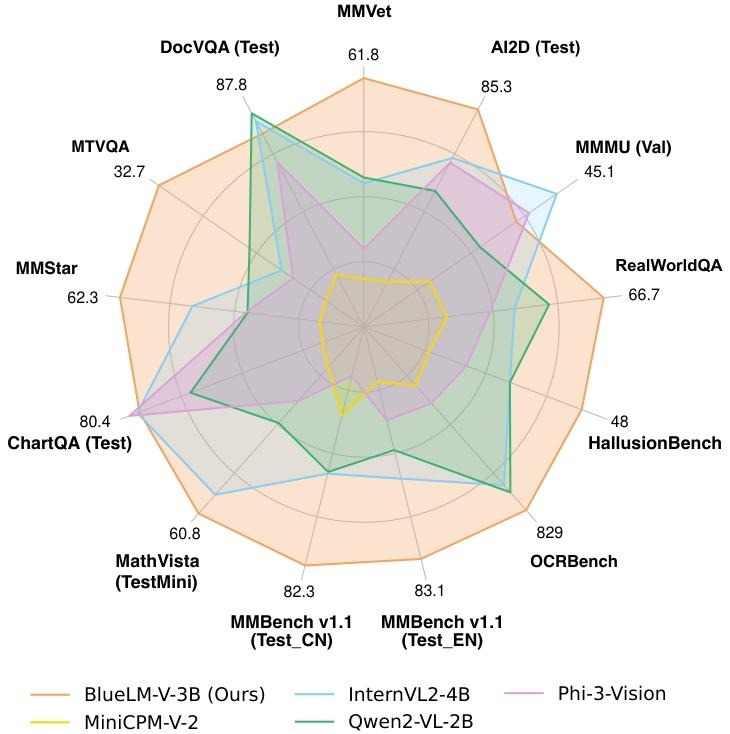
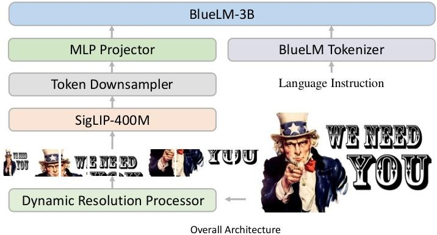
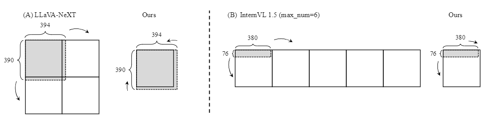
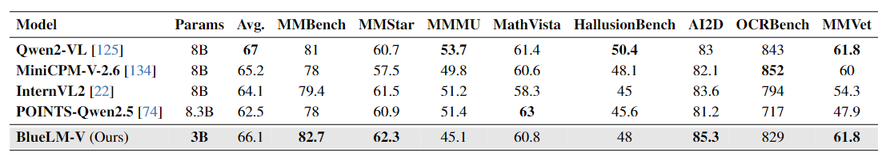
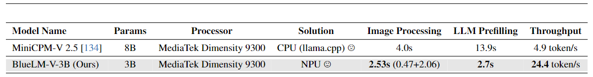

# BlueLM-V-3B: Algorithm and System Co-Design for Multimodal Large Language Models on Mobile Devices

vivo AIlab最近提出了一种针对移动设备上多模态大语言模型（MLLMs）的算法与系统协同设计方法：BlueLM-V-3B，旨在解决在手机上部署多模态大模型的挑战，实现高效的模型推理与应用。
其亮点包括：
- **小尺寸**，语言模型 27 亿参数、视觉编码器 4 亿参数
- **快速**，在联发科天玑 9300 处理器上 4 位 LLM 权重量化下生成速度达 24.4 token/s
- **性能强**，在 OpenCompass 基准测试中 40 亿参数模型里平均得分最高达 66.1 且超越一系列大参数模型（如 MiniCPM-V-2.6、InternVL2-8B）。 

和其他多模态大模型对比：(真就**六边形战士**吗？)

那为什么能取得如此好的效果呢？
### 1、网络结构：

- **图像编码器**：利用 [SigLIP](https://arxiv.org/pdf/2303.15343)的 ViT 来处理 384×384 像素的输入图像，其具有 4 亿参数，用于处理多模态（图像和语言）输入。
- **MLP 投影器**：采用一个 2 层的多层感知机（MLP）将图像标记空间映射到语言大模型（LLM）标记空间。
- **语言大模型（LLM）**：以内部的 27 亿参数 BlueLM 模型作为核心语言模型来设计 BlueLM-V-3B，并且为增强模型理解高分辨率图像的能力，集成了**动态分辨率处理器模块**，同时考虑到之前相关模型存在的图像过度放大等问题，引入新方法提升训练和部署效率，鉴于神经网络处理器（NPU）处理长标记性能有限，还利用了**token下采样器模块**来降低部署复杂性。

训练时，图像经动态分辨率处理器处理后，通过图像编码器、tokens下采样器和 MLP 映射层得到图像tokens，与语言指令tokens拼接用于训练；推理过程类似。
### 2、主要亮点
- **动态图像分辨率**：采用动态图像分辨率设计，针对[LLaVA-NeXT](https://github.com/LLaVA-VL/LLaVA-NeXT)和InternVL 1.5中存在的图像过度放大问题，提出松弛纵横比匹配方法，通过添加阈值 α 控制分辨率选择，减少图像tokens数量且不牺牲模型精度。同时，设计批量图像块编码与流水线并行处理，提升训练和推理效率。

- **tokens下采样器**：为解决动态图像分辨率导致的图像tokens过多问题，应用 VILA 中的下采样器块减少tokens数量，但仍面临 NPU 部署挑战。于是采用分块计算输入tokens策略，每轮并行处理 128 个输入tokens，平衡计算资源利用与处理效率。

- **模型量化与整体框架**：应用混合精度量化，对 ViT 和 MLP 投影器权重使用 INT8，LLM 权重使用 INT4，同时保持 LLM 激活为 INT16，ViT 和投影仪激活为 FP16，推理时 KV 缓存使用 INT8。此外，通过解耦图像编码和指令处理，提高部署效率，降低内存占用。
### 3、训练过程与数据
- **训练过程**：分两阶段，第一阶段预训练 MLP 投影层，冻结 ViT 和 LLM；第二阶段用大量图像 - 文本对微调模型。
- **训练数据**：预训练阶段使用包含 250 万图像 
    - 字幕对的开源数据集；微调阶段构建了 6.45 亿图像 
    - 文本对的数据集，涵盖多种任务和数据类型，包括开源和内部数据，还通过多种方式生成或转换数据，并利用 GPT4o 和 Gemini Pro 创建和修订相关内容，增强模型能力。
### 3、实验结果
- **松弛纵横比匹配效果**：该方法减少了图像tokens数量，在多模态 [LLaVA](https://github.com/haotian-liu/LLaVA) 665k 训练数据集上统计分析，相比 LLaVA-NeXT 和 InternVL 1.5 提高了部署效率，在 LLaVA 1.5 数据集上训练实验表明还提高了基准准确率。

- **不同基准测试准确率**：在 OpenCompass 基准测试中，BlueLM-V-3B 在多项任务上表现出色，超越同类参数模型，平均性能排名第二，在一些任务上达到 SOTA；在以文本为中心 / OCR 基准测试中，与同类参数大小的流行 MLLMs 相比表现相当，且多语言能力显著增强。

- **部署效率评估**：以 vivo X100 手机（MediaTek Dimensity 9300 处理器）为例，通过批量图像块编码、流水线并行处理和分块计算输入tokens等优化，BlueLM-V-3B 实现了较高的部署效率，与 MiniCPM-V 相比，具有更短的延迟和更快的tokens吞吐量。
